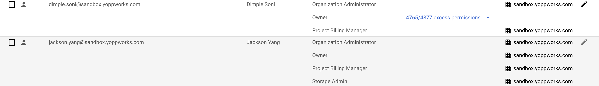

# Government of Ontario - Google Cloud Platform - Landing Zone

## Getting Started
### Summary

This repository contains the code base for a GCP landing zone (aka LandingZone solution). In order to deploy the LandingZone solution, some prerequisites are required:

- A shell environment where Terraform, jq, and the GCloud SDK can all be installed (see **Prerequisites - Tools** section below for installation instructions)
- A Google Cloud Platform Organization, where the administrator running this code has Organizational Admin

### Prerequisites - Tools

The LandingZone solution is inteded to be deployed using a shell environment running on OSX or common Linux distributions. The following tools need to be installed:

- GCloud SDK

  Install GCloud (OSX):

  ```
  brew install google-cloud-sdk 
  ```

  Install GCloud (Linux): [LINK](https://cloud.google.com/sdk/docs/install#linux)

  Once installed, please verify it by using:

  ```
  gcloud version
  ```

- JQ (for JSON queries)

  Install jq (OSX)

  ```
  sudo brew install jq 
  ```

  Install jq (Linux; *NOTE:* most distributions come with jq pre-installed)

  ```
  sudo apt-get install jq -q -y 
  ```

  Once installed, please verify it by using:

  ```
  jq -version
  ```

- Terraform >= 1.0

  Install Terraform (OSX)

  ```
  brew install terraform
  ```

  Install Terraform (Linux): [LINK](https://www.terraform.io/downloads.html)

  Once installed, please verify it by using

  ```
  terraform -version
  ```

### Prerequisites - Local Install

If you are installing the LandingZone from a local machine, rather than the GCP Cloud Shell, you will need to perform the following steps to ensure that the bootstrap script is able to perform all of its intended operations:

1. Login `gcloud` into the account that has Organizational Administrator privileges for the GCP organization that will be the LandingZone solution's deployment target:

  ```
  gcloud login
  ```

2. Obtain user access credentials via a web flow and put them in the well-known location for Application Default Credentials (ADC):

  ```
  gcloud auth application-default login
  ```

3. Run the script provided via https://source.developers.google.com/new-password, to enable the LandingZone bootstrap script to create and access Google Cloud Source Repositories.


### GCP Environment Setup

This LandingZone solution assumes your GCP account has proper permissions to run the LandingZone project as part of dependencies. The GCP user should:

- Have the Organization Administrator role
- Have the Group Admin role enabled on Cloud Identity
- Create the following groups:
   - `audit-admins`
   - `audit-viewers`
   - `cloudbuild-admins`
   - `cloudbuild-viewers`
   - `organization-admins`
   - `workload-admins`



## Cloud Landing Zone (CLZ) Pre-deployment
1. Git Initial Configuration
  [Config Git](https://git-scm.com/book/en/v2/Getting-Started-First-Time-Git-Setup)
2. Checkout the code from [Github Repo](https://github.com/YoppWorks/ontario-lift-shift) into local feature branch 
3. Config Gcloud SDK Cloud environment
    
    This LandingZone solution assumes your Google account has Organization Administrator on the target GCP Organization
    
    Some simple gcloud commands to check if you have permissions:
    
    Using an authenticated gcloud sdk environment:
    ```
    # Prints the active account
    gcloud config list account --format "value(core.account)"
    
    # What domain and what user?
    DOMAIN=google.com
    EMAIL=youremail@example.com
    # or this: EMAIL=$(gcloud config list account --format "value(core.account)")
    
    # Get the Org ID for IAM policy query
    ORG_ID=$(gcloud organizations list --filter="DISPLAY_NAME:$DOMAIN" --format="value(ID)")
    
    # search for the email in the IAM policy
    gcloud organizations get-iam-policy $ORG_ID --filter="bindings.role:roles/resourcemanager.organizationAdmin" --format="value(bindings.members)" | grep $EMAIL
    ```

4. Must update the below mentioned config parameters before deploying
   1. Update the `config/config.yaml` file with configuration values for your environment
   2. Update `config/TFvars/common/common.auto.tfvars` with values that will be shared between the non-prod and prod environments.
   3. In the `config/TFvars/nonprod` and `config/TFvars/prod` directories, configure all variable files that end with `*.auto.tfvars` for configuration of the environments.

## Cloud Landing Zone Deployment
### Bootstrap Module Deployment

  After all prerequisites are met, and you're having all the necessary admin GCP permissions, simply run the bootstrap.sh script in the `landingzone/environments/bootstrap/` folder
  ```
   cd landingzone/environments/bootstrap/
   ```
   ```
    ./bootstrap.sh run
   ```
  After entering this command, It will prompt you for information in order to launch the bootstrap script successfully. Press 'y' or 'Y' for the first question and
  do not hit enter, it will automatically continue to run terraform and launch it.
  

  Once terraform is successfully launched, it will prompt for the second question, press 'yes' or 'YES' and then hit enter this time to proceed further and wait till the time the script will finish.
  Once done.

  It will launch both gcloud and terraform commands and will generate CSR (Cloud Source Repository)
  with dump the Landing zone code to the newly created Google CSR repository.

- Verify CLZ deployed successfully by following below steps:
    - Login into GCP account.
    - Go to `GCP Menu -> Source repositories -> All repositories -> Select your repo -> Select branch as "main"`, verify that CSR repo is created and code is pushed into that repository.
    - Verify that CSR repo has been created with a proper folder structure as mentioned above.
    - Go to `GCP Menu -> Cloud Build -> triggers`, all pipeline should have automatically created and triggered along with the CSR creation.
    - Check the Cloud Build pipeline status and verify that all pipeline runs successfully by checking the logs.
    - If everything is successful, CSR is deployed and working as expected.

### Common Module Deployment [TBC]

After all prerequisites are met, and you're having all the necessary admin GCP permissions, simply run the bootstrap.sh script in the `landingzone/environments/bootstrap/` folder
  ```
   cd landingzone/environments/common/
   ```
- Follow the below steps to deploy the Common CLZ module:
1. `terraform init` -> Initialize terraform
2. `terraform state list` -> To verify all terraform resources available
3. `terraform validate` -> To validate the syntax of the terraform files
4. `terraform plan` -> To determine the desired state of all terraform resources
5. `terraform apply` -> Executes the actions proposed in a Terraform plan

### Non-Prod Module Deployment [TBC]

After all prerequisites are met, and you're having all the necessary admin GCP permissions, simply run the bootstrap.sh script in the `landingzone/environments/bootstrap/` folder
  ```
   cd landingzone/environments/nonprod/
   ```

- Follow the below steps to deploy the Non-Prod CLZ module:
1. `terraform init` -> Initialize terraform
2. `terraform state list` -> To verify all terraform resources available
3. `terraform validate` -> To validate the syntax of the terraform files
4. `terraform plan` -> To determine the desired state of all terraform resources
5. `terraform apply` -> Executes the actions proposed in a Terraform plan

### Prod Module Deployment [TBC]

After all prerequisites are met, and you're having all the necessary admin GCP permissions, simply run the bootstrap.sh script in the `landingzone/environments/bootstrap/` folder
  ```
   cd landingzone/environments/prod/
   ```
- Follow the below steps to deploy the Prod CLZ module:
1. `terraform init` -> Initialize terraform
2. `terraform state --list` -> To verify all terraform resources available
3. `terraform validate` -> To validate the syntax of the terraform files
4. `terraform plan` -> To determine the desired state of all terraform resources
5. `terraform apply` -> Executes the actions proposed in a Terraform plan

## Change/Update Cloud Landing Zone

1. Config CSR git .ssh key
    - Check on your local system whether you already have .ssh installed or not  by running the below mentioned command
       ```
        cd .ssh
       ```
    - If your local system doesn't have .ssh then please create a new .ssh key by following this [Generate SSH](https://www.atlassian.com/git/tutorials/git-ssh) doc.
    - Once .ssh key is generated, copy the public ssh key (id_rsa.pub) into GCP cloud shell machine.


2. Once GCP cloud shell has .ssh setup is done, checkout the CSR (Cloud Source Repository) to a local branch via .ssh authentication.

  **For example :**
 ```
    git clone ssh://dimple.soni@sandbox.yoppworks.com@source.developers.google.com:2022/p/rsde-go-landingzone17-test17/r/GoLandingZone17
 ```
3. Do the necessary code changes, commit and push it back to CSR via git.
    ```
    git checkout --track origin/main
   
    git add <files_to_commit>
    
    git commit -m "commit_message"
          
    git push origin/branch_name
    ```
4. Once all commits are done and pushed, verify the Cloud-Build Pipeline status.
5. If any of the cloud build pipeline got failed, troubleshoot the build issue by checking the pipeline logs.
6. Fix the build pipeline issue and repeat all the steps from [here](README.MD#Bootstrap Module Deployment)

## How to ?
**- How to start over CLZ bootstrap if it fails ?**
   1. Delete the entire CSR project from GCP dashboard or delete the resources manually.
   2. Do the local clean up by following the below steps.
      1. Delete the entire **.terraform** folder `bootstrap/environment/.terraform`, `bootstrap/environment/terraform.tfstate`, `bootstrap/environment/terraform.tfstate.backup`.
      2. Once local clean up is done, run the bootstrap script again to start over or go to bootstrap folder `cd bootstrap/` and run `./bootstrap start_over` command from gcp cloud shell **which is currently not available but alternatively it**
          **will be added to the project.**
      3. Rerun the bootstrap script `./bootstrap run` or restart it from the previous/feature branch's current state by following the below steps.
          ```
          git branch -D <branch_name> // delete the local branch
        
          git checkout -b <remote_branch_name> //checkout the existing remote branch
          ```
      4. Once remote branch is checkout, continue running the bootstrap script from here.

   3. Follow the steps from [here](README.MD#Bootstrap Module Deployment) to start over again from beginning.

**- How to use an external Git repository, such as [Github](https://github.com/), and use a CSR repository as a mirror**
   1. To push code and move Build Triggers to another repository, run `environments/bootstrap/bootstrap.sh use_another_repo` and follow the instructions.

**- How to destroy all the environments after they have been successfully created?**
   1. Go into the `environments/bootstrap` folder, run `./bootstrap.sh destroy`, and follow the instructions.

## Contributors
- Jackson Yang
- Dimple Soni
- Sergey Vershinin
- Justin Long


## Please read this warning
This LandingZone solution is meant to be run by **one elevated user, in one sitting, with the permanent naming convention** to be used.

If you want the LandingZone solution to be run by **multiple user** then please follow the below guideline.
- Give a unique name to the project and run it from scratch.
- Delete **terraform.tfstate** file and rerun the script for fresh installation.

The reason for this are:
- Permissions for that user are temporary, changing users before the automation takes over operations locks other users out of this process
- Accomplishing this is one sitting allows all users to contribute to repairing any issues in the environment by contributing code
- Project_Ids are globally consistent across all of Google Cloud Platform, projects take 7 days to delete and wont release that unique name until fully deleted.
