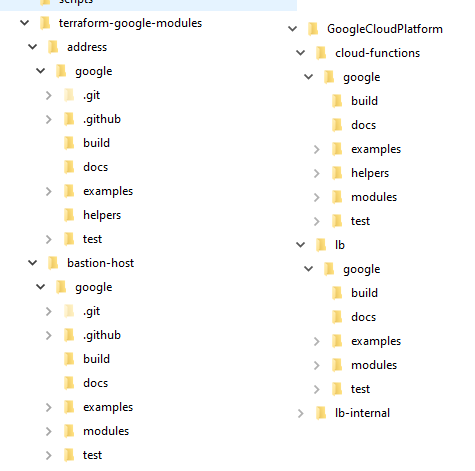

# Information déploiement

Voici les étapes qu'on a suivi pour déployer la distribution TEF en mode localisé dans le locataire gcp.mcn.gouv.qc.ca

## Récupérer de github la distribution

Le réferentiel de base Github est: [Terraform google modules](https://github.com/terraform-google-modules)

Ici on récupère localement [La distribution Terraform ZA GCP](https://github.com/terraform-google-modules/terraform-example-foundation) et les modules p.e. [terraform-google-network](https://github.com/terraform-google-modules/terraform-google-network), [terraform-google-vm](https://github.com/terraform-google-modules/terraform-google-vm) et les autres modules reférencés par la distribution. En effet la distribution les référence indirectement par leurs chemins dans le [Registre Terraform Google modules](https://registry.terraform.io/namespaces/terraform-google-modules)

On récupère aussi localement les modules Terraform GCP suivants

On récupère aussi localement à partir du registre Terraform [Google Cloud Platform](https://registry.terraform.io/namespaces/GoogleCloudPlatform) les modules suivants

* [Cloud Functions](https://registry.terraform.io/modules/GoogleCloudPlatform/cloud-functions)
* [lb-internal](https://registry.terraform.io/modules/GoogleCloudPlatform/lb-internal)
* [lb](https://registry.terraform.io/modules/GoogleCloudPlatform/lb/google/latest)

Dans le même repertoire ou on a récupéré la distribution on crée 2 sous-repertoires:

* terraform-google-modules
* GoogleCloudPlatform

On déplace en dessous de ces répertoires les modules, respectivement

* Les modules en provenance du [Registre Terraform Google modules](https://registry.terraform.io/namespaces/terraform-google-modules) en dessous du repertoire terraform-google-modules
* Les modules en provénance du [Registre Google Cloud Platform](https://registry.terraform.io/namespaces/GoogleCloudPlatform)

En les déplaçant on les réorganise pour respecter la même hierarchie de répertoires et noms que celle dans les registres Terraform. Par exemple:



## Rouler les script pour changer les références des modules en local

Le script a rouler est `localize_terraform_modules.py`

Note: Vous pouvez utiliser la [branche devops](https://dev.azure.com/ccticei/Migration/_git/TEF-GCP-LZ-HS?version=GBmcn-tf-modules-localized-for-reveng-test) ou ces substitutions sont déjà faites

Le script prend comme seul argument le repertoire racine ou se trouve la distribution, soit en format absolu soit rélatif au répertoire ou on roule le script. En Linux la commande est

`python localize_terraform_modules.py`

À noter que la version de Python requise est 2.7 ou 3.x

Le script va parcourir l'arborescence des répertoires et va préfixer chaque référence source d'un module par le prefix équivalent pour inclure la version locale du module. Par exemple:

```terraform
module "env_kms" {
  source  = "terraform-google-modules/project-factory/google"

=>

module "env_kms" {
  source  = "../../../terraform-google-modules/project-factory/google"
```

## Rouler les script pour mettre en commentaire les numéros de version

Lors de l'inclusion locale d'un module l'attribute version ne doit pas apparaître, autrement Terraform va penser qu'on cherche le module dans un régistre distant.

Note: Vous pouvez utiliser la [branche devops](https://dev.azure.com/ccticei/Migration/_git/TEF-GCP-LZ-HS?version=GBmcn-tf-modules-localized-for-reveng-test) ou ces substitutions sont déjà faites

Pour mettre en commentaire ces références de version rouler le script `comment_out_module_versionss.py`

Comme le script précedent on a besoin de Python 2.7 ou 3.x et le seul argument est le chemin absolu ou rélatof vers la racine de la distribution. Vois un exemple

```terraform
module "monitoring_project" {
  source  = "../../../terraform-google-modules/project-factory/google"
  version = "~> 14.0"

=>
module "monitoring_project" {
  source  = "../../../terraform-google-modules/project-factory/google"
  ## localized version = "~> 14.0"

```

## Corriger si besoin des bogues dans le code de la distribution.

Voir les rapports de bogues suivants qui montrent aussi les corrections:

[#1166 Bucket name length exceeds 63 characters with non-US region deployment](https://github.com/terraform-google-modules/terraform-example-foundation/issues/1166)

[#1167 Missing mandatory update_policy attribute in 3-networks-hub-and-spoke/modules/transitivity/main.tf](https://github.com/terraform-google-modules/terraform-example-foundation/issues/1167)

[#1169 In 4-projects CMEK GCS bucket name length exceeds the statutory 63 characters](https://github.com/terraform-google-modules/terraform-example-foundation/issues/1169)

Note: Vous pouvez utiliser la [branche devops](https://dev.azure.com/ccticei/Migration/_git/TEF-GCP-LZ-HS?version=GBmcn-tf-modules-localized-for-reveng-test) ou ces corrections sont déjà faites

## Créer les configurations requises pour le déploiement en mode local

La déploiement de la distribution comporte 5 étapes et pour chacune de ces étapes, qui correspond à un sous-répertoire, il y a des fichiers de configurations à créer sur mésure:

Note: Vous pouvez utiliser la [branche devops](https://dev.azure.com/ccticei/Migration/_git/TEF-GCP-LZ-HS?version=GBmcn-tf-modules-localized-for-reveng-test) ou ces configurations sont déjà faites

### 0-bootstrap

Rajouter un nouveau fichier backend.tf.local et NE PAS le symlinker encore à backend.tf (d'abord rouler la première phase du déploiement)

Le contenu (exemple) est celui plus-bas et le UPDATE_ME sera remplacé par le vrai nom du bucket de manière programatique avec une commande sed.

```terraform
terraform {
  backend "gcs" {
    bucket = "UPDATE_ME"
    prefix = "terraform/bootstrap/state"
  }
}
```

Rajouter un fichier outputs.tf.local et le symlinker à outputs.tf. Le contenu est basé sur outputs.tf.exemple avec les sections cloudbuild, jenkins, etc enlevées.

```terraform
output "seed_project_id" {
  description = "Project where service accounts and core APIs will be enabled."
  value       = module.seed_bootstrap.seed_project_id
}

output "bootstrap_step_terraform_service_account_email" {
  description = "Bootstrap Step Terraform Account"
  value       = google_service_account.terraform-env-sa["bootstrap"].email
}

output "projects_step_terraform_service_account_email" {
  description = "Projects Step Terraform Account"
  value       = google_service_account.terraform-env-sa["proj"].email
}

output "networks_step_terraform_service_account_email" {
  description = "Networks Step Terraform Account"
  value       = google_service_account.terraform-env-sa["net"].email
}

output "environment_step_terraform_service_account_email" {
  description = "Environment Step Terraform Account"
  value       = google_service_account.terraform-env-sa["env"].email
}

output "organization_step_terraform_service_account_email" {
  description = "Organization Step Terraform Account"
  value       = google_service_account.terraform-env-sa["org"].email
}

output "gcs_bucket_tfstate" {
  description = "Bucket used for storing terraform state for Foundations Pipelines in Seed Project."
  value       = module.seed_bootstrap.gcs_bucket_tfstate
}

output "common_config" {
  description = "Common configuration data to be used in other steps."
  value = {
    org_id                = var.org_id,
    parent_folder         = var.parent_folder,
    billing_account       = var.billing_account,
    default_region        = var.default_region,
    project_prefix        = var.project_prefix,
    folder_prefix         = var.folder_prefix
    parent_id             = local.parent
    bootstrap_folder_name = google_folder.bootstrap.name
  }
}


output "required_groups" {
  description = "List of Google Groups created that are required by the Example Foundation steps."
  value       = var.groups.create_required_groups == false ? tomap(var.groups.required_groups) : tomap({ for key, value in module.required_group : key => value.id })
}

output "optional_groups" {
  description = "List of Google Groups created that are optional to the Example Foundation steps."
  value       = var.groups.create_optional_groups == false ? tomap(var.groups.optional_groups) : tomap({ for key, value in module.optional_group : key => value.id })
}

## MRo: missing some outputs present in .github, etc
output "projects_gcs_bucket_tfstate" {
  description = "Bucket used for storing terraform state for stage 4-projects foundations pipelines in seed project."
  value       = module.seed_bootstrap.gcs_bucket_tfstate
}

```

Rajouter un fichier terraform-local.tf, en effet un sous-module requis pour provisionner certaines ressources. Le contenu est le suivant:

```terraform
locals {
  cicd_project_id = module.local_cicd.project_id
}

module "local_cicd" {
  source  = "terraform-google-modules/project-factory/google"
  version = "~> 12.0"

  name              = "${var.project_prefix}-b-cicd-local"
  random_project_id = true
  org_id            = var.org_id
  folder_id         = google_folder.bootstrap.id
  billing_account   = var.billing_account
  activate_apis = [
    "compute.googleapis.com",
    "admin.googleapis.com",
    "iam.googleapis.com",
    "billingbudgets.googleapis.com",
    "cloudbilling.googleapis.com",
    "serviceusage.googleapis.com",
    "cloudresourcemanager.googleapis.com",
    "iamcredentials.googleapis.com",
  ]
}


```

Ce qui est requis est `local.cicd_project_id` - même si en mode local il n'y a pas besoin d'un project ci-cd comme c'est le cas pour déploiement Jenkins, Gitlab, Codebuild, etc, la variable est encore réferencée.

Important à meentionner que les groups référencés par la configuration `required_groups`et si utilisés `optional_groups`dans terraform.mod.tfvars doivent exister en IAM

```bash
group_org_admins = "gcp-org-admins@gcp.mcn.gouv.qc.ca"
group_billing_admins = "gcp-billing-admins@gcp.mcn.gouv.qc.ca"
group_billing_data_users  = "gcp-billing-data-users@gcp.mcn.gouv.qc.ca"
group_audit_data_users    = "gcp-audit-data-users@gcp.mcn.gouv.qc.ca"
group_monitoring_workspace_users = "gcp-monitoring-workspace-users@gcp.mcn.gouv.qc.ca"

```

Rajouter un fichier `terraform.local.tfvars` (basé sur terraform.exemple.tfvars, avec des valeurs pour certaines variables) et le symlinker à terraform.tfvars. Un exemple de contenu de ce fichier:

```terraform

org_id = "946862951350" # format "000000000000"

billing_account = "01A591-8B15FB-F4CD0B" # format "000000-000000-000000"

group_org_admins = "gcp-org-admins@gcp.mcn.gouv.qc.ca"

group_billing_admins = "gcp-billing-admins@gcp.mcn.gouv.qc.ca"

group_billing_data_users  = "gcp-billing-data-users@gcp.mcn.gouv.qc.ca"
group_audit_data_users    = "gcp-audit-data-users@gcp.mcn.gouv.qc.ca"
group_monitoring_workspace_users = "gcp-monitoring-workspace-users@gcp.mcn.gouv.qc.ca"

# Example of values for the groups
# group_org_admins = "gcp-organization-admins@example.com"
# group_billing_admins = "gcp-billing-admins@example.com"

default_region = "northamerica-northeast2"

# Optional - for an organization with existing projects or for development/validation.
# Uncomment this variable to place all the example foundation resources under
# the provided folder instead of the root organization.
# The variable value is the numeric folder ID
# The folder must already exist.
parent_folder = "1020261881397"  # TFE-test1

```

Par rapport à la configuration ci-dessus, il y a des références de groupes dans IAM. Ces groupes doivent éxister (les créer si pas présents). Pas besoin d'y assigner des membres et des rôles.

### 1-org

Dans le sous-repertoire `envs/shared` rajouter un fichier `terraform.mod.tfvars` et en symlinker `terraform.tfvars` dans même sous-répertoire.

```terraform
# Must include the domain of the organization you are deploying the foundation.
domains_to_allow = ["gcp.mcn.gouv.qc.ca"]
essential_contacts_domains_to_allow = ["@gcp.mcn.gouv.qc.ca"]
billing_data_users = "gcp-billing-data-users@gcp.mcn.gouv.qc.ca"
audit_data_users = "gcp-security-admins@gcp.mcn.gouv.qc.ca"
scc_notification_name = "scc-notify"
remote_state_bucket = "REMOTE_STATE_BUCKET"
//scc_notification_filter = "state=\\\"ACTIVE\\\""
enable_hub_and_spoke = true
create_access_context_manager_access_policy = false
// Optional - If you are deploying Foundation Example in a parent folder
// consider using below create_unique_tag_key var because as Tag Keys are
// unique organization-wide it will add a random suffix at each tag key

//create_unique_tag_key = true

```

Le nom du `remote_state_bucket` sera ajusté programmatiquement, lors du déploiement, par une commande sed. Les autres valeurs il faut les spécifier.

### 2-environments

Créer un fichier de configuration terraform.mod.tfvars à partir d'une copie du fichier terraform.exemple.tfvars. Y mettre la bonne configuration

```terraform

remote_state_bucket = "REMOTE_STATE_BUCKET"

```

Le nom du `remote_state_bucket` sera ajusté programmatiquement, lors du déploiement, par une commande sed. Le groupe `monitoring_workspace_users`il faut le spécifier.

### 3-networks-hub-and-spoke

Créer (à partir des fichier correspondants .exemple.tfvars) les fichiers suivants


| Fichier                        | Symlink                   |
| -------------------------------- | --------------------------- |
| access_context.auto.mod.tfvars | access_context.autotfvars |
| common.auto.mod.tfvars         | common.auto.tfvars        |
| shared.auto.mod.tfvars         | shared.autotfvars         |

Le contenu serait le suivant (exemple)

#### access_context.auto.mod.tfvars

```terraform
access_context_manager_policy_id = ACCESS_CONTEXT_MANAGER_ID
```

La balise `ACCESS_CONTEXT_MANAGER_ID` sera remplacée programmatiquement (via une commande sed) lors du déploiement

#### common.auto.mod.tfvars

```terraform
domain = "gcp.mcn.gouv.qc.ca."

// Update the following line and add you email in the perimeter_additional_members list.
// You must be in this list to be able to view/access resources in the project protected by the VPC service controls.
perimeter_additional_members = ["user:usager.anonyme@mcn.gouv.qc.ca"]

remote_state_bucket = "REMOTE_STATE_BUCKET"

enable_hub_and_spoke_transitivity = false
```

Le nom du `remote_state_bucket` sera ajusté programmatiquement, lors du déploiement, par une commande sed. Les autres valeurs faut les spécifier.

#### shared.auto.mod.tfvars

Spécifie les adresses IP des serveurs DNS (si le cas). Par exemple

```terraform
target_name_server_addresses = [
  {
    ipv4_address    = "192.168.0.1",
    forwarding_path = "default"
  },
  {
    ipv4_address    = "192.168.0.2",
    forwarding_path = "default"
  }
]


```

### 4-projects

Créer (à partir des fichier correspondants .exemple.tfvars) les fichiers suivants, en symlinkant les fichiers correspondantsb à droite:


| Fichier                       | Symlink                   | Changement |
| ------------------------------- | --------------------------- | ------------ |
| common.auto.mod.tfvars        | common.auto.tfvars        | Aucun      |
| nonproduction.auto.mod.tfvars | nonproduction.auto.tfvars | Région    |
| production.auto.mod.tfvars    | production.auto.tfvars    | Région    |
| development.auto.mod.tfvars   | development.auto.tfvars   | Région    |
| shared.auto.mod.tfvars        | shared.auto.tfvars        | Région    |

Les seuls changements dans ces fichiers sont les régions

Dans nonproduction, production et development (.auto.mod.tfvars):

```terraform
location_kms = "northamerica-northeast2"
location_gcs = "northamerica-northeast2"

```

Dans shared.auto.mod.tfvars

```terraform
default_region = "northamerica-northeast2"
```

## Rouler le script de verification / création des symlink .tfvar

Dans les repertoires se trouvent des fichiers avec configurations personnalisées nommés soit `<nom>.auto.mod.tfvars` soit `<nom>.mod.tfvars`, des fichiers à symlinker respectivement à `<nom>.auto.tfvars` ou `<nom>.tfvars`. Le script Python `fix_tfvars_symlinks.py` crée en premier ces symlinks.

C'est nécessaire de rouler le script pour 2 raisons:

* Si l'image de déploiement provient de VSCode. Même si dans le repo github ou dans celui devops les fichiers *.tfvars au plus bas niveau sont des symlink une commande git clone ou un checkout VsCode dans Windows transforme automatiquement les symlink dans des fichiers texte dont le contenu est le chemin du symlink. Par contre le script ignore les symlink existants.
* L'autre raison est la présence des fichiers *.mod.tfvars spécifiques au déploiement localisé. Le script en crée des symlink vers *.tfvars. Autrement les symlink dans les répertoires inferieurs sont brisés.

En général dans les sous-repertoires dans la section précédente il y a (ou devrait en avoir) aussi des symlink vers les fichiers .tfvars à la racine d'un colis (p.e. 2-environments). Si la commande "git clone" a été faite en Windows, p.e. Vscode il n'y a pas des symlink mais des fichiers qui sont crées contenant le chemin du symlink. Par exemple:

```terraform
Dans 3-networks-hub-and-spoke/envs/development/common.auto.tfvars:
../../common.auto.tfvars
```

Le script `fix_tfvars_symlinks.py`va créer les symlink manquants (en Windows faut avoir des droits admin) ou si un symlink ne peut pas être crée (permissions) le fichier .tfvars d'en haut est simplement copié.

Le script prend comme seul argument le repertoire racine ou se trouve la distribution, soit en format absolu soit rélatif au répertoire ou on roule le script. En Linux la commande est

`python fix_tfvars_symlinks.py .`

C'est possible quand même qu'il restent des fichiers non-modifiés. Vérifier en roulant la commande suivante à la ricine du code source:

`find . -type f -name "*.tfvars" | xargs grep -P "^\.\./"`

Si on en trouve, se déplacer dans les repertoires respectifs et rouler la commande similaire à la commande suivante pour chacun:

`mv terraform.tfvars terraform.tfvars.mauvais && ln -s $(cat terraform.tfvars.mauvais) terraform.tfvars`

## Déploiement

On suit en général les README.md dans les colis, en commençant avec 0-bootstrap. Malheureusement ce n'est pas évident de déployer dans des dossiers à part plusieurs instances de ZA, car il y a des ressources avec noms hardcodés provisionnées au niveau de l'organisation

* des "policies access-context-manager" pour les périmètres de sécurité déployés par les scripts
* des étiquettes ("tags")
* des configurations de notification ("scc_notification_config")

De plus il faut s'assurer que les scripts sont executables (ce qui n'est pas le cas suite à un "git clone")

`find <repertoire de base> -type f -name "*.sh" | xargs chmod a+x`

`find <repertoire de base> -type f -name "*.sh" | xargs dos2unix`

Voir billet [#1170](https://github.com/terraform-google-modules/terraform-example-foundation/issues/1170)

On a aussi besoin d'installer `terraform-tools` .

Par exemple `sudo yum install google-cloud-sdk-terraform-tools -y`

Observation générale par rapport aux commandes `sed` dans les paragraphes suivants

Par défaut sed détruit le symlink et le remplace par une copie. L'avantage est que les fichiers .mod.tfvars restent inchangés.

Quand même si on désire de garder les symlink rajouter l'option `--follow-symlinks`

La procédure de déploiement dans les sections suivantes est spécifique au déploiement local (par exemple à partir de Cloud Shell ou dans une machine Linux avbec Terraform et gcloud installés).

Pour d'autres modes de déploiement voir les fichiers README.md dans chaque section.

### Fichiers de configuration

Les déploiements des colis 3-network-hub-and-spoke et 4-projects dans cette version sont paramétrables par l'entremise des fichiers yaml suivants situés dans le repertoire config en dessous de la racine:

* `vpc_config.yaml` : paramétrage déploiement 3-network-hub-and-spoke
* `prj_config.yaml` : paramétrage déploiement 4-projects

C'est à note que la paramétrage défaut dans les fichiers ci-dessus suit plus ou moins d'un point de vue plages d'adresse et unités d'affaire ce qu'on a par défaut dans TEF.

Pour ce qui est du déploiement du colis 4-projects il n'y a plus des sous-colis codés en dur business_unit_1 et business_unit_2. À la place on peut configuré de manière flexible les unités d'affaire et leurs paramètres via le nouveau sous-colis business_units et le fichier de configuration prj_config.yaml

### Nettoyage

Pour des fins de développement et essais le code a été modifié pour ne plus imposer le modèle "singleton" c'est à dire un seul déploiement par organisation. À la place cette version permet de déploier une zone d'accueil en dessous d'un dossier et en avoir plusieurs (dans les limites des quotas) en dessous de la même organisation. Quand même, pour sauver des coûts il es nécessaire de nettoyer des déploiements non-plus utilisés et çs implique désactiver la facturation et erffacer les projets. Pour l'instant la procédure est manuelle, sera automatisée par un script dans une prochaine version. Voici la procédure.

- Aller dans « asset manager » et exporter avec filtre « type= cloudresourcemanager.Project »
- Importer en Excel et filtrer pour « active » et par folder ID.  Extraire la colonne avec project_id.
- Pour chaque project-id rouler
  `gcloud billing projects unlink <project_id>`
- Pour chaque projet verifier si on a des liens – les lister avec
  `gcloud alpha resource-manager liens list --project <project_id>`
- Pour chaque lien qu’on trouve l’effacer
  `gcloud alpha resource-manager liens delete lien_id  --project <project_id>`
- effacer les projet – pour chaque rouler
  `gcloud projects delete --quiet <project_id>`

### Déploiement 0-bootstrap

D'abord on crée un dossier de base, en dessous duquel d'autres dossiers et projets seront déployés par le script.

Pour faciliter le déploiement par des différentes outils (CloudBuild, Gitlab, Github, etc) il faut d'abord rouler le script prep.sh dans le répertoire o-bootstrap en spécifiant le mode de déploiement. Par exemple:

`./prep.sh tf_local`

Le script simplement crée des symlink vers les fichiers spécifiques à un mode de déploiement en dessous du sous-répertoire `builders`.

Vérifier que les symlink ont été bel et bien crées:

* backend.tf_to_rename_after_apply : rename to backend.tf after running the rerraform apply
* outputs.tf
* terraform.tf
* terraform.tfvars

S'assurer que le symlink ou fichier backend.tf n'existe pas mais le symlink `terraform.tfvars` vers `terraform.mod.tfvars` existe. Sinon le créer:

`ln -s terraform.mod.tfvars terraform.tfvars`

Aussi créer le symlink pour outputs.tf si n'existe pas:

`ln -s outputs.tf.local outputs.tf`

D'abord on configure des variables d'environnement

```bash
export SUPER_ADMIN_EMAIL=<votre-compte>@gcp.mcn.gouv.qc.ca
# name these using date and iteration as suffix
export REGION=northamerica-northeast2
export ORG_ID=946862951350
export ROOT_FOLDER_ID=<l'ID numérique du dossier de base>
export BILLING_ID=01A591-8B15FB-F4CD0B

```

Changer de repertoire (`cd <repertoire de base>/0-bootstrap`) et

Remplacer dans terraform.tfvars la valeur du folder racine:

`sed -i'' -e "s/PARENT_FOLDER_REPLACE_ME/${ROOT_FOLDER_ID}/" ./terraform.tfvars`

Remplacer dans terraform.tfvars la valeur de la region:

`sed -i'' -e "s/DEFAULT_REGION_REPLACE_ME/${REGION}/" ./terraform.tfvars`

Remplacer dans terraform.tfvars la valeur du compte de facturation:

`sed -i'' -e "s/BILLING_ID_REPLACE_ME/${BILLING_ID}/" ./terraform.tfvars`

Remplacer dans terraform.tfvars la valeur du compte de l'ID de l'organisation:

`sed -i'' -e "s/ORG_ID_REPLACE_ME/${ORG_ID}/" ./terraform.tfvars`

Si on désire activer l'environnement "restricted" dans chacune des spokes, mettre dans terraform.tfvars

`restricted_enabled = true`

Si quand même `restricted_enabled = false`ou en commentaire même si on declare des environnements "restricted" dans vpc_config.yaml ou prj_config.yaml, seront ignorés

Si on desire ne pas déployer les spokes "management" wt / ou "identité" mettre en commentaire ou false dans terraform.tfvars

`management_enabled = false`

`identity_enabled = false`

1. Rouler `terraform init` et valider le succès (`Terraform has been successfully initialized!`)
2. Rouler `../scripts/validate-requirements.sh -o $ORG_ID -b $BILLING_ID -u $SUPER_ADMIN_EMAIL` qui devrait finir sans erreur majeure (ignorer le message pour la version de git, on n'utilise pas git):

   ```bash
   Validating required utility tools...
   Validating Terraform installation...
   Validating Google Cloud SDK installation...
   Validating Git installation...
     An incompatible git version, 1.8.3.1, was found.
     Version required should be at least 2.28.0
     Visit https://git-scm.com/book/en/v2/Getting-Started-Installing-Git and follow the instructions to install git.
     git default branch must be configured as main.

   ```

   C'est possible qu'on voit des erreurs suite au lancement du script de validation, similaires au plus bas:

   `0-bootstrap/terraform.tfvars must have required values fulfilled.`

   En effet c'est à cause du fait que dans terraform.tfvars il y a des strings `REPLACE_ME` dans des commentaires et le script cherche aveuglement pour tels strings:

   ```
   if [ "$(grep -v '^#' "$FILE" |grep -c 'REPLACE_ME')" != 0 ]; then
      echo "  0-bootstrap/terraform.tfvars must have required values fulfilled."
      ERRORS+=$'  terraform.tfvars file must be correctly fulfilled for 0-bootstrap step.\n'
   fi

   ```
3. Rouler `terraform plan -input=false -out bootstrap.tfplan`
4. Rouler `terraform apply bootstrap.tfplan` . Si tout est correct on verra le "output", par exemple:

   ```bash

   bootstrap_step_terraform_service_account_email = "sa-terraform-bootstrap@prj-b-seed-a083.iam.gserviceaccount.com"
   common_config = {
     "billing_account" = "01A591-8B15FB-F4CD0B"
     "bootstrap_folder_name" = "folders/238905929013"
     "default_region" = "northamerica-northeast2"
     "folder_prefix" = "fldr"
     "org_id" = "946862951350"
     "parent_folder" = "1020261881397"
     "parent_id" = "folders/1020261881397"
     "project_prefix" = "prj"
   }
   ```
5. Rouler les commandes suivantes

   ```
   export network_step_sa=$(terraform output -raw networks_step_terraform_service_account_email)
   export projects_step_sa=$(terraform output -raw projects_step_terraform_service_account_email)
   export projects_gcs_bucket_tfstate=$(terraform output -raw projects_gcs_bucket_tfstate)

   echo "network step service account = ${network_step_sa}"
   echo "projects step service account = ${projects_step_sa}"
   echo "projects gcs bucket tfstate = ${projects_gcs_bucket_tfstate}"

   ```
6. Obtenir les nom des bucket

   ```bash
   export backend_bucket=$(terraform output -raw gcs_bucket_tfstate)
   echo "backend_bucket = ${backend_bucket}"

   export backend_bucket_projects=$(terraform output -raw projects_gcs_bucket_tfstate)
   echo "backend_bucket_projects = ${backend_bucket_projects}"
   ```

   Et remplacer les balises avec les noms des bucket  dans tous les backend.tf dans les autres modules

   ```bash
   # Maintenant renommer le fichier backend
   mv backend.tf_to_rename_after_apply backend.tf

   # Et remplacer les balises dans tous les fichiers backend.tf
   cd ..
   for i in `find . -name 'backend.tf'`; do sed -i'' -e "s/UPDATE_ME/${backend_bucket}/" $i; done
   for i in `find . -name 'backend.tf'`; do sed -i'' -e "s/UPDATE_PROJECTS_BACKEND/${backend_bucket_projects}/" $i; done
   # Revenir en 0-bootstrap
   cd 0-bootstrap

   ```
7. Rouler encore une fois la commande `terraform init` et choisir "yes" pour copier l'état (tfstate) dans le bucket GCS.

Le déploiement de 0-bootstrap est fini et on peut continuer. Mais d'abord, même si on n'utilise pas cloudbuild, pour les commandes suivantes il faut

1. Récupérer l'ID du projet `prj-b-cicd-local` en dessous du dossier `fldr-bootstrap`  (p.e. `prj-b-cicd-local-102c)`
2. Créer une variable d'environnement p.e. `export CLOUD_BUILD_PROJECT_ID=prj-b-cicd-local-102c`

### Déploiement 1-org

D'abord changer de repertoire (`cd <repertoire de base>/1-org`)

1. Vérifier que le symlink `terraform.tfvars` dans sous-repertoire `./envs/shared`existe et pointe vers `terraform.mod.tfvars` dans le même répertoire. Si pas le cas le créer:

```bash
cd ./envs/shared/
ln -s terraform.mod.tfvars terraform.tfvars
cd ../../
```

2. Copier le script de déploiement et ajuster permissions

```bash
cp ../build/tf-wrapper.sh .
chmod 755 ./tf-wrapper.sh
```

3. Vérifier la configuration "Security Command Center"

   ```bash
   export ORGANIZATION_ID=$(terraform -chdir="../0-bootstrap/" output -json common_config | jq '.org_id' --raw-output)
   gcloud scc notifications describe "scc-notify" --organization=${ORGANIZATION_ID}
   ```
4. Vérifier si l'organisation a une "Access Context Manager policy" et marquer la valeur dans le fichier .tfvars

   ```bash
   export ACCESS_CONTEXT_MANAGER_ID=$(gcloud access-context-manager policies list --organization ${ORGANIZATION_ID} --format="value(name)")
   echo "access_context_manager_policy_id = ${ACCESS_CONTEXT_MANAGER_ID}"
   p.e.
   access_context_manager_policy_id = 6329355927
   if [ ! -z "${ACCESS_CONTEXT_MANAGER_ID}" ]; then
     sed -i'' -e "s=//create_access_context_manager_access_policy=create_access_context_manager_access_policy=" ./envs/shared/terraform.tfvars;
   fi

   ```
5. Mettre à jour le fichier `envs/shared/terraform.tfvars`

   ```bash
   export backend_bucket=$(terraform -chdir="../0-bootstrap/" output -raw gcs_bucket_tfstate)
   echo "remote_state_bucket = ${backend_bucket}"

   sed -i'' -e "s/REMOTE_STATE_BUCKET/${backend_bucket}/" ./envs/shared/terraform.tfvars
   ```
6. Setter la variable d"environnement `GOOGLE_IMPERSONATE_SERVICE_ACCOUNT` (il faut en faire unset à la fin, avant de commencer le déploiement de `2-environments`

   ```bash
   export GOOGLE_IMPERSONATE_SERVICE_ACCOUNT=$(terraform -chdir="../0-bootstrap/" output -raw organization_step_terraform_service_account_email)
   echo ${GOOGLE_IMPERSONATE_SERVICE_ACCOUNT}

   ```
7. Avant de rouler les commandes 'init' et 'plan' et réviser le output s'assurer que l'usager qui déploie, à part d'être administrateur de l'organisation, à aussi le rôle `Service Account Token Creator (roles/iam.serviceAccountTokenCreator)`

   ```bash
   ./tf-wrapper.sh init production
   ./tf-wrapper.sh plan production

   ```

   Le plan sera sauvé dans `./tmp_plan/envs-shared.tfplan`
8. S'assurer que la variable d'environnement `CLOUD_BUILD_PROJECT_ID` est bien définie et rouler la validation (résoudre des violations si le cas):

   ```bash
   ./tf-wrapper.sh validate production $(pwd)/../policy-library ${CLOUD_BUILD_PROJECT_ID}
   ```
9. La dernière étape est de déployer : `./tf-wrapper.sh apply production`
10. Ne pas oublier d'effacer `GOOGLE_IMPERSONATE_SERVICE_ACCOUNT` : `unset GOOGLE_IMPERSONATE_SERVICE_ACCOUNT`

### Déploiement 2-environments

D'abord changer de repertoire (`cd <repertoire de base>/2-environments`) et suivre les étapes dans la section "Run Terraform locally" du README.md

Note importante: pour que le déploiement des étapes suivantes (3-Network... et 4-Projects) fonctionnent il est nécessaire de déployer TOUS les environnements (production, nonproduction et developpement). Autrement on risque de voir des erreurs similaires au plus-bas:

`data.terraform_remote_state.env_nonproduction.outputs is object with no attributes`

1. Copier le script de déploiement et ajuster permissions

```bash
cp ../build/tf-wrapper.sh .
chmod 755 ./tf-wrapper.sh
```

2. Vérifier que le symlink `terraform.vars` existe et pointe vers `terraform.mod.tfvars`. Vérifier les valeurs dedans

```bash
remote_state_bucket = "REMOTE_STATE_BUCKET"
```

3. Patcher le nom du bucket dans le fichier tfvars

   ```bash
   export backend_bucket=$(terraform -chdir="../0-bootstrap/" output -raw gcs_bucket_tfstate)
   echo "remote_state_bucket = ${backend_bucket}"

   sed -i'' -e "s/REMOTE_STATE_BUCKET/${backend_bucket}/" ./terraform.tfvars
   ```
4. Setter la variable d'environnement `GOOGLE_IMPERSONATE_SERVICE_ACCOUNT` (il faut en faire unset à la fin, avant de commencer le déploiement de 3-networks...

```bash
export GOOGLE_IMPERSONATE_SERVICE_ACCOUNT=$(terraform -chdir="../0-bootstrap/" output -raw environment_step_terraform_service_account_email)
echo ${GOOGLE_IMPERSONATE_SERVICE_ACCOUNT}
```

5. Avant de rouler les commandes 'init' et 'plan' et réviser le output s'assurer que l'usager qui déploie, à part d'être administrateur de l'organisation, à aussi le rôle `Service Account Token Creator (roles/iam.serviceAccountTokenCreator)`

```bash
./tf-wrapper.sh init development
./tf-wrapper.sh plan development
```

6. S'assurer que la variable d'environnement `CLOUD_BUILD_PROJECT_ID` est bien définie et rouler la validation (résoudre des violations si le cas):

```bash
./tf-wrapper.sh validate development $(pwd)/../policy-library ${CLOUD_BUILD_PROJECT_ID}
```

7. Déployer developement

   ```bash
   ./tf-wrapper.sh apply development
   ```
8.
9. Répeter pour nonproduction et production

   ```bash
   ./tf-wrapper.sh init nonproduction
   ./tf-wrapper.sh plan nonproduction
   ./tf-wrapper.sh validate nonproduction $(pwd)/../policy-library ${CLOUD_BUILD_PROJECT_ID}
   ./tf-wrapper.sh apply nonproduction
   ```

   ```bash
   ./tf-wrapper.sh init production
   ./tf-wrapper.sh plan production
   ./tf-wrapper.sh validate production $(pwd)/../policy-library ${CLOUD_BUILD_PROJECT_ID}
   ./tf-wrapper.sh apply production
   ```

   In case "management" and / or "identity" were enabled run de same for management and identity
10. Ne pas oublier d'effacer `GOOGLE_IMPERSONATE_SERVICE_ACCOUNT` : `unset GOOGLE_IMPERSONATE_SERVICE_ACCOUNT`

### Déploiement 3-networks-hub-and-spoke

D'abord changer de repertoire (`cd <repertoire de base>/3-networks-hub-and-spoke`) et suivre les étapes dans la section "Run Terraform locally" du README.md. À mentionner que la procédure, décrite dans cette section est identique pour `3-networks-dual-svpc`

Important: il faut aussi rajouter un ou plus comptes usager valides dans `common.auto.tfvars` en remplaçant le défaut: `perimeter_additional_members = ["user:usager_perimetre@votre.domaine"]`

1. Copier le script de déploiement et ajuster permissions

```bash
cp ../build/tf-wrapper.sh .
chmod 755 ./tf-wrapper.sh
```

2. S'assurer que les symlink suivants sont présents et pointent vers les bons fichiers

   common.auto.tfvars -> common.auto.mod.tfvars

   shared.auto.tfvars -> shared.auto.mod.tfvars

   access_context.auto.tfvars -> access_context.auto.mod.tfvars
3. Patcher le nom du bucket tfstate dans les .tfvars

   ```bash
   export ORGANIZATION_ID=$(terraform -chdir="../0-bootstrap/" output -json common_config | jq '.org_id' --raw-output)
   export ACCESS_CONTEXT_MANAGER_ID=$(gcloud access-context-manager policies list --organization ${ORGANIZATION_ID} --format="value(name)")
   echo "access_context_manager_policy_id = ${ACCESS_CONTEXT_MANAGER_ID}"

   sed -i'' -e "s/ACCESS_CONTEXT_MANAGER_ID/${ACCESS_CONTEXT_MANAGER_ID}/" ./access_context.auto.tfvars

   export backend_bucket=$(terraform -chdir="../0-bootstrap/" output -raw gcs_bucket_tfstate)
   echo "remote_state_bucket = ${backend_bucket}"

   sed -i'' -e "s/REMOTE_STATE_BUCKET/${backend_bucket}/" ./common.auto.tfvars
   ```
4. Setter la variable d"environnement `GOOGLE_IMPERSONATE_SERVICE_ACCOUNT` (il faut en faire unset à la fin, avant de commencer le déploiement de 3-networks...

```bash
export GOOGLE_IMPERSONATE_SERVICE_ACCOUNT=$(terraform -chdir="../0-bootstrap/" output -raw networks_step_terraform_service_account_email)
echo ${GOOGLE_IMPERSONATE_SERVICE_ACCOUNT}
```

5. Rouler "init" et "plan" pour la partie "shared"

   ```bash
   ./tf-wrapper.sh init shared
   ./tf-wrapper.sh plan shared
   ```
6. S'assurer que la variable d'environnement `CLOUD_BUILD_PROJECT_ID` est bien définie et rouler la validation (résoudre des violations si le cas):

   ```bash
   ./tf-wrapper.sh validate shared $(pwd)/../policy-library ${CLOUD_BUILD_PROJECT_ID}
   ```
7. Déployer la partie "shared"

   ```bash
   ./tf-wrapper.sh apply shared
   ```
8.
9. Continuer avec production, nonproduction et development

   ```bash
   ./tf-wrapper.sh init production
   ./tf-wrapper.sh plan production
   ./tf-wrapper.sh validate production $(pwd)/../policy-library ${CLOUD_BUILD_PROJECT_ID}
   ./tf-wrapper.sh apply production
   ```

   ```bash
   ./tf-wrapper.sh init nonproduction
   ./tf-wrapper.sh plan nonproduction
   ./tf-wrapper.sh validate nonproduction $(pwd)/../policy-library ${CLOUD_BUILD_PROJECT_ID}
   ./tf-wrapper.sh apply nonproduction
   ```

   ```bash
   ./tf-wrapper.sh init development
   ./tf-wrapper.sh plan development
   ./tf-wrapper.sh validate development $(pwd)/../policy-library ${CLOUD_BUILD_PROJECT_ID}
   ./tf-wrapper.sh apply development
   ```

   In case "management" and / or "identity" were enabled run de same for management and identity
10. Ne pas oublier d'effacer `GOOGLE_IMPERSONATE_SERVICE_ACCOUNT`: `unset GOOGLE_IMPERSONATE_SERVICE_ACCOUNT`

### Déploiement 4-projects

D'abord changer de repertoire (`cd <repertoire de base>/4-projects`) et suivre les étapes dans la section "Run Terraform locally" du README.md.

1. Copier le script de déploiement et ajuster permissions

```bash
cp ../build/tf-wrapper.sh .
chmod 755 ./tf-wrapper.sh
```

2. S'assurer que les symlink suivants sont présents et pointent vers les bons fichiers

common.auto.tfvars -> common.auto.mod.tfvars

shared.auto.tfvars -> shared.auto.mod.tfvars

development.auto.tfvars -> development.auto.mod.tfvars

nonproduction.auto.tfvars -> nonproduction.auto.mod.tfvars

production.auto.tfvars -> production.auto.mod.tfvars

3. Patcher le nom du bucket tfstate dans les .tfvars

```bash
export remote_state_bucket=$(terraform -chdir="../0-bootstrap/" output -raw gcs_bucket_tfstate)
echo "remote_state_bucket = ${remote_state_bucket}"

sed -i'' -e "s/REMOTE_STATE_BUCKET/${remote_state_bucket}/" ./common.auto.tfvars
```

4. Setter la variable d"environnement `GOOGLE_IMPERSONATE_SERVICE_ACCOUNT` (il faut en faire unset à la fin, avant de commencer le déploiement de 3-networks...

```bash
export GOOGLE_IMPERSONATE_SERVICE_ACCOUNT=$(terraform -chdir="../0-bootstrap/" output -raw projects_step_terraform_service_account_email)
echo ${GOOGLE_IMPERSONATE_SERVICE_ACCOUNT}
```

5. Rouler "init" et "plan" pour la partie "shared"

```bash
./tf-wrapper.sh init shared
./tf-wrapper.sh plan shared
```

6. S'assurer que la variable d'environnement `CLOUD_BUILD_PROJECT_ID` est bien définie et rouler la validation (résoudre des violations si le cas):

```bash
./tf-wrapper.sh validate shared $(pwd)/../policy-library ${CLOUD_BUILD_PROJECT_ID}
```

7. Déployer la partie "shared"

```bash
./tf-wrapper.sh apply shared
```

8. Continuer avec production, nonproduction et development

   ```bash
   ./tf-wrapper.sh init production
   ./tf-wrapper.sh plan production
   ./tf-wrapper.sh validate production $(pwd)/../policy-library ${CLOUD_BUILD_PROJECT_ID}
   ./tf-wrapper.sh apply production
   ```
   ```bash
   ./tf-wrapper.sh init nonproduction
   ./tf-wrapper.sh plan nonproduction
   ./tf-wrapper.sh validate nonproduction $(pwd)/../policy-library ${CLOUD_BUILD_PROJECT_ID}
   ./tf-wrapper.sh apply nonproduction
   ```
   ```bash
   ./tf-wrapper.sh init development
   ./tf-wrapper.sh plan development
   ./tf-wrapper.sh validate development $(pwd)/../policy-library ${CLOUD_BUILD_PROJECT_ID}
   ./tf-wrapper.sh apply development
   ```
   In case "management" and / or "identity" were enabled run de same for management and identity
9. Ne pas oublier d'effacer `GOOGLE_IMPERSONATE_SERVICE_ACCOUNT` : `unset GOOGLE_IMPERSONATE_SERVICE_ACCOUNT`
