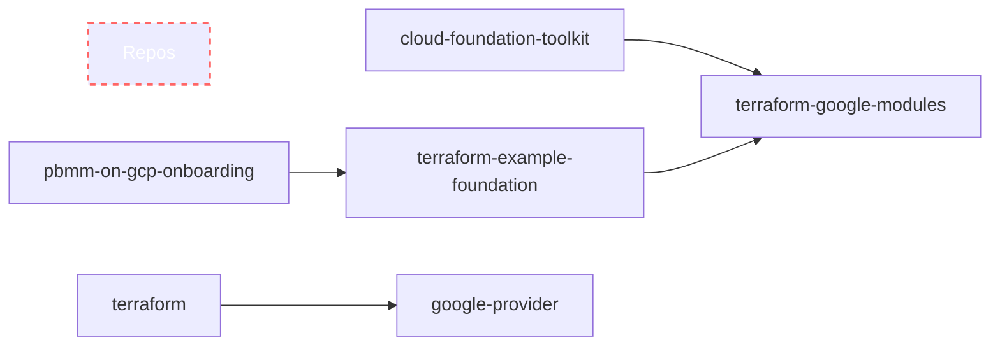

# Architecture
Tracking Issue [377](https://github.com/GoogleCloudPlatform/pbmm-on-gcp-onboarding/issues/377)
The Public Sector Secure PBMM Landing Zone is a collection of modules that is a copy of the Security Foundations Blueprint - Terraform Example Foundation that together deploys a configurable set of production, non-production and development Shared VPCs around 1 or more business units.
- https://cloud.google.com/architecture/security-foundations/printable
- https://github.com/terraform-google-modules/terraform-example-foundation

## Design Considerations
### Hub and Spoke
We are moving with the Hub and Spoke model with network appliances. See the following architectural review page https://cloud.google.com/architecture/landing-zones/decide-network-design#option-2, also see the TEF architecture page on [3-networks-hub-and-spoke](https://github.com/GoogleCloudPlatform/pbmm-on-gcp-onboarding/tree/main/3-networks-hub-and-spoke) via https://cloud.google.com/architecture/security-foundations/printable#hub-spoke-network-topology
See the GoC direction document for profile 1-6 https://wiki.gccollab.ca/images/7/75/GC_Cloud_Connection_Patterns.pdf - page 18/19 or https://wiki.gccollab.ca/images/9/9d/Network_Security_Zoning_Reference_Architecture.pdf
See also https://cloud.google.com/architecture/configure-networks-fedramp-dod-google-cloud


## Inventory
see https://github.com/GoogleCloudPlatform/pbmm-on-gcp-onboarding/wiki/Asset-Inventory

## Dependencies

## Micro-segmentation
There are two classifications in the LZ - restricted and base.
There are three environments - development, non-production, production.
There are two networking models - dual svpc (isolated environments) or hub-and-spoke (shared environments through NVA vms in the hub)


## High Level Diagram - Default 3-networks-hub-and-spoke

This diagram is [3-netoworks-hub-and-spoke](https://github.com/GoogleCloudPlatform/pbmm-on-gcp-onboarding/tree/main/3-networks-hub-and-spoke) centered - not [3-dual-svpc](https://github.com/GoogleCloudPlatform/pbmm-on-gcp-onboarding/tree/main/3-networks-dual-svpc)
At this point we will manage east-west traffic through the ngfw in the hub.

### Architecture example around hub-spoke pattern
Options set are
- CSR and Cloud Build
- default 0-bootstrap
- default 1-org
- default 2-environments
- specific 3-networks-hub-and-spoke
- default 4-projects
### High Level Diagram - Development environment only


### High Level Diagram - All dev/nonprod/prod environments

## Low Level Diagram - Default


follow
```
serviceusage.Service,559
compute.Route,141
iam.ServiceAccount,108
logging.LogSink,78
logging.LogBucket,75
cloudbilling.ProjectBillingInfo,51
cloudresourcemanager.Project,51
compute.Project,49
compute.Subnetwork,39
compute.Address,38
dns.ManagedZone,33
storage.Bucket,29
orgpolicy.Policy,19
cloudbuild.BuildTrigger,15
compute.FirewallPolicy,15
compute.Network,14
compute.Router,12
cloudresourcemanager.Folder,11
dns.Policy,10
compute.ForwardingRule,8
iam.ServiceAccountKey,8
servicedirectory.Endpoint,8
servicedirectory.Namespace,8
servicedirectory.Service,8
identity.ServicePerimeter,7
cloudkms.CryptoKey,6
cloudkms.CryptoKeyVersion,6
cloudkms.KeyRing,6
cloudresourcemanager.TagValue,4
identity.AccessLevel,4
artifactregistry.DockerImage,3
pubsub.Subscription,3
pubsub.Topic,3
artifactregistry.Repository,2
bigquery.Dataset,2
bigquery.Table,1
cloudbilling.BillingAccount,1
cloudbuild.WorkerPool,1
cloudfunctions.Function,1
cloudresourcemanager.Organization,1
cloudresourcemanager.TagKey,1
compute.Firewall,1
eventarc.Trigger,1
identity.AccessPolicy,1
run.Revision,1
run.Service,1
workflows.Workflow,1
```

## Architecture Extensions and Customization


## Repositories Structure
- CFT provides modules as copies to terraform-google-modules
- terraform-example-foundation references terraform-google-modules
- terraform executable references google-provider


[mermaid - diagrams as code](https://mermaid-js.github.io/mermaid/#/flowchart?id=graph)


### Fortinet NGFW
- https://github.com/GoogleCloudPlatform/pbmm-on-gcp-onboarding/issues/389

### Google Cloud NGFW
- https://github.com/GoogleCloudPlatform/pbmm-on-gcp-onboarding/issues/396
- Video on Google NGFW from Ryan https://www.youtube.com/watch?v=OCqnf2E6zn0
- https://cloud.google.com/blog/products/identity-security/introducing-google-cloud-firewall-plus-with-intrusion-prevention

### Repos of Interest
- https://github.com/terraform-google-modules/terraform-google-network/tree/master/modules/network-firewall-policy
- https://github.com/hashicorp/terraform-provider-google/issues/17030

## Landing Zone Documentation
- TEF V1 - https://cloud.google.com/blog/products/devops-sre/using-the-cloud-foundation-toolkit-with-terraform

## Links
- https://www.theregister.com/2024/01/12/first_asiapacific_to_south_america/
- https://cloud.google.com/architecture/best-practices-vpc-design#connecting_multiple_networks

