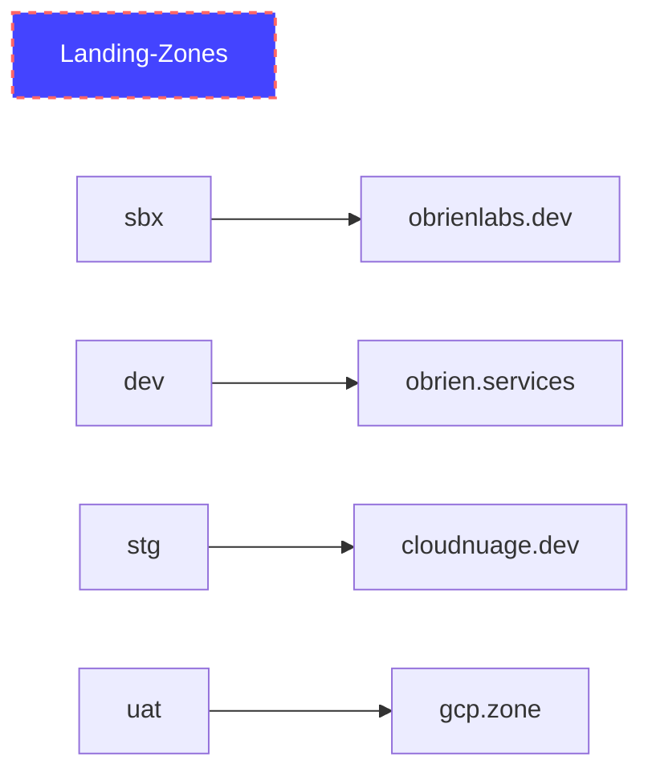

# PBMM Landing Zone - Architecture
## Purpose
Create a PBMM secure landing zone for the Google Cloud Environment. 

## Requirements
### R1: L7 Packet Inspection required
### R2: Workload separation
### R3: Centralized IP spece management

## Design Issues
The design of the landing zone follows GCP best practices and architecture principles at the following references.

- https://cloud.google.com/architecture/landing-zones
- https://cloud.google.com/architecture/framework
- 
### Decide on Shared VPC or Hub-and-spoke Network Topologies
The requirements of the landing zone involve a managed IP space and use of L7 packet inspection - which leans more towards use of Shared VPC's for each dev/stg/uat/prod environment.   See decision references in https://cloud.google.com/architecture/landing-zones/decide-network-design

https://cloud.google.com/architecture/best-practices-vpc-design#multi-nic

## Overview

## Onboarding

## Installation

## Updates

## Post Install Day 1 Operations

This is a work in progress from 20220731.

## Diagrams

### CI/CD Pipelines

### High Level Network Diagram

### Low Level Network Diagram 
20220802 - integrating Fortigate HA-active-passive https://github.com/fortinetsolutions/terraform-modules/tree/master/GCP/examples/ha-active-passive-lb-sandwich

### Landing Zone Dev Instances
The following environments are used for landing zone development. 
- A console/api sbx environment to work out the architecture and artifacts
- A dev environment to work out the deployment automation code
- A stg environment to dev-trigger deployments prior to PR merging
- a uat environment to keep a CI/CD repository triggered environment up that doubles for client demos 

