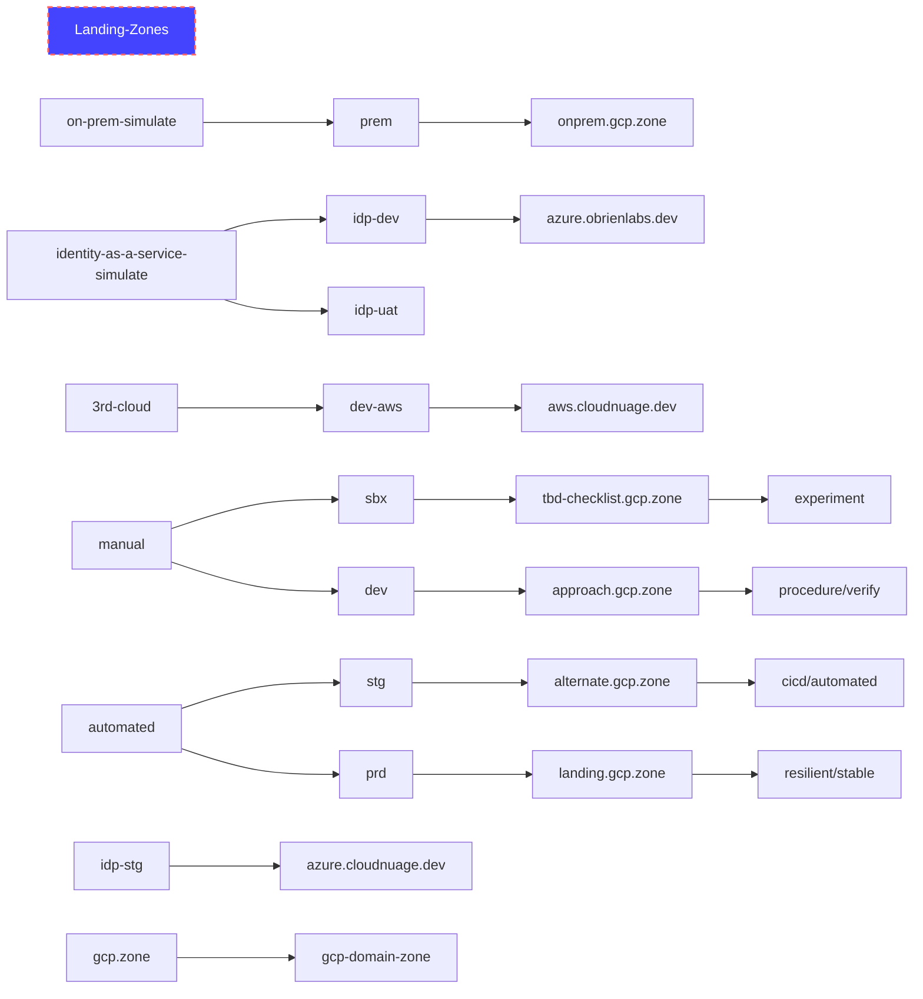

# Deployment Examples

## Environments

### GCP Organizations

ID | Domain | Domain CSP | C CSP | Identity | sa | Phone | MFA | Credits | Use | Quotas
---|---|---|---|---|---|---|---|---|---|---
1 | gcp.obrien.services | AWS | GCP | Identity | m | oldev | | 0618 | LZ 0323 | 10 proj
2 | _gcp.obrienlabs.info_ | AWS | GCP | Identity | r | | | 1102 | empty |
3 | obrien.systems | | GCP | | | | | | |
4 | containerized.org | | GCP | WS | m | | | | LZ |
6 | _clouddevops.dev_ | | GCP | WS | m | | | 0716 | mostly empty |
9 | eventstream.dev| | GCP | Identity | m | | | - | very empty |
10 | _gcp.gcloud.network_ | | GCP | identity | ad-s | | | | very empty |
12 | ***cloudnuage.dev*** | | GCP | WS | r/m | | | 0902 | LZ june |
13 | ***nuage-cloud.org*** | | GCP | WS | a-r | | | 0904 | empty - with gcp.zone | 2 billing
15 | _eventfield.io_ | AWS | GCP | | m | | | 0 | empty |
16 | ***gcp.zone*** | | GCP | WS | m | | | 1104 | LZ manual - with n-c.org |
17 | ***landing.gcp.zone*** | | GCP | | m | | | 1113 | LZ automated CD - with n-c.org |

### Microsoft Azure Active Directory Accounts
- under mi*ol.dev - https://portal.azure.com/#view/Microsoft_AAD_UsersAndTenants/UserManagementMenuBlade/~/AllUsers

## References
- Simulated workloads - https://github.com/GoogleCloudPlatform/pbmm-on-gcp-onboarding/issues/82
- Deployment Environments - https://github.com/GoogleCloudPlatform/pbmm-on-gcp-onboarding/issues/155
- ADFS Identity Federation - https://github.com/GoogleCloudPlatform/pbmm-on-gcp-onboarding/issues/99
