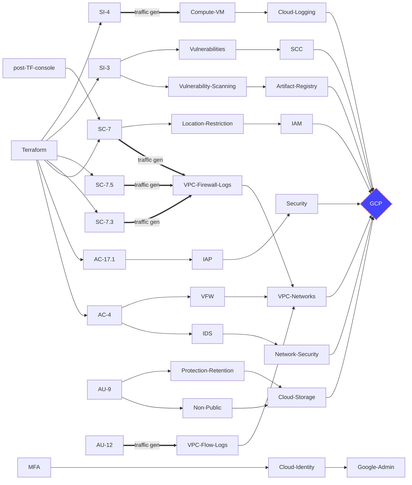
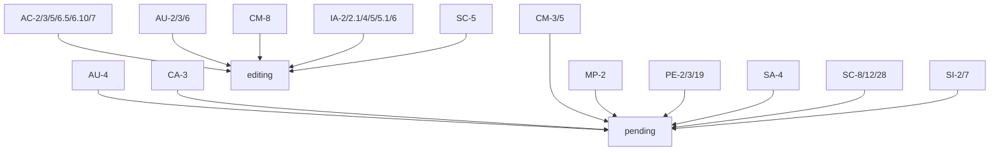

# Security Controls Mappings
## Controls Coverage




[mermaid - diagrams as code](https://mermaid-js.github.io/mermaid/#/flowchart?id=graph)

## P1 Security Controls
- See P1 list italic diff of 77 in https://cyber.gc.ca/sites/default/files/cyber/publications/itsg33-ann4a-1-eng.pdf
- The current **P1 list of 60 security controls** is highlighted below including those in bold=internal and italics=ITSG-33 (2015)
```
AC-2/2.1/3/4/5/6/6.5/6.10/7/19
AT-3
AU-2/3/6/8/9/9.4/12
CA-3
CM-2/3/4/5/8
IA-2/2.1/2.2/4/5/5.1/5.6/5.7/5.13/6/8
IR-6
MP-2
PE-3/19
PS-6
RA-5
SA-4/8
SC-5/7/7.3/7.5/8/8.1/12(p2?)13/17/26/28/28.1
SI-2/3/3.7/4/7

added SC-13 (from ds+tbs 202012)
added AC-12,AT-3,IR-6,PS-6,RA-5,SA-8,SC-26 (from ds 202012)
added PE-3/19,SC-101 (from ds 202012 sub-optimal)
added IA-2.2/2.11/5.7/5.13/8,SC-8.1/17/28.1,SI-3.7 (from tbs 202012)
removed AC-17.1,AU-4,CM-7.5,SI-8 (from tbs 202012)
IA-5.6 listed as P2 in https://cyber.gc.ca/sites/default/files/cyber/publications/itsg33-ann4a-1-eng.pdf
```

 `Category` | `Controls 42 plain 82 bold - 97/italic  ` 
 --- | ---  
AC | [AC-2](#0020ac-2account-management) **[AC-2.1](#0030ac-21account-management--automated-system-account-management)** [AC-3](#0110ac-3access-enforcement) [AC-4](#0120ac-4information-flow-enforcement) [AC-5](#0140ac-5separation-of-duties) **[AC-6](#0150ac-6least-privilege)** [AC-6(5)](#0180ac-65least-privilege--privileged-accounts) **[AC-6(10)](#0200ac-610least-privilege--prohibit-non-privileged-users-from-executing-privileged-functions)** [AC-7](#0210ac-7unsuccessful-logon-attempts)  [AC-17(1)](#0290ac-171remote-access--automated-monitoring--control) **[AC-19](#0380ac-19access-control-for-mobile-devices)** : _AC-1_  _AC-3(7)_ _AC-3(9)_ _AC-3(10)_ _AC-4(4)_ _AC-4(12) AC-4(13) AC-4(14) AC-4(15)_   _AC-8_ **AC-9** **AC-17** **AC-18** _AC-18(5)_  _AC-19(4)_ **AC-20.3** **AC-22**
AT | _AT-1_ **AT-2** _AT-2(2)_ **AT-3**
AU | _AU-1_ [AU-2](#0500au-2audit-events) [AU-3](#0520au-3content-of-audit-records) [AU-4](#0545au-4audit-storage-capacity) _AU-4(1)_ [AU-6](#0580au-6audit-review-analysis-and-reporting) **AU-8** **AU-8.9** _[AU-9](#0700au-9protection-of-audit-information)_ **AU-9.4** [AU-12](#0740au-12audit-generation) 
CA | _CA-1_ _CA-2(1)_ [CA-3](#0800ca-3system-interconnections) _CA-3(2)_ _CA-3(3)_ _CA-3(4)_ _CA-6_ _CA-7(1)_
CM | _CM-1_ [CM-2](#0930cm-2baseline-configuration) _CM-2(7)_ [CM-3](#0980cm-3configuration-change-control) **CM-4** [CM-5](#1030cm-5access-restrictions-for-change) **CM-6** CM-7 _[CM-7(5)](#1130cm-75least-functionality--authorized-software--whitelisting)_ [CM-8](#1140cm-8information-system-component-inventory) CM-9
CP | _CP-1_ **CP-9**
IA | _IA-1_ [IA-2](#2100ia-2identification-and-authentication-organizational-users) [IA-2(1)](#2110ia-21identification-and-authentication-organizational-users--network-access-to-privileged-accounts) **IA-2.2** **IA-2.11** **IA-3** [IA-4](#2200ia-4identifier-management) [IA-5](2240ia-5authenticator-management) **[IA-5(1)](#2250ia-51authenticator-management--password-based-authentication)** **IA-5.6** **IA-5.7** **IA-5.13** [IA-6](#2360ia-6authenticator-feedback) **IA-8**
IR | _IR-1_ **IR-9**
MA | _MA-1_ _MA-3(3) MA-5(2)_
MP | _MP-1_ _[MP-2](#2780mp-2media-access)_ MP-3 **MP-4** _MP-5 MP-5(3)_ _MP-8_ _MP-8(3) MP-8(4)_
PE | _PE-1_ PE-2 _PE-2(3)_ _PE-2(100)_ PE-3 _PE-4 PE-6 PE-6(2) PE-6(3) PE-6(4) PE-8 PE-16 PE-18 PE-18(1)_ PE-19 _PE-20_
PL | _PL-1_ **PL-2** **PL-4** _PL-7 PL-8 PL-8(1) PL-8(2)_
PS | _PS-1_ _PS-3_ _PS-3(1) PS-3(2)_ **PS-4** **PS-5** **PS-6** _PS-6(2)_ **PS-7**
RA | _RA-1_ **RA-2** **RA-3**
SA | _SA-1_ [SA-4](#6020sa-4acquisition-process) SA-4(2) _SA-4(6) SA-4(7) **SA-8** SA-9_ **SA-22**
SC | _SC-1_ **SC-2** [SC-5](#6240sc-5denial-of-service-protection) [SC-7](#6260sc-7boundary-protection) [SC-7(3)](#6270sc-73boundary-protection--access-points) [SC-7(5)](#6290sc-75boundary-protection--deny-by-default--allow-by-exception) _SC-7(8) SC-7(14)_ [SC-8](#6350sc-8transmission-confidentiality-and-integrity) **SC-8.1** **[SC-12(p2)](#6380sc-12cryptographic-key-establishment-and-management)** _SC-12(2) SC-12(3) **SC-17** SC-18_ SC-23 _SC-24_ [SC-28](#6540sc-28protection-of-information-at-rest) **SC-28.1** _SC-43 SC-101_
SI | _SI-1_ [SI-2](#6580si-2flaw-remediation) [SI-3](#6610si-3malicious-code-protection) **SI-3.7** [SI-4](#6650si-4information-system-monitoring) **SI-5** [SI-7](#6780si-7software-firmware-and-information-integrity) [SI-8](#6810si-8spam-protection)

TBS specific:
```
AC-2.1/5/6.5/6.10/7/9/19/20.3
AU-8/9/9.4/12
CM-3/4/5/8
IA-2.1/2.2/2.11/4/5.1/5.6/5.7/5.13/6/8
SA-22
SC-5/7.5/8/8.1/12(p3?)/17/28/28.1
SI-3.7
```
ITSG-33 site only
```
CM-7/7.5
CP-1/9
```

## Controls to GCP Services Mappings : 1:N
 
`Control` | `Services` 
--- | ---   
[AC-2](#0020ac-2account-management) | _5310_vm_ssh_login_start_towards_root_denied, _5311_vm_ssh_login_non_root_ssh_dynamic_key_transfer_approved, _5312_vm_ssh_login_non_root_approved, _5910_mfa_on_super_admin_account_before_setting_org_policy, _9951_google_admin_group_accounts

This diagram is being integrated into this page and will be removed

 
 
## GCP Service to Controls Mappings : 1:N

## Code To Controls Mappings : 1:N


## References
- SCED (SC2G) connection patterns - slide 18/19 for cloud profiles 1 to 6 https://wiki.gccollab.ca/images/7/75/GC_Cloud_Connection_Patterns.pdf
- CCCS PBMM ITSG-33 Annex 4A Profile 1 https://cyber.gc.ca/sites/default/files/cyber/publications/itsg33-ann4a-1-eng.pdf from https://cyber.gc.ca/en/guidance/annex-4a-profile-1-protected-b-medium-integrity-medium-availability-itsg-33


## Guardrails Subset


 `Guardrails` | `Controls` 
 --- | ---   
GR 1 | [AC-2](#0020ac-2account-management) 
GR 2 | [AC-2](#0020ac-2account-management) 
GR 3 | [AC-2](#0020ac-2account-management) 
GR 4 | [AC-2](#0020ac-2account-management) 


# Individual Security Controls

## legend
## pk,control id,phase 1,phase 2, service name, service link, service evidence,code link, future, control link, title 

## 0010,AC-1,,,,,,,,,Access Control Policy and Procedures

## 0020,AC-2,,,,,,,,,Account Management
P1 :

_5311_vm_ssh_login_non_root_ssh_dynamic_key_transfer_approved

### Definition: cloud identity super-admin root account with additional least-priv subaccounts

### Services: MFA, IAM roles/accounts - IAM Roles (org admin, billing admin, project admin, project billing admin), Identity Super Admin Role, ssh access, MFA on the identity account with optional AD federation

Admin Group Account, Password Policy, Access Logs Event Logging, MFA, IAM Essential Contacts

### Related Controls: AC‑2, AC‑2(1), AC‑3, AC‑5, AC‑6, AC‑6(5), AC‑6(10), AC‑7, AC‑9, AC‑19, AC‑20(3), IA‑2, IA‑2(1), IA‑2(2), IA‑2(11), IA‑4, IA‑5, IA‑5(1), IA‑5(6), IA‑5(7), IA‑5(13), IA‑6, IA‑8

### Violations
- L: Cloud Audit Logging should be configured properly across all services and all users from a project
- H: Cloud Storage buckets should not be anonymously or publicly accessible
- H: Datasets should not be publicly accessible by anyone on the internet


## 0030,AC-2(1),,,,,,,,,Account Management | Automated System Account Management
P2 : TBS

_5080_terraform_service_account_project_level
_5081_terraform_service_account_org_level

IAM Policy Analyser

## 0040,AC-2(2),,,,,,,,,Account Management | Removal of Temporary / Emergency Accounts

## 0050,AC-2(3),,,,,,,,,Account Management | Disable Inactive Accounts

## 0060,AC-2(4),,,,,,,,,Account Management | Automated Audit Actions

## 0070,AC-2(5),,,,,,,,,Account Management | Inactivity Logout

## 0080,AC-2(7),,,,,,,,,Account Management | Role-Based Schemes

## 0090,AC-2(9),,,,,,,,,Account Management | Restrictions on Use of Shared Groups / Accounts

## 0100,AC-2(10),,,,,,,,,Account Management | Shared / Group Account Credential Termination

## 0110,AC-3,,,,,,,,,Access Enforcement
P1

### Violations
- H: Corporate login credentials should be used instead of Gmail accounts
- H: No Root: MySQL database instance should not allow anyone to connect with administrative privileges.


### Definition:

### Services:  MFA, IAM roles/accounts, Cloud Identity/Federation 

### Related Controls: AC-2

_5810_iam_project_roles_audit_project


## 0120,AC-4,,,,,,,,,Information Flow Enforcement
P1

### Definition: VPC Perimeter + VPC firewall rules,  (WAF) or 

### Services: VPC firewall, Network Security - IDS

GCP Services Coverage:
 - [VPC - VPC Networks - Firewall Rules](#vpc---vpc-networks---firewall-rules)
 - [Network Security - Cloud IDS](#network-security---cloud-ids)


_5062_cloud_asset_inventory_prod_proj_firewall

_5063_cloud_asset_inventory_prod_proj_firewall_change_history


## 0130,AC-4(21),,,,,,,,,Information Flow Enforcement | Physical / Logical Separation of Information Flows

## 0140,AC-5,,,,,,,,,Separation of Duties
P1

### Violations
- M: Separation of duties should be enforced while assigning KMS related roles to users
- M: Separation of duties should be enforced while assigning service account related roles to users
    

### Definition:

### Services: MFA, IAM roles/accounts 


## 0150,AC-6,,,,,,,,,Least Privilege

### Violations
- M: Instances should not be configured to use the default service account with full access to all Cloud APIs
- M: Users should not have "Owner" permissions on a project that has cryptographic keys
- M: Default Service account should not used for Project access in Kubernetes Clusters
- M: The iam.serviceAccountUser and iam.serviceAccountTokenCreator roles should not be assigned to a user at the project level
- M: Primitive/Basic roles (Owner, Writer, Reader) are too permissive and should not be used


## 0160,AC-6(1),,,,,,,,,Least Privilege | Authorize Access to Security Functions

## 0170,AC-6(2),,,,,,,,,Least Privilege | Non-Privileged Access for Non-Security Functions

## 0180,AC-6(5),,,,,,,,,Least Privilege | Privileged Accounts
P1

### Definition:

### Services:  MFA, IAM roles/accounts


## 0190,AC-6(9),,,,,,,,,Least Privilege | Auditing Use of Privileged Functions

## 0200,AC-6(10),,,,,,,,,Least Privilege | Prohibit Non-Privileged Users from Executing Privileged Functions
P1

### Definition:

### Services:   MFA, IAM roles/accounts, Cloud Identity/Federation 


## 0210,AC-7,,,,,,,,,Unsuccessful Logon Attempts
P1

### Definition:

### Services: MFA, IAM roles/accounts, Cloud Identity/Federation 


## 0220,AC-8,,,,,,,,,System Use Notification

## 0230,AC-10,,,,,,,,,Concurrent Session Control

## 0240,AC-11,,,,,,,,,Session Lock

## 0250,AC-11(1),,,,,,,,,Session Lock | Pattern-Hiding Displays

## 0260,AC-12,,,,,,,,,Session Termination

## 0270,AC-14,,,,,,,,,Permitted Actions without Identification or Authentication

## 0280,AC-17,,,,,,,,,Remote Access
P1 :

## 0290,AC-17(1),,,,,,,,,Remote Access | Automated Monitoring / Control
P2 : 

### Definition: 

### Services: SSH, IAP

GCP Services Coverage:
 - [Security - Identity Aware Proxy](#security---identity-aware-proxy)


## 0300,AC-17(2),,,,,,,,,Remote Access | Protection of Confidentiality / Integrity using Encryption

## 0310,AC-17(3),,,,,,,,,Remote Access | Managed Access Control Points

## 0320,AC-17(4),,,,,,,,,Remote Access | Privileged Commands / Access

## 0330,AC-17(9),,,,,,,,,Remote Access | Disconnect / Disable Access

## 0340,AC-17(100),,,,,,,,,Remote Access | Remote Access to Privileged Accounts using Dedicated Management Console

## 0350,AC-18,,,,,,,,,Wireless Access

## 0360,AC-18(1),,,,,,,,,Wireless Access | Authentication and Encryption

## 0370,AC-18(4),,,,,,,,,Wireless Access | Restrict Configurations by Users

## 0380,AC-19,,,,,,,,,Access Control for Mobile Devices
P1 :

## 0390,AC-20,,,,,,,,,Use of External Information Systems

## 0400,AC-20(1),,,,,,,,,Use of External Information Systems | Limits of Authorized Use

## 0410,AC-20(2),,,,,,,,,Use of External Information Systems | Portable Storage Devices

## 0420,AC-21,,,,,,,,,Information Sharing

## 0430,AC-22,,,,,,,,,Publicly Accessible Content

## 0440,AT-1,,,,,,,,,Security Awareness and Training Policy and Procedures

## 0450,AT-2,,,,,,,,,Security Awareness Training

## 0460,AT-2(2),,,,,,,,,Security Awareness Training | Insider Threat

## 0470,AT-3,,,,,,,,,Role-Based Security Training
P1 : 

## 0480,AT-4,,,,,,,,,Security Training Records

## 0490,AU-1,,,,,,,,,Audit and Accountability Policy and Procedures

## 0500,AU-2,,,,,,,,,Audit Events
P1 : 

### Violations
- L: Cloud Audit Logging should be configured properly across all services and all users from a project

### Definition:

### Services: Monitoring, Metrics, Log Sinks, IAM audit roles/group

_6820_monitoring_4_dashboard_vms_2

_7322_alerting-log-explorer-log-based-alert


## 0510,AU-2(3),,,,,,,,,Audit Events | Reviews and Updates

## 0520,AU-3,,,,,,,,,Content of Audit Records
P1 : 

### Definition:

### Services: see AU-3


## 0530,AU-3(1),,,,,,,,,Content of Audit Records | Additional Audit Information

## 0540,AU-3(2),,,,,,,,,

_1300_cloud_bigquery_audit_project_enabled


## 0545,AU-4,,,,,,,,,Audit Storage Capacity
P1 : 

### Definition:

### Services:

_9511_cloud_storage_classes_audit_bucket_for_au-4


## 0550,AU-5,,,,,,,,,Response to Audit Processing Failures

## 0560,AU-5(1),,,,,,,,,

## 0570,AU-5(2),,,,,,,,,

## 0580,AU-6,,,,,,,,,Audit Review, Analysis, and Reporting
P1 : 

### Definition:

### Services: BigQuery

_1300_cloud_bigquery_audit_project_enabled

## 0590,AU-6(1),,,,,,,,,Audit Review, Analysis, and Reporting | Process Integration

## 0600,AU-6(3),,,,,,,,,Audit Review, Analysis, and Reporting | Correlate Audit Repositories

## 0610,AU-6(4),,,,,,,,,

## 0620,AU-6(5),,,,,,,,,

_5812_iam_org_roles_least_priv_super_admin_account

## 0630,AU-6(6),,,,,,,,,

## 0640,AU-6(7),,,,,,,,,

## 0650,AU-6(10),,,,,,,,,

## 0660,AU-7,,,,,,,,,Audit Reduction and Report Generation

## 0670,AU-7(1),,,,,,,,,Audit Reduction and Report Generation | Automatic Processing

## 0680,AU-8,,,,,,,,,Time Stamps
P1 : 

## 0690,AU-8(1),,,,,,,,,Time Stamps | Synchronization with Authoritative Time Sourcs

## 0700,AU-9,,,,,,,,,Protection of Audit Information
P2 : 

GCP Services Coverage:
 - [Cloud Storage - Cloud Storage Bucket Not Public](#cloud-storage---cloud-storage-bucket-not-public)
 - [Cloud Storage - Cloud Storage Bucket Protection Retention 1 sec](#cloud-storage---cloud-storage-bucket-protection-retention-1-sec)


### Violations
- H: Storage buckets used as log sinks should not be publicly accessible

## 0710,AU-9(2),,,,,,,,,Protection of Audit Information | Audit Backup on Separate Physical Systems / Components

## 0720,AU-9(4),,,,,,,,,Protection of Audit Information | Access by Subset of Privileged Users
P2 : 

## 0730,AU-11,,,,,,,,,Audit Record Retention

## 0740,AU-12,,,,,,,,,Audit Generation
P1 : 

VPC Flow logs

### Definition:

### Services: Log Sinks

_7382_operations_log_router_syncs_default_prod


## 0750,CA-1,,,,,,,,,Security Assessment and Authorization Policies and Procedures

## 0760,CA-2,,,,,,,,,Security Assessments

## 0770,CA-2(1),,,,,,,,,Security Assessments | Independent Assessors

## 0780,CA-2(2),,,,,,,,,Security Assessments | Specialized Assessments

## 0790,CA-2(3),,,,,,,,,Security Assessments | External Organizations

## 0800,CA-3,,,,,,,,,System Interconnections
P1 :  

### Definition:

### Services: 

## 0810,CA-3(3),,,,,,,,,System Interconnections | Classified Non-National Security System Connections

## 0820,CA-3(5),,,,,,,,,System Interconnections | Restrictions on External Network Connections

## 0830,CA-5,,,,,,,,,Plan of Action and Milestones

## 0840,CA-6,,,,,,,,,Security Authorization

## 0850,CA-6(1),,,,,,,,,

## 0860,CA-7,,,,,,,,,Continuous Monitoring

## 0870,CA-7(1),,,,,,,,,Continuous Monitoring | Independent Assessment

## 0880,CA-7(3),,,,,,,,,

## 0890,CA-8,,,,,,,,,Penetration  Testing

## 0900,CA-8(1),,,,,,,,,Penetration  Testing | Independent Penetration Testing Agent for Team

## 0910,CA-9,,,,,,,,,Internal System Connections

## 0920,CM-1,,,,,,,,,Configuration Management Policy and Procedures

## 0930,CM-2,,,,,,,,,Baseline Configuration
P1 : 

### Definition:

### Services: Marketplace

### Related Controls: CM-2 CM-3 CM-4 CM-5 CM-8 SA-22


## 0940,CM-2(1),,,,,,,,,Baseline Configuration | Reviews and Updates

## 0950,CM-2(2),,,,,,,,,Baseline Configuration | Automation Support for Accuracy / Currency

## 0960,CM-2(3),,,,,,,,,Baseline Configuration | Retention of Previous  Configurations

## 0970,CM-2(7),,,,,,,,,"Baseline Configuration | Configure Systems, Components, or Devices for High-Risk Areas"

## 0980,CM-3,,,,,,,,,Configuration Change Control
P1 : 

### Definition:

### Services: 

### Related Controls: CM-2 CM-3 CM-4 CM-5 CM-8 SA-22

## 0990,CM-3(1),,,,,,,,,

## 1000,CM-3(4),,,,,,,,,Configuration Change Control | Security Representative

## 1010,CM-3(6),,,,,,,,,Configuration Change Control | Cryptography Management

## 1020,CM-4,,,,,,,,,Security Impact Analysis
P3 : 

### Related Controls: CM-2 CM-3 CM-4 CM-5 CM-8 SA-22

## 1030,CM-5,,,,,,,,,Access Restrictions for Change
P1 : 

_5650_resource_manager_org_level

### Definition:

### Services: 

### Related Controls: CM-2 CM-3 CM-4 CM-5 CM-8 SA-22

## 1040,CM-5(1),,,,,,,,,Access Restrictions for Change | Automated Access Enforcement / Auditing

## 1050,CM-5(3),,,,,,,,,

## 1060,CM-5(5),,,,,,,,,Access Restrictions for Change | Limit Production / Operational Privileges

## 1080,CM-5(6),,,,,,,,,Access Restrictions for Change | Limit Library Privileges

## 1080,CM-6,,,,,,,,,Configuration Settings

## 1090,CM-6(1),,,,,,,,,Configuration Settings | Automated Central Management / Application / Verification

## 1100,CM-6(2),,,,,,,,,Configuration Settings | Respond to Unauthorized Changes

## 1110,CM-7,,,,,,,,,Least Functionality
P1 : ITSG-33

## 1120,CM-7(1),,,,,,,,,Least Functionality | Periodic Review

## 1130,CM-7(5),,,,,,,,,Least Functionality | Authorized Software / Whitelisting
P1 : ITSG-33

### Definition:

### Services: 

## 1140,CM-8,,,,,,,,,Information System Component Inventory
P1 : 

_5052_cloud_asset_inventory_nonprod_default
_5053_cloud_asset_inventory_nonprod_full_36_assets

### Definition:

### Services: 

Cloud Asset Inventory

### Related Controls: CM-2 CM-3 CM-4 CM-5 CM-8 SA-22

_5052_cloud_asset_inventory_nonprod_default

_5053_cloud_asset_inventory_nonprod_full_36_assets

_5054_cloud_asset_inventory_nonprod_guardrails_on_obrien_services

_5056_cloud_asset_inventory_prod_perimeter_31

_6702_marketplace_unrestricted_to_goc

_6704_marketplace_user_limited_access_via_denied_billing

_6704_marketplace_user_limited_access_via_denied_billing

_8504_security_command_center_standard_assets


## 1150,CM-8(1),,,,,,,,,Information System Component Inventory | Updates During Installations  / Removals

## 1160,CM-8(2),,,,,,,,,Information System Component Inventory | Automated Maintenance

## 1170,CM-8(3),,,,,,,,,Information System Component Inventory | Automated Unauthorized Component Detection

## 1180,CM-8(5),,,,,,,,,Information System Component Inventory | No Duplicate Accounting of Components

## 1190,CM-9,,,,,,,,,Configuration Management Plan
P1 : ITSG-33

## 1200,CM-10,,,,,,,,,Software Usage Restrictions

## 1210,CM-10(1),,,,,,,,,Software Usage Restrictions | Open Source Software

## 1220,CM-11,,,,,,,,,User-Installed Software

## 1230,CP-1,,,,,,,,,Contingency Planning Policy and Procedures
P1 : ITSG-33

## 1240,CP-2,,,,,,,,,Contingency Plan

## 1250,CP-2(1),,,,,,,,,Contingency Plan | Coordinate with Related Plans

## 1260,CP-2(2),,,,,,,,,Contingency Plan | Capacity Planning

## 1270,CP-2(3),,,,,,,,,Contingency Plan | Resume Essential Missions / Business Functions

## 1280,CP-2(4),,,,,,,,,Contingency Plan | Resume All Missions / Business Functions

## 1290,CP-2(5),,,,,,,,,Contingency Plan | Continue Essential Missions / Business Functions

## 1300,CP-2(6),,,,,,,,,Contingency Plan | Alternate Processing / Storage Site

## 1310,CP-2(8),,,,,,,,,Contingency Plan | Identify Critical Assets

## 1320,CP-3,,,,,,,,,Contingency Training

## 1330,CP-4,,,,,,,,,Contingency Plan Testing

## 1340,CP-4(1),,,,,,,,,Contingency Plan Testing | Coordinate with Related Plans

## 1350,CP-4(2),,,,,,,,,Contingency Plan Testing | Alternate Processing Site

## 1360,CP-6,,,,,,,,,Alternate Storage Site

## 1370,CP-6(1),,,,,,,,,Alternate Storage Site | Separation from Primary Site

## 1380,CP-6(2),,,,,,,,,Alternate Storage Site | Recovery Times / Point Objectives

## 1390,CP-6(3),,,,,,,,,Alternate Storage Site | Accessibility

## 1400,CP-7,,,,,,,,,Alternative Processing Site

## 1410,CP-7(1),,,,,,,,,Alternative Processing Site | Separation from Primary Site

## 1420,CP-7(2),,,,,,,,,Alternative Processing Site | Accessibility

## 1430,CP-7(3),,,,,,,,,Alternative Processing Site | Priority of Service

## 1440,CP-7(4),,,,,,,,,Alternative Processing Site | Preparation for Use

## 1450,CP-8,,,,,,,,,Telecommunications Services

## 1460,CP-8(1),,,,,,,,,Telecommunications Services | Priority of Service Provisions

## 1470,CP-8(2),,,,,,,,,Telecommunications Services | Single Points of Failure

## 1480,CP-8(3),,,,,,,,,Telecommunications Services | Separation of Primary / Alternate Providers

## 1490,CP-8(5),,,,,,,,,Telecommunications Services | Alternate Telecommunication Service Testing

## 1500,CP-9,,,,,,,,,Information System Backup

## 1510,CP-9(1),,,,,,,,,Information System Backup | Testing for Reliability / Integrity

## 1520,CP-9(2),,,,,,,,,Information System Backup | Test Restoration using Sampling

## 1530,CP-9(3),,,,,,,,,Information System Backup | Separate Storage for Critical Information

## 1540,CP-9(5),,,,,,,,,Information System Backup | Transfer to Alternate Storage Site

## 1550,CP-9(7),,,,,,,,,Information System Backup | Dual Authorization

## 1560,CP-10,,,,,,,,,Information System Recovery and Reconstitution

## 1570,CP-10(2),,,,,,,,,Information System Recovery and Reconstitution | Transaction Recovery

## 1580,CP-10(4),,,,,,,,,Information System Recovery and Reconstitution | Restore within Time Period

## 2090,IA-1,,,,,,,,,Identification and Authentication Policy and Procedures

## 2100,IA-2,,,,,,,,,Identification and Authentication (Organizational Users)
>Priority: P1

### Definition:

### Services:  MFA, IAM roles/accounts, Cloud Identity/Federation 

### Related Controls: AC‑2, AC‑2(1), AC‑3, AC‑5, AC‑6, AC‑6(5), AC‑6(10), AC‑7, AC‑9, AC‑19, AC‑20(3), IA‑2, IA‑2(1), IA‑2(2), IA‑2(11), IA‑4, IA‑5, IA‑5(1), IA‑5(6), IA‑5(7), IA‑5(13), IA‑6, IA‑8

## 2110,IA-2(1),,,,,,,,,Identification and Authentication (Organizational Users) | Network Access to Privileged Accounts
>Priority: P1

### Definition:

### Services:  MFA, IAM roles/accounts, Cloud Identity/Federation 

### Related Controls: AC‑2, AC‑2(1), AC‑3, AC‑5, AC‑6, AC‑6(5), AC‑6(10), AC‑7, AC‑9, AC‑19, AC‑20(3), IA‑2, IA‑2(1), IA‑2(2), IA‑2(11), IA‑4, IA‑5, IA‑5(1), IA‑5(6), IA‑5(7), IA‑5(13), IA‑6, IA‑8

## 2120,IA-2(2),,,,,,,,,


## 2130,IA-2(3),,,,,,,,,Identification and Authentication (Organizational Users) | Local Access to Privileged Accounts

## 2140,IA-2(4),,,,,,,,,

## 2150,IA-2(5),,,,,,,,,

## 2160,IA-2(6),,,,,,,,,Identification and Authentication (Organizational Users) | Network Access to Privileged Accounts - Separate Device

## 2170,IA-2(8),,,,,,,,,Identification and Authentication (Organizational Users) | Network Access to Privileged Accounts - Replay Resistant

## 2180,IA-2(11),,,,,,,,,Identification and Authentication (Organizational Users) | Remote Access  - Separate Device

## 2190,IA-3,,,,,,,,,Device Identification and Authentication

## 2200,IA-4,,,,,,,,,Identifier Management
>Priority: P1

### Definition:

### Services:  MFA, IAM roles/accounts, Cloud Identity/Federation 

### Related Controls: AC‑2, AC‑2(1), AC‑3, AC‑5, AC‑6, AC‑6(5), AC‑6(10), AC‑7, AC‑9, AC‑19, AC‑20(3), IA‑2, IA‑2(1), IA‑2(2), IA‑2(11), IA‑4, IA‑5, IA‑5(1), IA‑5(6), IA‑5(7), IA‑5(13), IA‑6, IA‑8

## 2210,IA-4(2),,,,,,,,,Identifier Management | Supervisor Authorization

## 2220,IA-4(3),,,,,,,,,Identifier Management | Multiple Forms of Certification

## 2230,IA-4(4),,,,,,,,,Identifier Management | Identify User Status

## 2240,IA-5,,,,,,,,,Authenticator Management
>Priority: P1

### Definition:

### Services:  MFA, IAM roles/accounts, Cloud Identity/Federation 

### Related Controls: AC‑2, AC‑2(1), AC‑3, AC‑5, AC‑6, AC‑6(5), AC‑6(10), AC‑7, AC‑9, AC‑19, AC‑20(3), IA‑2, IA‑2(1), IA‑2(2), IA‑2(11), IA‑4, IA‑5, IA‑5(1), IA‑5(6), IA‑5(7), IA‑5(13), IA‑6, IA‑8

## 2250,IA-5(1),,,,,,,,,Authenticator Management | Password-Based Authentication
>Priority: P1

### Definition:

### Services:  MFA, IAM roles/accounts, Cloud Identity/Federation 

### Related Controls: AC‑2, AC‑2(1), AC‑3, AC‑5, AC‑6, AC‑6(5), AC‑6(10), AC‑7, AC‑9, AC‑19, AC‑20(3), IA‑2, IA‑2(1), IA‑2(2), IA‑2(11), IA‑4, IA‑5, IA‑5(1), IA‑5(6), IA‑5(7), IA‑5(13), IA‑6, IA‑8

## 2260,IA-5(2),,,,,,,,,Authenticator Management | PKI-Based Authentication

## 2270,IA-5(3),,,,,,,,,Authenticator Management | In-Person or Trusted Third-Party Registration

## 2280,IA-5(4),,,,,,,,,Authenticator Management | Automated Support for Password Strength Determination

## 2290,IA-5(6),,,,,,,,,Authenticator Management | Protection of Authenticators

## 2300,IA-5(7),,,,,,,,,Authenticator Management | No Embedded Unencrypted Static Authenticators

## 2310,IA-5(8),,,,,,,,,Authenticator Management | Multiple Information System Accounts

## 2320,IA-5(11),,,,,,,,,Authenticator Management | Hardware Token-Based Authentication

## 2340,IA-5(13),,,,,,,,,

## 2350,IA-5(14),,,,,,,,,

## 2360,IA-6,,,,,,,,,Authenticator Feedback
>Priority: P1

### Definition:

### Services:  MFA, IAM roles/accounts, Cloud Identity/Federation 

### Related Controls: AC‑2, AC‑2(1), AC‑3, AC‑5, AC‑6, AC‑6(5), AC‑6(10), AC‑7, AC‑9, AC‑19, AC‑20(3), IA‑2, IA‑2(1), IA‑2(2), IA‑2(11), IA‑4, IA‑5, IA‑5(1), IA‑5(6), IA‑5(7), IA‑5(13), IA‑6, IA‑8

## 2370,IA-7,,,,,,,,,Cryptographic Module Authentication

## 2380,IA-8,,,,,,,,,Identification and Authentication (Non-Organizational Users)

## 2390,IR-1,,,,,,,,,Incident Response Policy and Procedures

## 2400,IR-2,,,,,,,,,Incident Response Training

## 2410,IR-3,,,,,,,,,Incident Response Testing

## 2420,IR-3(2),,,,,,,,,Incident Response Testing | Coordination with Related Plans

## 2430,IR-4,,,,,,,,,Incident Handling

## 2440,IR-4(1),,,,,,,,,Incident Handling | Automated Incident Handling Processes

## 2450,IR-4(3),,,,,,,,,Incident Handling | Continuity of Operations

## 2460,IR-4(6),,,,,,,,,

## 2470,IR-4(7),,,,,,,,,

## 2480,IR-4(8),,,,,,,,,

## 2490,IR-4(9),,,,,,,,,

## 2500,IR-5,,,,,,,,,Incident Monitoring

## 2510,IR-6,,,,,,,,,Incident Reporting

_1102_log_bucket_guardrails_audit_bucket

## 2520,IR-6(1),,,,,,,,,Incident Reporting | Automated Reporting

## 2530,IR-7,,,,,,,,,Incident Response Assistance

## 2540,IR-7(1),,,,,,,,,Incident Response Assistance | Automation Support for Availability of Information / Support

## 2550,IR-7(2),,,,,,,,,Incident Response Assistance | Coordination with External Providers

## 2560,IR-8,,,,,,,,,Incident Response Plan

## 2570,IR-9,,,,,,,,,Information Spillage Response

## 2580,IR-9(1),,,,,,,,,Information Spillage Response | Responsible Personnel

## 2590,IR-9(2),,,,,,,,,Information Spillage Response | Training

## 2600,IR-9(3),,,,,,,,,Information Spillage Response | Post-Spill Operations

## 2610,IR-9(4),,,,,,,,,Information Spillage Response | Exposure to Unauthorized Personnel

## 2620,MA-1,,,,,,,,,System Maintenance Policy and Procedures

## 2630,MA-2,,,,,,,,,Controlled Maintenance

## 2640,MA-3,,,,,,,,,Maintenance Tools

## 2650,MA-3(1),,,,,,,,,Maintenance Tools | Inspect Tools

## 2670,MA-3(2),,,,,,,,,Maintenance Tools | Inspect Media

## 2680,MA-3(3),,,,,,,,,Maintenance Tools | Prevent Unauthorized Removal

## 2690,MA-4,,,,,,,,,Nonlocal Maintenance

## 2700,MA-4(1),,,,,,,,,Nonlocal Maintenance | Auditing and Review

## 2710,MA-4(2),,,,,,,,,Nonlocal Maintenance | Document Nonlocal Maintenance

## 2720,MA-4(3),,,,,,,,,Nonlocal Maintenance | Comparable Security / Sanitization

## 2730,MA-4(6),,,,,,,,,Nonlocal Maintenance | Cryptographic Protection

## 2740,MA-5,,,,,,,,,Maintenance Personnel

## 2750,MA-5(1),,,,,,,,,Maintenance Personnel | Individuals without Appropriate Access

## 2760,MA-6,,,,,,,,,Timely Maintenance

## 2770,MP-1,,,,,,,,,Media Protection Policy and Procedures

## 2780,MP-2,,,,,,,,,Media Access
>Priority: P1 suboptimal

### Definition:

### Services: 

## 2790,MP-3,,,,,,,,,Media Marking

## 2800,MP-4,,,,,,,,,Media Storage

## 2810,MP-5,,,,,,,,,Media Transport

## 2820,MP-5(4),,,,,,,,,Media Transport | Cryptographic Protection

## 2830,MP-6,,,,,,,,,Media Sanitization

## 2840,MP-6(1),,,,,,,,,Media Sanitization | Review / Approve / Track / Document / Verify

## 2850,MP-6(2),,,,,,,,,Media Sanitization | Equipment Testing

## 2860,MP-6(3),,,,,,,,,Media Sanitization | Non-destructive Techniques

## 2870,MP-7,,,,,,,,,Media Use

## 2880,MP-7(1),,,,,,,,,Media Use | Prohibit Use without Owner

## 2890,MP-8,,,,,,,,,Media Downgrading

## 2900,MP-8(1),,,,,,,,,Media Downgrading | Documentation of Process

## 3810,PE-1,,,,,,,,,Physical and Environmental Protection Policy and Procedures

## 3820,PE-2,,,,,,,,,Physical Access Authorizations
>Priority: P1 suboptimal

### Definition:

### Services: 

## 3830,PE-3,,,,,,,,,Physical Access Control
>Priority: P1 suboptimal

### Definition:

### Services: 

## 3840,PE-3(1),,,,,,,,,Physical Access Control | Information System Access

## 3850,PE-4,,,,,,,,,Access Control for Transmission Medium

## 3860,PE-5,,,,,,,,,Access Control for Output Devices

## 3870,PE-6,,,,,,,,,Monitoring Physical Access

## 3880,PE-6(1),,,,,,,,,Monitoring Physical Access | Intrusion Alarms / Surveillance Equipment

## 3890,PE-6(4),,,,,,,,,Monitoring Physical Access | Monitoring Physical Access to Information Systems

## 3900,PE-8,,,,,,,,,Visitor Access Records

## 3910,PE-9,,,,,,,,,Power Equipment and Cabling

## 3920,PE-10,,,,,,,,,Emergency Shutoff

## 3930,PE-11,,,,,,,,,Emergency Power

## 3940,PE-12,,,,,,,,,Emergency Lighting

## 3950,PE-13,,,,,,,,,Fire Protection

## 3960,PE-13(2),,,,,,,,,Fire Protection | Suppression Devices / Systems

## 3970,PE-13(3),,,,,,,,,Fire Protection | Automatic Fire Suppression

## 3980,PE-14,,,,,,,,,Temperature and Humidity Controls

## 3990,PE-14(2),,,,,,,,,Temperature and Humidity Controls | Monitoring with Alarms / Notifications

## 4000,PE-15,,,,,,,,,Water Damage Protection

## 4010,PE-16,,,,,,,,,Delivery and Removal

## 4020,PE-17,,,,,,,,,Alternate Work Site

## 4030,PE-18,,,,,,,,,

## 4035,PE-19,,,,,,,,,
>Priority: P1 suboptimal 

### Definition:

### Services: 


## 4040,PL-1,,,,,,,,,Security Planning Policy and Procedures

## 4050,PL-2,,,,,,,,,System Security Plan

## 4060,PL-2(3),,,,,,,,,System Security Plan | Plan / Coordinate with Other Organizational Entities

## 4070,PL-4,,,,,,,,,Rules of Behavior

## 4080,PL-4(1),,,,,,,,,Rules of Behavior | Social Media and Networking Restrictions

## 4090,PL-8,,,,,,,,,Information System Architecture

## 4100,PS-1,,,,,,,,,Personnel Security Policy and Procedures

## 4110,PS-2,,,,,,,,,Position Risk Designation

## 4120,PS-3,,,,,,,,,Personnel Screening

## 4130,PS-3(3),,,,,,,,,Personnel Screening | Information with Special Protection Measures

## 4140,PS-4,,,,,,,,,Personnel Termination

## 4150,PS-5,,,,,,,,,Personnel Transfer

## 4160,PS-6,,,,,,,,,Access Agreements

## 4170,PS-7,,,,,,,,,Third-Party Personnel Security

## 4180,PS-8,,,,,,,,,Personnel Sanctions

## 5190,RA-1,,,,,,,,,Risk Assessment Policy and Procedures

## 5200,RA-2,,,,,,,,,Security Categorization

## 5210,RA-3,,,,,,,,,Risk Assessment

## 5220,RA-5,,,,,,,,,Vulnerability Scannin<F2>g

## 5230,RA-5(1),,,,,,,,,Vulnerability Scanning | Update Tool Capability

## 5240,RA-5(2),,,,,,,,,Vulnerability Scanning | Update by Frequency / Prior to New Scan / When Identified

## 5250,RA-5(3),,,,,,,,,Vulnerability Scanning | Breadth / Depth of Coverage

## 5260,RA-5(5),,,,,,,,,Vulnerability Scanning | Privileged Access

## 5270,RA-5(6),,,,,,,,,Vulnerability Scanning | Automated Trend Analyses

## 5280,RA-5(8),,,,,,,,,Vulnerability Scanning | Review Historic Audit Logs

## 5990,SA-1,,,,,,,,,System and Services Acquisition Policy and Procedures

## 6000,SA-2,,,,,,,,,Allocation of Resources

## 6010,SA-3,,,,,,,,,System Development Lifecycle

## 6020,SA-4,,,,,,,,,Acquisition Process
>Priority: P1

### Definition:

### Services: 


## 6030,SA-4(1),,,,,,,,,Acquisition Process | Functional Properties of Security Controls

## 6040,SA-4(2),,,,,,,,,Acquisition Process | Design / Implementation Information for Security Controls

## 6050,SA-4(8),,,,,,,,,Acquisition Process | Continuous Monitoring Plan

## 6060,SA-4(9),,,,,,,,,Acquisition Process | Functions / Ports / Protocols / Services in Use

## 6070,SA-5,,,,,,,,,Information System Documentation

## 6080,SA-8,,,,,,,,,Security Engineering Principles

## 6090,SA-9,,,,,,,,,External Information System Services

## 6100,SA-9(1),,,,,,,,,External Information System Services | Risk Assessments / Organizational Approvals

## 6110,SA-9(2),,,,,,,,,External Information System Services | Identification of Functions / Ports / Protocols / Services

## 6120,SA-9(4),,,,,,,,,External Information System Services | Consistent Interests of Consumers and Providers

## 6130,SA-9(5),,,,,,,,,External Information System Services | Processing, Storage, and Service Location

## 6140,SA-10,,,,,,,,,Developer Configuration Management

## 6150,SA-10(1),,,,,,,,,Developer Configuration Management | Software / Firmware Integrity Verification

## 6160,SA-11,,,,,,,,,Developer Security Testing and Evaluation

## 6170,SA-11(1),,,,,,,,,Developer Security Testing and Evaluation | Static Code Analysis

## 6180,SA-11(2),,,,,,,,,Developer Security Testing and Evaluation | Threat and Vulnerability Analyses

## 6190,SA-11(8),,,,,,,,,Developer Security Testing and Evaluation | Dynamic Code Analysis

## 6200,SA-15,,,,,,,,,Development Process, Standards, and Tools
    
## G205,SA-22,,,,,,,,,Unsupported System Components
    
Container scanning

### Related Controls: CM-2 CM-3 CM-4 CM-5 CM-8 SA-22

## 6210,SC-1,,,,,,,,,System and Communications Protection Policy and Procedures

## 6220,SC-2,,,,,,,,,Application Partitioning

## 6230,SC-4,,,,,,,,,Information in Shared Resources

## 6240,SC-5,,,,,,,,,Denial of Service Protection
>Priority: P1

### Definition: DDoS

### Services: https://cloud.google.com/armor

    _0802_cloud_armor_standard_tier_default
    

## 6250,SC-6,,,,,,,,,Resource Availability

## 6260,SC-7,,,,,,,,,Boundary Protection
P1 : 
### GCP Services Coverage:
 - [VPC - VPC Networks - Firewall Logs](#vpc---vpc-networks---firewall-logs)
    
_5590_iam_org_policy_resource_location_restriction_on_gr
    
### Definition:

### Services: 


## 6270,SC-7(3),,,,,,,,,Boundary Protection | Access Points
P1 : 
### GCP Services Coverage:
 - [VPC - VPC Networks - Firewall Logs](#vpc---vpc-networks---firewall-logs)

### Definition:

### Services: 

## 6280,SC-7(4),,,,,,,,,Boundary Protection | External Telecommunications Services

## 6290,SC-7(5),,,,,,,,,Boundary Protection | Deny by Default / Allow by Exception
P1 : 
### GCP Services Coverage:
 - [VPC - VPC Networks - Firewall Logs](#vpc---vpc-networks---firewall-logs)

VPC firewalls

### Definition:

### Services: 

## 6300,SC-7(7),,,,,,,,,Boundary Protection | Prevent Split Tunneling for Remote Devices

## 6310,SC-7(8),,,,,,,,,Boundary Protection | Route Traffic to Authenticated Proxy Servers

## 6320,SC-7(12),,,,,,,,,Boundary Protection | Host-Based Protection

## 6330,SC-7(13),,,,,,,,,Boundary Protection | Isolation of Security Tools / Mechanisms / Support Components

## 6340,SC-7(18),,,,,,,,,Boundary Protection | Fail Secure

## 6350,SC-8,,,,,,,,,Transmission Confidentiality and Integrity
>Priority: P1

### Definition:

### Services: 

## 6360,SC-8(1),,,,,,,,,Transmission Confidentiality and Integrity | Cryptographic or Alternate Physical Protection

## 6370,SC-10,,,,,,,,,Network Disconnect

## 6380,SC-12,,,,,,,,,Cryptographic Key Establishment and Management
Priority: P1 but P3 on https://cyber.gc.ca/sites/default/files/cyber/publications/itsg33-ann4a-1-eng.pdf

### Definition:

### Services: 

## 6390,SC-12(1),,,,,,,,,Cryptographic Key Establishment and Management | Availability

## 6400,SC-12(2),,,,,,,,,Cryptographic Key Establishment and Management | Symmetric Keys

## 6410,SC-12(3),,,,,,,,,Cryptographic Key Establishment and Management | Asymmetric Keys

## 6420,SC-13,,,,,,,,,Cryptographic Protection

## 6430,SC-15,,,,,,,,,Collaborative Computing Devices

## 6440,SC-17,,,,,,,,,Public Key Infrastructure Certificates

## 6450,SC-18,,,,,,,,,Mobile Code

## 6460,SC-18(3),,,,,,,,,Mobile Code | Prevent Downloading / Execution

## 6470,SC-18(4),,,,,,,,,Mobile Code | Prevent Automatic Execution

## 6480,SC-19,,,,,,,,,Voice over Internet Protocol

## 6490,SC-20,,,,,,,,,Secure Name / Address Resolution Service (Authoritative Source)

## 6500,SC-21,,,,,,,,,Secure Name / Address Resolution Service (Recursive or Caching Resolver)

## 6510,SC-22,,,,,,,,,Architecture and Provisioning for Name / Address Resolution Service

## 6520,SC-23,,,,,,,,,Session Authenticity

## 6530,SC-23(1),,,,,,,,,Session Authenticity | Invalidate Session Identifiers at Logout

## 6540,SC-28,,,,,,,,,Protection of Information at Rest
>Priority: P1

### Definition:

### Services: 

## 6550,SC-28(1),,,,,,,,,Protection of Information at Rest | Cryptographic Protection

## 6560,SC-39,,,,,,,,,Process Isolation

## 6570,SI-1,,,,,,,,,System and Information Integrity Policy and Procedures

## 6580,SI-2,,,,,,,,,Flaw Remediation
>Priority: P1

### Definition:

### Services: https://cloud.google.com/armor

    _0802_cloud_armor_standard_tier_default
    

## 6590,SI-2(2),,,,,,,,,Flaw Remediation | Automated Flaw Remediation Status

## 6600,SI-2(3),,,,,,,,,Flaw Remediation | Time to Remediate Flaws / Benchmarks for Corrective Actions

## 6610,SI-3,,,,,,,,,Malicious Code Protection
>Priority: P1
    


### Definition: Vulnerability scanning

### Services: 
GCP Services Coverage:
 - [Artifact Registry - Vulnerability Scanning](#artifact-registry---vulnerability-scanning)
 - [Security Command Center - Vulnerabilities](#security-command-center---vulnerabilities)
 

## 6620,SI-3(1),,,,,,,,,Malicious Code Protection | Central Management

## 6630,SI-3(2),,,,,,,,,Malicious Code Protection | Automatic Updates

## 6640,SI-3(7),,,,,,,,,Malicious Code Protection | Non Signature-Based Detection

## 6650,SI-4,,,,,,,,,Information System Monitoring
P1

### Definition: logging

### Services: 
GCP Services Coverage:
 - [Cloud Logging - VM Logging Agent Logs](#cloud-logging---vm-logging-agent-logs)
    https://cloud.google.com/armor

    _0802_cloud_armor_standard_tier_default
    _6887_logging_agent_evidence_from_vm
    
 

## 6660,SI-4(1),,,,,,,,,Information System Monitoring | System-Wide Intrusion Detection System

## 6670,SI-4(2),,,,,,,,,Information System Monitoring | Automated Tools for Real-Time Analysis

## 6680,SI-4(4),,,,,,,,,Information System Monitoring | Inbound and Outbound Communications Traffic

## 6690,SI-4(5),,,,,,,,,Information System Monitoring | System-Generated Alerts

## 6700,SI-4(7),,,,,,,,,Information System Monitoring | Automated Response to Suspicious Events

## 6710,SI-4(11),,,,,,,,,Information System Monitoring | Analyze Communications Traffic Anomalies

## 6720,SI-4(14),,,,,,,,,Information System Monitoring | Wireless Intrusion Detection

## 6730,SI-4(16),,,,,,,,,Information System Monitoring | Correlate Monitoring Information

## 6740,SI-4(20),,,,,,,,,Information System Monitoring | Privileged User

## 6750,SI-4(23),,,,,,,,,Information System Monitoring | Host-Based Devices

## 6760,SI-5,,,,,,,,,Security Alerts, Advisories, and Directives

## 6770,SI-6,,,,,,,,,Security Function Verification

## 6780,SI-7,,,,,,,,,Software, Firmware, and Information Integrity
>Priority: P1

### Definition:

### Services: 


## 6790,SI-7(1),,,,,,,,,Software, Firmware, and Information Integrity | Integrity Checks

## 6800,SI-7(7),,,,,,,,,Software, Firmware, and Information Integrity | Integration of Detection and Response

## 6810,SI-8,,,,,,,,,Spam Protection

## 6820,SI-8(1),,,,,,,,,Spam Protection | Central Management of Protection Mechanisms

## 6830,SI-8(2),,,,,,,,,Spam Protection | Automatic Updates

## 6840,SI-10,,,,,,,,,Information Input Validation

## 6850,SI-11,,,,,,,,,Error Handling

## 6680,SI-12,,,,,,,,,Information Handling and Retention

## 6870,SI-16,,,,,,,,,Memory Protection
 
# Google Cloud Services
## Artifact Registry 
 ### Artifact Registry - Vulnerability Scanning
 - Security Controls covered: [SI-3](#6610si-3malicious-code-protection) RA-5
 - Tags: dynamic
 - Workload: [Traffic Generation](google-cloud-landingzone-traffic-generation.md)
 
 This control requires that a workload has been deployed - ideally a container created from a cloud build trigger off a CSR repo.
 #### Evidence: 
  - _0904_artifact_registry_vulnerability_scanning_example_run
  - Navigate to the artifact registry service at https://console.cloud.google.com/artifacts?project=traffic-os
  - select the repository https://console.cloud.google.com/artifacts/docker/traffic-os/northamerica-northeast1/traffic-generation?project=traffic-os
  - select the digest https://console.cloud.google.com/artifacts/docker/traffic-os/northamerica-northeast1/traffic-generation/traffic-generation?project=traffic-os
  - select the image and the vulnarabilities tab [https://console.cloud.google.com/artifacts/docker/traffic-os/northamerica-northeast1/traffic-generation/traffic-generation/sha256:5a8ba156be1baa972eb49d90a69ee97e3984aae75d783e1e132db5275f392781;tab=vulnerabilities?project=traffic-os&supportedpurview=project](https://console.cloud.google.com/artifacts/docker/traffic-os/northamerica-northeast1/traffic-generation/traffic-generation/sha256:5a8ba156be1baa972eb49d90a69ee97e3984aae75d783e1e132db5275f392781;tab=vulnerabilities?project=traffic-os)
 

 
 ## Cloud Logging
    
add 
```
curl http://127.0.0.1/nbi/api
```
 ### Cloud Logging - VM Logging Agent Logs
  - Security Controls covered: [SI-4](#6650si-4information-system-monitoring)
 #### Evidence:
 - _6888_logging_agent_logs_from_vm_in_logging_api
 - This control requires that a workload has been deployed
 - Navigate to the VM that is generating the logs (the Stackdriver logging agent docker container must be deployed along with the workload container) https://console.cloud.google.com/compute/instancesDetail/zones/northamerica-northeast1-a/instances/traffic-generation-target-private?project=traffic-os&supportedpurview=project&pageState=(%22duration%22:(%22groupValue%22:%22PT1H%22,%22customValue%22:null))
 
 

 - click the logs link on the VM details page - and change the time from 1h https://console.cloud.google.com/logs/query;query=%2528resource.type%3D%22gce_instance%22%20AND%20resource.labels.instance_id%3D%227618594468053982908%22%2529%20OR%20%2528resource.type%3D%22global%22%20AND%20jsonPayload.instance.id%3D%227618594468053982908%22%2529;timeRange=2022-06-22T19:47:48.975Z%2F2022-06-23T02:47:48.975872Z;cursorTimestamp=2022-06-23T02:32:32.680417Z?project=traffic-os&supportedpurview=project
 

 
## Cloud Storage
### Cloud Storage - Cloud Storage Bucket not public
 - Security Controls covered: [AU-9](#0700au-9protection-of-audit-information)
 #### Evidence:
 - _9502_cloud_storage_audit_bucket_no_public_access_for_au-9
 - Navigate to the audit buckets created in the audit project - check the "**Public Access**" flag (set to false)
 - https://console.cloud.google.com/storage/browser?referrer=search&orgonly=true&project=ospe-obs-audit-obs&supportedpurview=project&prefix=
 

### Cloud Storage - Cloud Storage Bucket Protection Retention 1 sec 
 - Security Controls covered: [AU-9](#0700au-9protection-of-audit-information)
 #### Evidence:
 - _9503_cloud_storage_audit_bucket_retention_1_sec_protection
 - Navigate as above to the audit bucket https://console.cloud.google.com/storage/browser?referrer=search&orgonly=true&project=ospe-obs-audit-obs&supportedpurview=project&prefix=
 
    


## Marketplace
   

GCP Marketplace restricted
CM-2
CM-4
CM-5
CM-8
SA-22

_6702_marketplace_unrestricted_to_goc

 
 ## Network Security
  ### Network Security - Cloud Armor
  ### Network Security - Cloud IDS
   - Security Controls covered: [AC-4](#0120ac-4information-flow-enforcement)
  #### Evidence
    - Navigate to Network Security - select Cloud IDS (based on Paloalto networks) https://console.cloud.google.com/marketplace/product/google/ids.googleapis.com?returnUrl=%2Fnet-security%2Fids%2Flist%3Fproject%3Dtraffic-os%26supportedpurview%3Dproject&project=traffic-os&supportedpurview=project
    
   
  
 ### Network Security - SSL Policies
 #### Evidence
  - Navigate to Network Security - select SSL Policies
    https://console.cloud.google.com/net-security/sslpolicies/list?project=traffic-os&supportedpurview=project
    
    

 ## Security
 ### Security - Access Context Manager
    _0110_security_access_context_manager_org_level
    
 ### Security - Identity Aware Proxy
    see https://github.com/GoogleCloudPlatform/pbmm-on-gcp-onboarding/issues/51 
  - Security Controls covered: [AC-17(1)](#0290ac-171remote-access--automated-monitoring--control)
 #### Evidence:
  - navigate to IAP https://console.cloud.google.com/security/iap/getStarted?project=ospe-obs-obsprd-obshostproj9&supportedpurview=project
  - and enable the service per project https://console.cloud.google.com/security/iap?project=ospe-obs-obsprd-obshostproj9&supportedpurview=project  
     
    


        
 ## Security Command Center
 ### Security Command Center - Premium
    
  ### Security Command Center - Vulnerabilities
  - Security Controls covered: [SI-3](#6610si-3malicious-code-protection)
 #### Evidence:
 - _6888_logging_agent_logs_from_vm_in_logging_api
 - This control does not require that a specific workload is deployed - it does however require that SCC be enabled for each project (the default)
 - Navigate to Security Command Center and select the 2nd tab "vulnerabilities" at https://console.cloud.google.com/security/command-center/vulnerabilities?organizationId=507082630395&supportedpurview=organizationId,folder,project
 
 

    _8502_security_command_center_standard_enabled
    
 ## VPC
  ### VPC - VPC Networks
  #### VPC - VPC Networks - Firewall Rules  
   - Security Controls covered: [AC-4](#0120ac-4information-flow-enforcement)
 - Tags: static/dynamic
 - Workload: [Traffic Generation](google-cloud-landingzone-traffic-generation.md)
    
 ##### Evidence: 
  - Navigate to VPC networks and switch to the public perimeter project https://console.cloud.google.com/networking/networks/list?project=ospe-obs-obsprd-obspubper&supportedpurview=project
  - Navigate to one of the 4 VPC's - the public perimeter VPC https://console.cloud.google.com/networking/networks/details/ospecnr-obspubpervpc-vpc?project=ospe-obs-obsprd-obspubper&supportedpurview=project&pageTab=SUBNETS
  - Navigate to the bastion ingres firewall rule showing 22 and 3389 enabled https://console.cloud.google.com/networking/firewalls/details/ospefwl-ospecnr-obspubpervpc-vpc-iap-bastian-ports-fwr?project=ospe-obs-obsprd-obspubper&supportedpurview=project
  - Navigate to the 0.0.0.0/0 ingres firewall rule [https://console.cloud.google.com/networking/firewalls/details/ospefwl-ospecnr-obspubpervpc-vpc-iap-bastian-ports-fwr?project=ospe-obs-obsprd-obspubper&supportedpurview=project ](https://console.cloud.google.com/networking/firewalls/details/ospefwl-allow-ssh-ingress-p-fwr?project=ospe-obs-obsprd-obspubper&supportedpurview=project)
    
    


#### VPC - VPC Networks - Firewall Logs
 - Security Controls covered: [SC-7](#6260sc-7boundary-protection) [SC-7(3)](#6270sc-73boundary-protection--access-points) [SC-7(5)](#6290sc-75boundary-protection--deny-by-default--allow-by-exception)
 - Tags: static/dynamic
 - Workload: [Traffic Generation](google-cloud-landingzone-traffic-generation.md)    

##### Evidence
 - Navigate to VPC networks on the production/host/proj project https://console.cloud.google.com/networking/networks/list?project=ospe-obs-obsprd-obshostproj9
 - Check any of the firewalls on the prod project https://console.cloud.google.com/networking/firewalls/details/ospefwl-allow-midtier-to-datatier-fwr?project=ospe-obs-obsprd-obshostproj9
-  Verify Logs are On with Metadata = https://registry.terraform.io/providers/hashicorp/google/latest/docs/resources/compute_firewall#log_config 
Code = ``` flow_logs = true ``` https://github.com/GoogleCloudPlatform/pbmm-on-gcp-onboarding/blob/main/environments/prod/prod-firewall.auto.tfvars#L30
https://console.cloud.google.com/networking/firewalls/details/ospefwl-deny-datatier-to-any-fwr?project=ospe-obs-obsprd-obshostproj9

    


      
    
    
#### VPC - VPC Networks - VPC Flow Logs
 - Security Controls covered: [SI-3](#6610si-3malicious-code-protection) 
 AU-12
#### Evidence:  
 


     
VPC: ingress/egress monitor
AC-3
AC-17(1)

VPC private google access
CA-3

VPC: security zones
AC-4

VPC: dns managed zone

   
    
    
## Services Linking TODO
    

admin - group account
AC-2

Password policy
AC-2

Access Logs
AC-2
AC-7   

Event Logging
AC-2
    
MFA
_5910_mfa_on_super_admin_account_before_setting_org_policy
AC-2
IA-5.1

AC-19
IA=5.13
SC-7


Organization Policy Service

IAM : Policy Analyser


IAM : Roles 975
AC-2
AC-3
AC-5
AC-6
AC-6.5
AC-6.10
CM-7.5
IA-2
    
IAM : Organization Policies 72 - Resource Location Restriction
AC-2
AC-6
AC-6.10
    
IAM : Quotas
AC-2
AC-6.10
    
IAM : Tags
AC-2
    
IAM : Labels

IAM : Essential Contacts
AC-2

 
IAM : Groups
AC-6.5

IAM : Least Priv super admin account
AC-6.5

IAM : Asset Inventory
CM-8

IAM : Audit Logs
AC-3
    
IAM : Release Notes

IAM : Privacy & Security

IAM : Resource Manager
AC-5
CM-5
CM-8

IAM : Policy Troubleshooter

IAM : Workload Identity Fedn
IA-2
IA-2.1
IA-2.2
IA-4
IA-5
IA-5.1
IA-5.13
IA-8

Cloud Identity Premium - failed password attempts

Cloud Datalab
AU-6
cloud functions

BigQuery
AU-6

BigQuery Sink

Org Log Sink

Security : Identity Aware Proxy
AC-17.1
CA-3
CM-7.5
IA-2
IA-2.1
    
G Suite Security Assessment


Cloud Storage
AU-9 

 Cloud Storage : storage classes
AU-4

Cloud console
CM-4
CM-8


Cloud Deployment Manager
CA-3?
CM-3

Cloud Build
CM-2?
CM-3
CM-7.5

Cloud Deploy
CM-2 future
CM-3

Terraform
CM-2?
CM-3

Cloud Logging
AU-2
AU-3

 Cloud Logging : log based alerts

 security audit logs

Cloud Monitoring/perf

Cloud Operations Suite
AU-2
AU-6
AU-6.4
AU-12
CM-3

Access Transparency
AU-3

Customer
IA-5.6

data loss prevention

network: zone

network: region

Cloud Load Balancing
AC-4

 Autoscaling

CSR


Application layer Transport sec
IA-6

Cloud CDN

K8S Binary Authorization
CM-4
CM-7.5

Cloud Security Scanner

Container Registry : cont analysis

Shielded VMs

Titan


KMS
IA-5.7

Cloud HSM

Encryption at rest

Encryption in Transit

Customer Managed SSL/Cert

Google Managed SSL/Cert

Google Public Key Infra

cloud Armor Managed Detection

cloud Armor - standard

cloud Armor - plus

MOU defense/thread mon/protect

Security Command Center

Fortigate HA Cluster

Managed Instance Groups

GKE Nodes auto upgrades

bulk instance API

IAM deny 202203 preview

Google Workspace

   
    
    
 # Links
    - detailed ITSG-33 (2014) https://cyber.gc.ca/en/guidance/annex-2-information-system-security-risk-management-activities-itsg-33
    - summary ITSG-33 https://cyber.gc.ca/en/guidance/annex-4-identification-control-elements-security-controls-itsg-41
 
 # Appendix
    
 ## Traffic Generation
    To generate logs either run a couple curls directly on the target VM - or turn on traffic generation on the source cloud run container.  Use your own system DNS and IPs in place of below
    ```
    VM (for logs, ssh and the IP for the traffic generator
    
    https://console.cloud.google.com/compute/instancesDetail/zones/northamerica-northeast1-a/instances/traffic-generation-target-private?project=traffic-os&supportedpurview=project&pageState=(%22duration%22:(%22groupValue%22:%22PT1H%22,%22customValue%22:null))
    
    swagger
    
    https://traffic-generation-magellan-private-nnnnn-nn.a.run.app/nbi/swagger-ui.html#/forwarding-controller
    
    curl -X GET "https://traffic-generation-magellan-private-3nnn-nn.a.run.app/nbi/forward/traffic?chaosPercentage=0.0&client=1&delay=500&dns=http%3A%2F%2F34.....105&iterations=20&region=1&to=8080&useCaseNumber=1" -H "accept: */*"
    ```
 

 # diagrams
https://docs.github.com/en/get-started/writing-on-github/working-with-advanced-formatting/creating-diagrams


