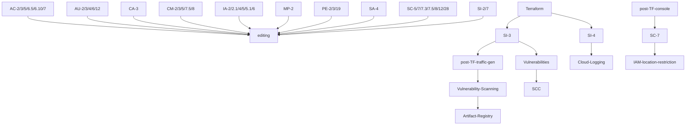

# Security Controls Mappings
## Controls Coverage

## P1 Security Controls
- See P1 list italic diff of 77 in https://cyber.gc.ca/sites/default/files/cyber/publications/itsg33-ann4a-1-eng.pdf

 `Category` | `Controls 41 plain 66/bold - 77/italic  ` 
 --- | ---  
AC | _AC-1_ [AC-2](#0020ac-2account-management) AC-3 _AC-3(7)_ _AC-3(9)_ _AC-3(10)_ [AC-4](#0120ac-4information-flow-enforcement) _AC-4(4)_ _AC-4(12) AC-4(13) AC-4(14) AC-4(15)_ AC-5 AC-6 AC-6(5) AC-6(10) AC-7 _AC-8_ **AC-17** [AC-17(1)](#0290ac-171remote-access--automated-monitoring--control) **AC-18** _AC-18(5)_ **AC-19** _AC-19(4)_ **AC-22**
AT | _AT-1_ *AT-2** _AT-2(2)_ **AT-3**
AU | _AU-1_ [AU-2](#0500au-2audit-events) AU-3 AU-4 _AU-4(1)_ AU-6 **AU-8** AU-12 
CA | _CA-1_ _CA-2(1)_ CA-3 _CA-3(2)_ _CA-3(3)_ _CA-3(4)_ _CA-6_ _CA-7(1)_
CM | _CM-1_ CM-2 _CM-2(7)_ CM-3 CM-5 **CM-6** CM-7 _CM-7(5)_ CM-8 CM-9
CP | _CP-1_ **CP-9**
IA | _IA-1_ IA-2 IA-2(1) **IA-3** IA-4 IA-5 IA-5(1) IA=6
IR | _IR-1_ **IR-9**
MA | _MA-1_ _MA-3(3) MA-5(2)_
MP | _MP-1_ MP-2 _MP-3_ **MP-4** _MP-5 MP-5(3)_ _MP-8_ _MP-8(3) MP-8(4)_
PE | _PE-1_ PE-2 _PE-2(3)_ _PE-2(100)_ PE-3 _PE-4 PE-6 PE-6(2) PE-6(3) PE-6(4) PE-8 PE-16 PE-18 PE-18(1)_ PE-19 _PE-20_
PL | _PL-1_ **PL-2** **PL-4** _PL-7 PL-8 PL-8(1) PL-8(2)_
PS | _PS-1_ _PS-3_ _PS-3(1) PS-3(2)_ **PS-4** **PS-5** **PS-6** _PS-6(2)_ **PS-7**
RA | _RA-1_ **RA-2** **RA-3**
SA | _SA-1_ SA-4 SA-4(2) _SA-4(6) SA-4(7) SA-9_
SC | _SC-1_ **SC-2** SC-5 SC-7 SC-7(3) SC-7(5) _SC-7(8) SC-7(14)_ SC-8 SC-12(p2) _SC-12(2) SC-12(3) SC-18_ SC-23 _SC-24_ SC-28 _SC-43 SC-101_
SI | _SI-1_ SI-2 [SI-3](#6610si-3malicious-code-protection) [SI-4](#6650si-4information-system-monitoring) **SI-5** SI-8

## Controls to GCP Services Mappings : 1:N
 
`Control` | `Services` 
--- | ---   
[AC-2](#0020ac-2account-management) | _5310_vm_ssh_login_start_towards_root_denied, _5311_vm_ssh_login_non_root_ssh_dynamic_key_transfer_approved, _5312_vm_ssh_login_non_root_approved, _5910_mfa_on_super_admin_account_before_setting_org_policy, _9951_google_admin_group_accounts

 
 
## GCP Service to Controls Mappings : 1:N

## Code To Controls Mappings : 1:N

## References
- SCED (SC2G) connection patterns - slide 18/19 for cloud profiles 1 to 6 https://wiki.gccollab.ca/images/7/75/GC_Cloud_Connection_Patterns.pdf
- CCCS PBMM ITSG-33 Annex 4A Profile 1 https://cyber.gc.ca/sites/default/files/cyber/publications/itsg33-ann4a-1-eng.pdf from https://cyber.gc.ca/en/guidance/annex-4a-profile-1-protected-b-medium-integrity-medium-availability-itsg-33

## Guardrails Subset

 `Guardrails` | `Controls` 
 --- | ---   
GR 1 | [AC-2](#0020ac-2account-management) 
GR 2 | [AC-2](#0020ac-2account-management) 
GR 3 | [AC-2](#0020ac-2account-management) 
GR 4 | [AC-2](#0020ac-2account-management) 

# Individual Security Controls

## legend
## pk,control id,phase 1,phase 2, service name, service link, service evidence,code link, future, control link, title 

## 0010,AC-1,,,,,,,,,Access Control Policy and Procedures

## 0020,AC-2,,,,,,,,,Account Management
>Priority: P1

### Definition: super-admin root account with least-priv subaccounts

### Services: MFA, IAM roles/accounts - IAM Roles (org admin, billing admin, project admin, project billing admin), Identity Super Admin Role, ssh access, mfa

### Related Controls: AC‑2, AC‑2(1), AC‑3, AC‑5, AC‑6, AC‑6(5), AC‑6(10), AC‑7, AC‑9, AC‑19, AC‑20(3), IA‑2, IA‑2(1), IA‑2(2), IA‑2(11), IA‑4, IA‑5, IA‑5(1), IA‑5(6), IA‑5(7), IA‑5(13), IA‑6, IA‑8

## 0030,AC-2(1),,,,,,,,,Account Management | Automated System Account Management

## 0040,AC-2(2),,,,,,,,,Account Management | Removal of Temporary / Emergency Accounts

## 0050,AC-2(3),,,,,,,,,Account Management | Disable Inactive Accounts

## 0060,AC-2(4),,,,,,,,,Account Management | Automated Audit Actions

## 0070,AC-2(5),,,,,,,,,Account Management | Inactivity Logout

## 0080,AC-2(7),,,,,,,,,Account Management | Role-Based Schemes

## 0090,AC-2(9),,,,,,,,,Account Management | Restrictions on Use of Shared Groups / Accounts

## 0100,AC-2(10),,,,,,,,,Account Management | Shared / Group Account Credential Termination

## 0110,AC-3,,,,,,,,,Access Enforcement
>Priority: P1

### Definition:

### Services:  MFA, IAM roles/accounts, Cloud Identity/Federation 

### Related Controls: AC-2

_5810_iam_project_roles_audit_project

## 0120,AC-4,,,,,,,,,Information Flow Enforcement
>Priority: P1

### Definition: VPC Perimeter + VPC firewall rules,  (WAF) or 

### Services: VPC firewall

GCP Services Coverage:
 - [VPC - VPC Networks - Firewall Rules](#vpc---vpc-networks---firewall-rules)

_5062_cloud_asset_inventory_prod_proj_firewall

_5063_cloud_asset_inventory_prod_proj_firewall_change_history

## 0130,AC-4(21),,,,,,,,,Information Flow Enforcement | Physical / Logical Separation of Information Flows

## 0140,AC-5,,,,,,,,,Separation of Duties
>Priority: P1

### Definition:

### Services: MFA, IAM roles/accounts 

## 0150,AC-6,,,,,,,,,Least Privilege

## 0160,AC-6(1),,,,,,,,,Least Privilege | Authorize Access to Security Functions

## 0170,AC-6(2),,,,,,,,,Least Privilege | Non-Privileged Access for Non-Security Functions

## 0180,AC-6(5),,,,,,,,,Least Privilege | Privileged Accounts
>Priority: P1

### Definition:

### Services:  MFA, IAM roles/accounts

## 0190,AC-6(9),,,,,,,,,Least Privilege | Auditing Use of Privileged Functions

## 0200,AC-6(10),,,,,,,,,Least Privilege | Prohibit Non-Privileged Users from Executing Privileged Functions
>Priority: P1

### Definition:

### Services:   MFA, IAM roles/accounts, Cloud Identity/Federation 

## 0210,AC-7,,,,,,,,,Unsuccessful Logon Attempts
>Priority: P1

### Definition:

### Services: MFA, IAM roles/accounts, Cloud Identity/Federation 

## 0220,AC-8,,,,,,,,,System Use Notification

## 0230,AC-10,,,,,,,,,Concurrent Session Control

## 0240,AC-11,,,,,,,,,Session Lock

## 0250,AC-11(1),,,,,,,,,Session Lock | Pattern-Hiding Displays

## 0260,AC-12,,,,,,,,,Session Termination

## 0270,AC-14,,,,,,,,,Permitted Actions without Identification or Authentication

## 0280,AC-17,,,,,,,,,Remote Access

## 0290,AC-17(1),,,,,,,,,Remote Access | Automated Monitoring / Control
>Priority: P1

### Definition: 

### Services: SSH, IAP

GCP Services Coverage:
 - [Security - Identity Aware Proxy](#security---identity-aware-proxy)

https://console.cloud.google.com/security/iap?project=ospe-obs-obsprd-obshostproj9&supportedpurview=project

## 0300,AC-17(2),,,,,,,,,Remote Access | Protection of Confidentiality / Integrity using Encryption

## 0310,AC-17(3),,,,,,,,,Remote Access | Managed Access Control Points

## 0320,AC-17(4),,,,,,,,,Remote Access | Privileged Commands / Access

## 0330,AC-17(9),,,,,,,,,Remote Access | Disconnect / Disable Access

## 0340,AC-17(100),,,,,,,,,Remote Access | Remote Access to Privileged Accounts using Dedicated Management Console

## 0350,AC-18,,,,,,,,,Wireless Access

## 0360,AC-18(1),,,,,,,,,Wireless Access | Authentication and Encryption

## 0370,AC-18(4),,,,,,,,,Wireless Access | Restrict Configurations by Users

## 0380,AC-19,,,,,,,,,Access Control for Mobile Devices

## 0390,AC-20,,,,,,,,,Use of External Information Systems

## 0400,AC-20(1),,,,,,,,,Use of External Information Systems | Limits of Authorized Use

## 0410,AC-20(2),,,,,,,,,Use of External Information Systems | Portable Storage Devices

## 0420,AC-21,,,,,,,,,Information Sharing

## 0430,AC-22,,,,,,,,,Publicly Accessible Content

## 0440,AT-1,,,,,,,,,Security Awareness and Training Policy and Procedures

## 0450,AT-2,,,,,,,,,Security Awareness Training

## 0460,AT-2(2),,,,,,,,,Security Awareness Training | Insider Threat

## 0470,AT-3,,,,,,,,,Role-Based Security Training

## 0480,AT-4,,,,,,,,,Security Training Records

## 0490,AU-1,,,,,,,,,Audit and Accountability Policy and Procedures

## 0500,AU-2,,,,,,,,,Audit Events
>Priority: P1

### Definition:

### Services: 

## 0510,AU-2(3),,,,,,,,,Audit Events | Reviews and Updates

## 0520,AU-3,,,,,,,,,Content of Audit Records
>Priority: P1

### Definition:

### Services: 

## 0530,AU-3(1),,,,,,,,,Content of Audit Records | Additional Audit Information

## 0540,AU-3(2),,,,,,,,,

## 0545,AU-4,,,,,,,,,Audit Storage Capacity
>Priority: P1

### Definition:

### Services: 

## 0550,AU-5,,,,,,,,,Response to Audit Processing Failures

## 0560,AU-5(1),,,,,,,,,

## 0570,AU-5(2),,,,,,,,,

## 0580,AU-6,,,,,,,,,Audit Review, Analysis, and Reporting
>Priority: P1

### Definition:

### Services: 

## 0590,AU-6(1),,,,,,,,,Audit Review, Analysis, and Reporting | Process Integration

## 0600,AU-6(3),,,,,,,,,Audit Review, Analysis, and Reporting | Correlate Audit Repositories

## 0610,AU-6(4),,,,,,,,,

## 0620,AU-6(5),,,,,,,,,

## 0630,AU-6(6),,,,,,,,,

## 0640,AU-6(7),,,,,,,,,

## 0650,AU-6(10),,,,,,,,,

## 0660,AU-7,,,,,,,,,Audit Reduction and Report Generation

## 0670,AU-7(1),,,,,,,,,Audit Reduction and Report Generation | Automatic Processing

## 0680,AU-8,,,,,,,,,Time Stamps

## 0690,AU-8(1),,,,,,,,,Time Stamps | Synchronization with Authoritative Time Sourcs

## 0700,AU-9,,,,,,,,,Protection of Audit Information

## 0710,AU-9(2),,,,,,,,,Protection of Audit Information | Audit Backup on Separate Physical Systems / Components

## 0720,AU-9(4),,,,,,,,,Protection of Audit Information | Access by Subset of Privileged Users

## 0730,AU-11,,,,,,,,,Audit Record Retention

## 0740,AU-12,,,,,,,,,Audit Generation
>Priority: P1

### Definition:

### Services: 

## 0750,CA-1,,,,,,,,,Security Assessment and Authorization Policies and Procedures

## 0760,CA-2,,,,,,,,,Security Assessments

## 0770,CA-2(1),,,,,,,,,Security Assessments | Independent Assessors

## 0780,CA-2(2),,,,,,,,,Security Assessments | Specialized Assessments

## 0790,CA-2(3),,,,,,,,,Security Assessments | External Organizations

## 0800,CA-3,,,,,,,,,System Interconnections
>Priority: P1

### Definition:

### Services: 

## 0810,CA-3(3),,,,,,,,,System Interconnections | Classified Non-National Security System Connections

## 0820,CA-3(5),,,,,,,,,System Interconnections | Restrictions on External Network Connections

## 0830,CA-5,,,,,,,,,Plan of Action and Milestones

## 0840,CA-6,,,,,,,,,Security Authorization

## 0850,CA-6(1),,,,,,,,,

## 0860,CA-7,,,,,,,,,Continuous Monitoring

## 0870,CA-7(1),,,,,,,,,Continuous Monitoring | Independent Assessment

## 0880,CA-7(3),,,,,,,,,

## 0890,CA-8,,,,,,,,,Penetration  Testing

## 0900,CA-8(1),,,,,,,,,Penetration  Testing | Independent Penetration Testing Agent for Team

## 0910,CA-9,,,,,,,,,Internal System Connections

## 0920,CM-1,,,,,,,,,Configuration Management Policy and Procedures

## 0930,CM-2,,,,,,,,,Baseline Configuration
>Priority: P1

### Definition:

### Services: 

## 0940,CM-2(1),,,,,,,,,Baseline Configuration | Reviews and Updates

## 0950,CM-2(2),,,,,,,,,Baseline Configuration | Automation Support for Accuracy / Currency

## 0960,CM-2(3),,,,,,,,,Baseline Configuration | Retention of Previous  Configurations

## 0970,CM-2(7),,,,,,,,,"Baseline Configuration | Configure Systems, Components, or Devices for High-Risk Areas"

## 0980,CM-3,,,,,,,,,Configuration Change Control
>Priority: P1

### Definition:

### Services: 

## 0990,CM-3(1),,,,,,,,,

## 1000,CM-3(4),,,,,,,,,Configuration Change Control | Security Representative

## 1010,CM-3(6),,,,,,,,,Configuration Change Control | Cryptography Management

## 1020,CM-4,,,,,,,,,Security Impact Analysis

## 1030,CM-5,,,,,,,,,Access Restrictions for Change
>Priority: P1

### Definition:

### Services: 

## 1040,CM-5(1),,,,,,,,,Access Restrictions for Change | Automated Access Enforcement / Auditing

## 1050,CM-5(3),,,,,,,,,

## 1060,CM-5(5),,,,,,,,,Access Restrictions for Change | Limit Production / Operational Privileges

## 1080,CM-5(6),,,,,,,,,Access Restrictions for Change | Limit Library Privileges

## 1080,CM-6,,,,,,,,,Configuration Settings

## 1090,CM-6(1),,,,,,,,,Configuration Settings | Automated Central Management / Application / Verification

## 1100,CM-6(2),,,,,,,,,Configuration Settings | Respond to Unauthorized Changes

## 1110,CM-7,,,,,,,,,Least Functionality

## 1120,CM-7(1),,,,,,,,,Least Functionality | Periodic Review

## 1130,CM-7(5),,,,,,,,,Least Functionality | Authorized Software / Whitelisting
>Priority: P1

### Definition:

### Services: 

## 1140,CM-8,,,,,,,,,Information System Component Inventory
>Priority: P1

### Definition:

### Services: 

_5052_cloud_asset_inventory_nonprod_default

_5053_cloud_asset_inventory_nonprod_full_36_assets

_5054_cloud_asset_inventory_nonprod_guardrails_on_obrien_services

_5056_cloud_asset_inventory_prod_perimeter_31

_6702_marketplace_unrestricted_to_goc

_6704_marketplace_user_limited_access_via_denied_billing

_6704_marketplace_user_limited_access_via_denied_billing

_8504_security_command_center_standard_assets

## 1150,CM-8(1),,,,,,,,,Information System Component Inventory | Updates During Installations  / Removals

## 1160,CM-8(2),,,,,,,,,Information System Component Inventory | Automated Maintenance

## 1170,CM-8(3),,,,,,,,,Information System Component Inventory | Automated Unauthorized Component Detection

## 1180,CM-8(5),,,,,,,,,Information System Component Inventory | No Duplicate Accounting of Components

## 1190,CM-9,,,,,,,,,Configuration Management Plan

## 1200,CM-10,,,,,,,,,Software Usage Restrictions

## 1210,CM-10(1),,,,,,,,,Software Usage Restrictions | Open Source Software

## 1220,CM-11,,,,,,,,,User-Installed Software

## 1230,CP-1,,,,,,,,,Contingency Planning Policy and Procedures

## 1240,CP-2,,,,,,,,,Contingency Plan

## 1250,CP-2(1),,,,,,,,,Contingency Plan | Coordinate with Related Plans

## 1260,CP-2(2),,,,,,,,,Contingency Plan | Capacity Planning

## 1270,CP-2(3),,,,,,,,,Contingency Plan | Resume Essential Missions / Business Functions

## 1280,CP-2(4),,,,,,,,,Contingency Plan | Resume All Missions / Business Functions

## 1290,CP-2(5),,,,,,,,,Contingency Plan | Continue Essential Missions / Business Functions

## 1300,CP-2(6),,,,,,,,,Contingency Plan | Alternate Processing / Storage Site

## 1310,CP-2(8),,,,,,,,,Contingency Plan | Identify Critical Assets

## 1320,CP-3,,,,,,,,,Contingency Training

## 1330,CP-4,,,,,,,,,Contingency Plan Testing

## 1340,CP-4(1),,,,,,,,,Contingency Plan Testing | Coordinate with Related Plans

## 1350,CP-4(2),,,,,,,,,Contingency Plan Testing | Alternate Processing Site

## 1360,CP-6,,,,,,,,,Alternate Storage Site

## 1370,CP-6(1),,,,,,,,,Alternate Storage Site | Separation from Primary Site

## 1380,CP-6(2),,,,,,,,,Alternate Storage Site | Recovery Times / Point Objectives

## 1390,CP-6(3),,,,,,,,,Alternate Storage Site | Accessibility

## 1400,CP-7,,,,,,,,,Alternative Processing Site

## 1410,CP-7(1),,,,,,,,,Alternative Processing Site | Separation from Primary Site

## 1420,CP-7(2),,,,,,,,,Alternative Processing Site | Accessibility

## 1430,CP-7(3),,,,,,,,,Alternative Processing Site | Priority of Service

## 1440,CP-7(4),,,,,,,,,Alternative Processing Site | Preparation for Use

## 1450,CP-8,,,,,,,,,Telecommunications Services

## 1460,CP-8(1),,,,,,,,,Telecommunications Services | Priority of Service Provisions

## 1470,CP-8(2),,,,,,,,,Telecommunications Services | Single Points of Failure

## 1480,CP-8(3),,,,,,,,,Telecommunications Services | Separation of Primary / Alternate Providers

## 1490,CP-8(5),,,,,,,,,Telecommunications Services | Alternate Telecommunication Service Testing

## 1500,CP-9,,,,,,,,,Information System Backup

## 1510,CP-9(1),,,,,,,,,Information System Backup | Testing for Reliability / Integrity

## 1520,CP-9(2),,,,,,,,,Information System Backup | Test Restoration using Sampling

## 1530,CP-9(3),,,,,,,,,Information System Backup | Separate Storage for Critical Information

## 1540,CP-9(5),,,,,,,,,Information System Backup | Transfer to Alternate Storage Site

## 1550,CP-9(7),,,,,,,,,Information System Backup | Dual Authorization

## 1560,CP-10,,,,,,,,,Information System Recovery and Reconstitution

## 1570,CP-10(2),,,,,,,,,Information System Recovery and Reconstitution | Transaction Recovery

## 1580,CP-10(4),,,,,,,,,Information System Recovery and Reconstitution | Restore within Time Period

## 2090,IA-1,,,,,,,,,Identification and Authentication Policy and Procedures

## 2100,IA-2,,,,,,,,,Identification and Authentication (Organizational Users)
>Priority: P1

### Definition:

### Services:  MFA, IAM roles/accounts, Cloud Identity/Federation 

### Related Controls: AC‑2, AC‑2(1), AC‑3, AC‑5, AC‑6, AC‑6(5), AC‑6(10), AC‑7, AC‑9, AC‑19, AC‑20(3), IA‑2, IA‑2(1), IA‑2(2), IA‑2(11), IA‑4, IA‑5, IA‑5(1), IA‑5(6), IA‑5(7), IA‑5(13), IA‑6, IA‑8

## 2110,IA-2(1),,,,,,,,,Identification and Authentication (Organizational Users) | Network Access to Privileged Accounts
>Priority: P1

### Definition:

### Services:  MFA, IAM roles/accounts, Cloud Identity/Federation 

### Related Controls: AC‑2, AC‑2(1), AC‑3, AC‑5, AC‑6, AC‑6(5), AC‑6(10), AC‑7, AC‑9, AC‑19, AC‑20(3), IA‑2, IA‑2(1), IA‑2(2), IA‑2(11), IA‑4, IA‑5, IA‑5(1), IA‑5(6), IA‑5(7), IA‑5(13), IA‑6, IA‑8

## 2120,IA-2(2),,,,,,,,,

## 2130,IA-2(3),,,,,,,,,Identification and Authentication (Organizational Users) | Local Access to Privileged Accounts

## 2140,IA-2(4),,,,,,,,,

## 2150,IA-2(5),,,,,,,,,

## 2160,IA-2(6),,,,,,,,,Identification and Authentication (Organizational Users) | Network Access to Privileged Accounts - Separate Device

## 2170,IA-2(8),,,,,,,,,Identification and Authentication (Organizational Users) | Network Access to Privileged Accounts - Replay Resistant

## 2180,IA-2(11),,,,,,,,,Identification and Authentication (Organizational Users) | Remote Access  - Separate Device

## 2190,IA-3,,,,,,,,,Device Identification and Authentication

## 2200,IA-4,,,,,,,,,Identifier Management
>Priority: P1

### Definition:

### Services:  MFA, IAM roles/accounts, Cloud Identity/Federation 

### Related Controls: AC‑2, AC‑2(1), AC‑3, AC‑5, AC‑6, AC‑6(5), AC‑6(10), AC‑7, AC‑9, AC‑19, AC‑20(3), IA‑2, IA‑2(1), IA‑2(2), IA‑2(11), IA‑4, IA‑5, IA‑5(1), IA‑5(6), IA‑5(7), IA‑5(13), IA‑6, IA‑8

## 2210,IA-4(2),,,,,,,,,Identifier Management | Supervisor Authorization

## 2220,IA-4(3),,,,,,,,,Identifier Management | Multiple Forms of Certification

## 2230,IA-4(4),,,,,,,,,Identifier Management | Identify User Status

## 2240,IA-5,,,,,,,,,Authenticator Management
>Priority: P1

### Definition:

### Services:  MFA, IAM roles/accounts, Cloud Identity/Federation 

### Related Controls: AC‑2, AC‑2(1), AC‑3, AC‑5, AC‑6, AC‑6(5), AC‑6(10), AC‑7, AC‑9, AC‑19, AC‑20(3), IA‑2, IA‑2(1), IA‑2(2), IA‑2(11), IA‑4, IA‑5, IA‑5(1), IA‑5(6), IA‑5(7), IA‑5(13), IA‑6, IA‑8

## 2250,IA-5(1),,,,,,,,,Authenticator Management | Password-Based Authentication
>Priority: P1

### Definition:

### Services:  MFA, IAM roles/accounts, Cloud Identity/Federation 

### Related Controls: AC‑2, AC‑2(1), AC‑3, AC‑5, AC‑6, AC‑6(5), AC‑6(10), AC‑7, AC‑9, AC‑19, AC‑20(3), IA‑2, IA‑2(1), IA‑2(2), IA‑2(11), IA‑4, IA‑5, IA‑5(1), IA‑5(6), IA‑5(7), IA‑5(13), IA‑6, IA‑8

## 2260,IA-5(2),,,,,,,,,Authenticator Management | PKI-Based Authentication

## 2270,IA-5(3),,,,,,,,,Authenticator Management | In-Person or Trusted Third-Party Registration

## 2280,IA-5(4),,,,,,,,,Authenticator Management | Automated Support for Password Strength Determination

## 2290,IA-5(6),,,,,,,,,Authenticator Management | Protection of Authenticators

## 2300,IA-5(7),,,,,,,,,Authenticator Management | No Embedded Unencrypted Static Authenticators

## 2310,IA-5(8),,,,,,,,,Authenticator Management | Multiple Information System Accounts

## 2320,IA-5(11),,,,,,,,,Authenticator Management | Hardware Token-Based Authentication

## 2340,IA-5(13),,,,,,,,,

## 2350,IA-5(14),,,,,,,,,

## 2360,IA-6,,,,,,,,,Authenticator Feedback
>Priority: P1

### Definition:

### Services:  MFA, IAM roles/accounts, Cloud Identity/Federation 

### Related Controls: AC‑2, AC‑2(1), AC‑3, AC‑5, AC‑6, AC‑6(5), AC‑6(10), AC‑7, AC‑9, AC‑19, AC‑20(3), IA‑2, IA‑2(1), IA‑2(2), IA‑2(11), IA‑4, IA‑5, IA‑5(1), IA‑5(6), IA‑5(7), IA‑5(13), IA‑6, IA‑8

## 2370,IA-7,,,,,,,,,Cryptographic Module Authentication

## 2380,IA-8,,,,,,,,,Identification and Authentication (Non-Organizational Users)

## 2390,IR-1,,,,,,,,,Incident Response Policy and Procedures

## 2400,IR-2,,,,,,,,,Incident Response Training

## 2410,IR-3,,,,,,,,,Incident Response Testing

## 2420,IR-3(2),,,,,,,,,Incident Response Testing | Coordination with Related Plans

## 2430,IR-4,,,,,,,,,Incident Handling

## 2440,IR-4(1),,,,,,,,,Incident Handling | Automated Incident Handling Processes

## 2450,IR-4(3),,,,,,,,,Incident Handling | Continuity of Operations

## 2460,IR-4(6),,,,,,,,,

## 2470,IR-4(7),,,,,,,,,

## 2480,IR-4(8),,,,,,,,,

## 2490,IR-4(9),,,,,,,,,

## 2500,IR-5,,,,,,,,,Incident Monitoring

## 2510,IR-6,,,,,,,,,Incident Reporting

## 2520,IR-6(1),,,,,,,,,Incident Reporting | Automated Reporting

## 2530,IR-7,,,,,,,,,Incident Response Assistance

## 2540,IR-7(1),,,,,,,,,Incident Response Assistance | Automation Support for Availability of Information / Support

## 2550,IR-7(2),,,,,,,,,Incident Response Assistance | Coordination with External Providers

## 2560,IR-8,,,,,,,,,Incident Response Plan

## 2570,IR-9,,,,,,,,,Information Spillage Response

## 2580,IR-9(1),,,,,,,,,Information Spillage Response | Responsible Personnel

## 2590,IR-9(2),,,,,,,,,Information Spillage Response | Training

## 2600,IR-9(3),,,,,,,,,Information Spillage Response | Post-Spill Operations

## 2610,IR-9(4),,,,,,,,,Information Spillage Response | Exposure to Unauthorized Personnel

## 2620,MA-1,,,,,,,,,System Maintenance Policy and Procedures

## 2630,MA-2,,,,,,,,,Controlled Maintenance

## 2640,MA-3,,,,,,,,,Maintenance Tools

## 2650,MA-3(1),,,,,,,,,Maintenance Tools | Inspect Tools

## 2670,MA-3(2),,,,,,,,,Maintenance Tools | Inspect Media

## 2680,MA-3(3),,,,,,,,,Maintenance Tools | Prevent Unauthorized Removal

## 2690,MA-4,,,,,,,,,Nonlocal Maintenance

## 2700,MA-4(1),,,,,,,,,Nonlocal Maintenance | Auditing and Review

## 2710,MA-4(2),,,,,,,,,Nonlocal Maintenance | Document Nonlocal Maintenance

## 2720,MA-4(3),,,,,,,,,Nonlocal Maintenance | Comparable Security / Sanitization

## 2730,MA-4(6),,,,,,,,,Nonlocal Maintenance | Cryptographic Protection

## 2740,MA-5,,,,,,,,,Maintenance Personnel

## 2750,MA-5(1),,,,,,,,,Maintenance Personnel | Individuals without Appropriate Access

## 2760,MA-6,,,,,,,,,Timely Maintenance

## 2770,MP-1,,,,,,,,,Media Protection Policy and Procedures

## 2780,MP-2,,,,,,,,,Media Access
>Priority: P1 suboptimal

### Definition:

### Services: 

## 2790,MP-3,,,,,,,,,Media Marking

## 2800,MP-4,,,,,,,,,Media Storage

## 2810,MP-5,,,,,,,,,Media Transport

## 2820,MP-5(4),,,,,,,,,Media Transport | Cryptographic Protection

## 2830,MP-6,,,,,,,,,Media Sanitization

## 2840,MP-6(1),,,,,,,,,Media Sanitization | Review / Approve / Track / Document / Verify

## 2850,MP-6(2),,,,,,,,,Media Sanitization | Equipment Testing

## 2860,MP-6(3),,,,,,,,,Media Sanitization | Non-destructive Techniques

## 2870,MP-7,,,,,,,,,Media Use

## 2880,MP-7(1),,,,,,,,,Media Use | Prohibit Use without Owner

## 2890,MP-8,,,,,,,,,Media Downgrading

## 2900,MP-8(1),,,,,,,,,Media Downgrading | Documentation of Process

## 3810,PE-1,,,,,,,,,Physical and Environmental Protection Policy and Procedures

## 3820,PE-2,,,,,,,,,Physical Access Authorizations
>Priority: P1 suboptimal

### Definition:

### Services: 

## 3830,PE-3,,,,,,,,,Physical Access Control
>Priority: P1 suboptimal

### Definition:

### Services: 

## 3840,PE-3(1),,,,,,,,,Physical Access Control | Information System Access

## 3850,PE-4,,,,,,,,,Access Control for Transmission Medium

## 3860,PE-5,,,,,,,,,Access Control for Output Devices

## 3870,PE-6,,,,,,,,,Monitoring Physical Access

## 3880,PE-6(1),,,,,,,,,Monitoring Physical Access | Intrusion Alarms / Surveillance Equipment

## 3890,PE-6(4),,,,,,,,,Monitoring Physical Access | Monitoring Physical Access to Information Systems

## 3900,PE-8,,,,,,,,,Visitor Access Records

## 3910,PE-9,,,,,,,,,Power Equipment and Cabling

## 3920,PE-10,,,,,,,,,Emergency Shutoff

## 3930,PE-11,,,,,,,,,Emergency Power

## 3940,PE-12,,,,,,,,,Emergency Lighting

## 3950,PE-13,,,,,,,,,Fire Protection

## 3960,PE-13(2),,,,,,,,,Fire Protection | Suppression Devices / Systems

## 3970,PE-13(3),,,,,,,,,Fire Protection | Automatic Fire Suppression

## 3980,PE-14,,,,,,,,,Temperature and Humidity Controls

## 3990,PE-14(2),,,,,,,,,Temperature and Humidity Controls | Monitoring with Alarms / Notifications

## 4000,PE-15,,,,,,,,,Water Damage Protection

## 4010,PE-16,,,,,,,,,Delivery and Removal

## 4020,PE-17,,,,,,,,,Alternate Work Site

## 4030,PE-18,,,,,,,,,

## 4035,PE-19,,,,,,,,,
>Priority: P1 suboptimal 

### Definition:

### Services: 

## 4040,PL-1,,,,,,,,,Security Planning Policy and Procedures

## 4050,PL-2,,,,,,,,,System Security Plan

## 4060,PL-2(3),,,,,,,,,System Security Plan | Plan / Coordinate with Other Organizational Entities

## 4070,PL-4,,,,,,,,,Rules of Behavior

## 4080,PL-4(1),,,,,,,,,Rules of Behavior | Social Media and Networking Restrictions

## 4090,PL-8,,,,,,,,,Information System Architecture

## 4100,PS-1,,,,,,,,,Personnel Security Policy and Procedures

## 4110,PS-2,,,,,,,,,Position Risk Designation

## 4120,PS-3,,,,,,,,,Personnel Screening

## 4130,PS-3(3),,,,,,,,,Personnel Screening | Information with Special Protection Measures

## 4140,PS-4,,,,,,,,,Personnel Termination

## 4150,PS-5,,,,,,,,,Personnel Transfer

## 4160,PS-6,,,,,,,,,Access Agreements

## 4170,PS-7,,,,,,,,,Third-Party Personnel Security

## 4180,PS-8,,,,,,,,,Personnel Sanctions

## 5190,RA-1,,,,,,,,,Risk Assessment Policy and Procedures

## 5200,RA-2,,,,,,,,,Security Categorization

## 5210,RA-3,,,,,,,,,Risk Assessment

## 5220,RA-5,,,,,,,,,Vulnerability Scannin<F2>g

## 5230,RA-5(1),,,,,,,,,Vulnerability Scanning | Update Tool Capability

## 5240,RA-5(2),,,,,,,,,Vulnerability Scanning | Update by Frequency / Prior to New Scan / When Identified

## 5250,RA-5(3),,,,,,,,,Vulnerability Scanning | Breadth / Depth of Coverage

## 5260,RA-5(5),,,,,,,,,Vulnerability Scanning | Privileged Access

## 5270,RA-5(6),,,,,,,,,Vulnerability Scanning | Automated Trend Analyses

## 5280,RA-5(8),,,,,,,,,Vulnerability Scanning | Review Historic Audit Logs

## 5990,SA-1,,,,,,,,,System and Services Acquisition Policy and Procedures

## 6000,SA-2,,,,,,,,,Allocation of Resources

## 6010,SA-3,,,,,,,,,System Development Lifecycle

## 6020,SA-4,,,,,,,,,Acquisition Process
>Priority: P1

### Definition:

### Services: 

## 6030,SA-4(1),,,,,,,,,Acquisition Process | Functional Properties of Security Controls

## 6040,SA-4(2),,,,,,,,,Acquisition Process | Design / Implementation Information for Security Controls

## 6050,SA-4(8),,,,,,,,,Acquisition Process | Continuous Monitoring Plan

## 6060,SA-4(9),,,,,,,,,Acquisition Process | Functions / Ports / Protocols / Services in Use

## 6070,SA-5,,,,,,,,,Information System Documentation

## 6080,SA-8,,,,,,,,,Security Engineering Principles

## 6090,SA-9,,,,,,,,,External Information System Services

## 6100,SA-9(1),,,,,,,,,External Information System Services | Risk Assessments / Organizational Approvals

## 6110,SA-9(2),,,,,,,,,External Information System Services | Identification of Functions / Ports / Protocols / Services

## 6120,SA-9(4),,,,,,,,,External Information System Services | Consistent Interests of Consumers and Providers

## 6130,SA-9(5),,,,,,,,,External Information System Services | Processing, Storage, and Service Location

## 6140,SA-10,,,,,,,,,Developer Configuration Management

## 6150,SA-10(1),,,,,,,,,Developer Configuration Management | Software / Firmware Integrity Verification

## 6160,SA-11,,,,,,,,,Developer Security Testing and Evaluation

## 6170,SA-11(1),,,,,,,,,Developer Security Testing and Evaluation | Static Code Analysis

## 6180,SA-11(2),,,,,,,,,Developer Security Testing and Evaluation | Threat and Vulnerability Analyses

## 6190,SA-11(8),,,,,,,,,Developer Security Testing and Evaluation | Dynamic Code Analysis

## 6200,SA-15,,,,,,,,,Development Process, Standards, and Tools

## 6210,SC-1,,,,,,,,,System and Communications Protection Policy and Procedures

## 6220,SC-2,,,,,,,,,Application Partitioning

## 6230,SC-4,,,,,,,,,Information in Shared Resources

## 6240,SC-5,,,,,,,,,Denial of Service Protection
>Priority: P1

### Definition:

### Services: 

## 6250,SC-6,,,,,,,,,Resource Availability

## 6260,SC-7,,,,,,,,,Boundary Protection
>Priority: P1

### Definition:

### Services: 

## 6270,SC-7(3),,,,,,,,,Boundary Protection | Access Points
>Priority: P1

### Definition:

### Services: 

## 6280,SC-7(4),,,,,,,,,Boundary Protection | External Telecommunications Services

## 6290,SC-7(5),,,,,,,,,Boundary Protection | Deny by Default / Allow by Exception
>Priority: P1

### Definition:

### Services: 

## 6300,SC-7(7),,,,,,,,,Boundary Protection | Prevent Split Tunneling for Remote Devices

## 6310,SC-7(8),,,,,,,,,Boundary Protection | Route Traffic to Authenticated Proxy Servers

## 6320,SC-7(12),,,,,,,,,Boundary Protection | Host-Based Protection

## 6330,SC-7(13),,,,,,,,,Boundary Protection | Isolation of Security Tools / Mechanisms / Support Components

## 6340,SC-7(18),,,,,,,,,Boundary Protection | Fail Secure

## 6350,SC-8,,,,,,,,,Transmission Confidentiality and Integrity
>Priority: P1

### Definition:

### Services: 

## 6360,SC-8(1),,,,,,,,,Transmission Confidentiality and Integrity | Cryptographic or Alternate Physical Protection

## 6370,SC-10,,,,,,,,,Network Disconnect

## 6380,SC-12,,,,,,,,,Cryptographic Key Establishment and Management
>Priority: P1

### Definition:

### Services: 

## 6390,SC-12(1),,,,,,,,,Cryptographic Key Establishment and Management | Availability

## 6400,SC-12(2),,,,,,,,,Cryptographic Key Establishment and Management | Symmetric Keys

## 6410,SC-12(3),,,,,,,,,Cryptographic Key Establishment and Management | Asymmetric Keys

## 6420,SC-13,,,,,,,,,Cryptographic Protection

## 6430,SC-15,,,,,,,,,Collaborative Computing Devices

## 6440,SC-17,,,,,,,,,Public Key Infrastructure Certificates

## 6450,SC-18,,,,,,,,,Mobile Code

## 6460,SC-18(3),,,,,,,,,Mobile Code | Prevent Downloading / Execution

## 6470,SC-18(4),,,,,,,,,Mobile Code | Prevent Automatic Execution

## 6480,SC-19,,,,,,,,,Voice over Internet Protocol

## 6490,SC-20,,,,,,,,,Secure Name / Address Resolution Service (Authoritative Source)

## 6500,SC-21,,,,,,,,,Secure Name / Address Resolution Service (Recursive or Caching Resolver)

## 6510,SC-22,,,,,,,,,Architecture and Provisioning for Name / Address Resolution Service

## 6520,SC-23,,,,,,,,,Session Authenticity

## 6530,SC-23(1),,,,,,,,,Session Authenticity | Invalidate Session Identifiers at Logout

## 6540,SC-28,,,,,,,,,Protection of Information at Rest
>Priority: P1

### Definition:

### Services: 

## 6550,SC-28(1),,,,,,,,,Protection of Information at Rest | Cryptographic Protection

## 6560,SC-39,,,,,,,,,Process Isolation

## 6570,SI-1,,,,,,,,,System and Information Integrity Policy and Procedures

## 6580,SI-2,,,,,,,,,Flaw Remediation
>Priority: P1

### Definition:

### Services: 

## 6590,SI-2(2),,,,,,,,,Flaw Remediation | Automated Flaw Remediation Status

## 6600,SI-2(3),,,,,,,,,Flaw Remediation | Time to Remediate Flaws / Benchmarks for Corrective Actions

## 6610,SI-3,,,,,,,,,Malicious Code Protection
>Priority: P1

### Definition: Vulnerability scanning

### Services: 
GCP Services Coverage:
 - [Artifact Registry - Vulnerability Scanning](#artifact-registry---vulnerability-scanning)
 - [Security Command Center - Vulnerabilities](#security-command-center---vulnerabilities)
 

## 6620,SI-3(1),,,,,,,,,Malicious Code Protection | Central Management

## 6630,SI-3(2),,,,,,,,,Malicious Code Protection | Automatic Updates

## 6640,SI-3(7),,,,,,,,,Malicious Code Protection | Non Signature-Based Detection

## 6650,SI-4,,,,,,,,,Information System Monitoring
>Priority: P1

### Definition: logging

### Services: 
GCP Services Coverage:
 - [Cloud Logging - VM Logging Agent Logs](#cloud-logging---vm-logging-agent-logs)
 

## 6660,SI-4(1),,,,,,,,,Information System Monitoring | System-Wide Intrusion Detection System

## 6670,SI-4(2),,,,,,,,,Information System Monitoring | Automated Tools for Real-Time Analysis

## 6680,SI-4(4),,,,,,,,,Information System Monitoring | Inbound and Outbound Communications Traffic

## 6690,SI-4(5),,,,,,,,,Information System Monitoring | System-Generated Alerts

## 6700,SI-4(7),,,,,,,,,Information System Monitoring | Automated Response to Suspicious Events

## 6710,SI-4(11),,,,,,,,,Information System Monitoring | Analyze Communications Traffic Anomalies

## 6720,SI-4(14),,,,,,,,,Information System Monitoring | Wireless Intrusion Detection

## 6730,SI-4(16),,,,,,,,,Information System Monitoring | Correlate Monitoring Information

## 6740,SI-4(20),,,,,,,,,Information System Monitoring | Privileged User

## 6750,SI-4(23),,,,,,,,,Information System Monitoring | Host-Based Devices

## 6760,SI-5,,,,,,,,,Security Alerts, Advisories, and Directives

## 6770,SI-6,,,,,,,,,Security Function Verification

## 6780,SI-7,,,,,,,,,Software, Firmware, and Information Integrity
>Priority: P1

### Definition:

### Services: 

## 6790,SI-7(1),,,,,,,,,Software, Firmware, and Information Integrity | Integrity Checks

## 6800,SI-7(7),,,,,,,,,Software, Firmware, and Information Integrity | Integration of Detection and Response

## 6810,SI-8,,,,,,,,,Spam Protection

## 6820,SI-8(1),,,,,,,,,Spam Protection | Central Management of Protection Mechanisms

## 6830,SI-8(2),,,,,,,,,Spam Protection | Automatic Updates

## 6840,SI-10,,,,,,,,,Information Input Validation

## 6850,SI-11,,,,,,,,,Error Handling

## 6680,SI-12,,,,,,,,,Information Handling and Retention

## 6870,SI-16,,,,,,,,,Memory Protection
 
# Google Cloud Services
## Artifact Registry 
 ### Artifact Registry - Vulnerability Scanning
 - Security Controls covered: [SI-3](#6610si-3malicious-code-protection)
 - Tags: dynamic
 - Workload: [Traffic Generation](google-cloud-landingzone-traffic-generation.md)
 
 This control requires that a workload has been deployed - ideally a container created from a cloud build trigger off a CSR repo.
 #### Evidence: 
  - _0904_artifact_registry_vulnerability_scanning_example_run
  - Navigate to the artifact registry service at https://console.cloud.google.com/artifacts?project=traffic-os
  - select the repository https://console.cloud.google.com/artifacts/docker/traffic-os/northamerica-northeast1/traffic-generation?project=traffic-os
  - select the digest https://console.cloud.google.com/artifacts/docker/traffic-os/northamerica-northeast1/traffic-generation/traffic-generation?project=traffic-os
  - select the image and the vulnarabilities tab [https://console.cloud.google.com/artifacts/docker/traffic-os/northamerica-northeast1/traffic-generation/traffic-generation/sha256:5a8ba156be1baa972eb49d90a69ee97e3984aae75d783e1e132db5275f392781;tab=vulnerabilities?project=traffic-os&supportedpurview=project](https://console.cloud.google.com/artifacts/docker/traffic-os/northamerica-northeast1/traffic-generation/traffic-generation/sha256:5a8ba156be1baa972eb49d90a69ee97e3984aae75d783e1e132db5275f392781;tab=vulnerabilities?project=traffic-os)
 

 
 ## Cloud Logging
 ### Cloud Logging - VM Logging Agent Logs
  - Security Controls covered: [SI-4](#6650si-4information-system-monitoring)
 #### Evidence:
 - _6888_logging_agent_logs_from_vm_in_logging_api
 - This control requires that a workload has been deployed
 - Navigate to the VM that is generating the logs (the Stackdriver logging agent docker container must be deployed along with the workload container) https://console.cloud.google.com/compute/instancesDetail/zones/northamerica-northeast1-a/instances/traffic-generation-target-private?project=traffic-os&supportedpurview=project&pageState=(%22duration%22:(%22groupValue%22:%22PT1H%22,%22customValue%22:null))
 
 

 - click the logs link on the VM details page - and change the time from 1h https://console.cloud.google.com/logs/query;query=%2528resource.type%3D%22gce_instance%22%20AND%20resource.labels.instance_id%3D%227618594468053982908%22%2529%20OR%20%2528resource.type%3D%22global%22%20AND%20jsonPayload.instance.id%3D%227618594468053982908%22%2529;timeRange=2022-06-22T19:47:48.975Z%2F2022-06-23T02:47:48.975872Z;cursorTimestamp=2022-06-23T02:32:32.680417Z?project=traffic-os&supportedpurview=project
 
  
 
    
 ## Security
  ### Security - Identity Aware Proxy
    see https://github.com/GoogleCloudPlatform/pbmm-on-gcp-onboarding/issues/51 
  - Security Controls covered: [AC-17(1)](#0290ac-171remote-access--automated-monitoring--control)
 #### Evidence:
  - navigate to IAP https://console.cloud.google.com/security/iap/getStarted?project=ospe-obs-obsprd-obshostproj9&supportedpurview=project
  - and enable the service per project https://console.cloud.google.com/security/iap?project=ospe-obs-obsprd-obshostproj9&supportedpurview=project  
     
    

        
 ## Security Command Center
 ### Security Command Center - Vulnerabilities
  - Security Controls covered: [SI-3](#6610si-3malicious-code-protection)
 #### Evidence:
 - _6888_logging_agent_logs_from_vm_in_logging_api
 - This control does not require that a specific workload is deployed - it does however require SCC enabled for each project (the default)
 - Navigate to Security Command Center and select the 2nd tab "vulnerabilities" at https://console.cloud.google.com/security/command-center/vulnerabilities?organizationId=507082630395&supportedpurview=organizationId,folder,project
 
 

    
 ## VPC
  ### VPC - VPC Networks
   #### VPC - VPC Networks - Firewall Rules  
 - Security Controls covered: [AC-4](#0120ac-4information-flow-enforcement)
 - Tags: static/dynamic
 - Workload: [Traffic Generation](google-cloud-landingzone-traffic-generation.md)
    
 #### Evidence: 
  - Navigate to VPC networks and switch to the public perimeter project https://console.cloud.google.com/networking/networks/list?project=ospe-obs-obsprd-obspubper&supportedpurview=project
  - Navigate to one of the 4 VPC's - the public perimeter VPC https://console.cloud.google.com/networking/networks/details/ospecnr-obspubpervpc-vpc?project=ospe-obs-obsprd-obspubper&supportedpurview=project&pageTab=SUBNETS
  - Navigate to the bastion ingres firewall rule showing 22 and 3389 enabled https://console.cloud.google.com/networking/firewalls/details/ospefwl-ospecnr-obspubpervpc-vpc-iap-bastian-ports-fwr?project=ospe-obs-obsprd-obspubper&supportedpurview=project
  - Navigate to the 0.0.0.0/0 ingres firewall rule [https://console.cloud.google.com/networking/firewalls/details/ospefwl-ospecnr-obspubpervpc-vpc-iap-bastian-ports-fwr?project=ospe-obs-obsprd-obspubper&supportedpurview=project ](https://console.cloud.google.com/networking/firewalls/details/ospefwl-allow-ssh-ingress-p-fwr?project=ospe-obs-obsprd-obspubper&supportedpurview=project)
    
    
    

    
    
 # Links
 
 # Appendix
 
 # diagrams
https://docs.github.com/en/get-started/writing-on-github/working-with-advanced-formatting/creating-diagrams

