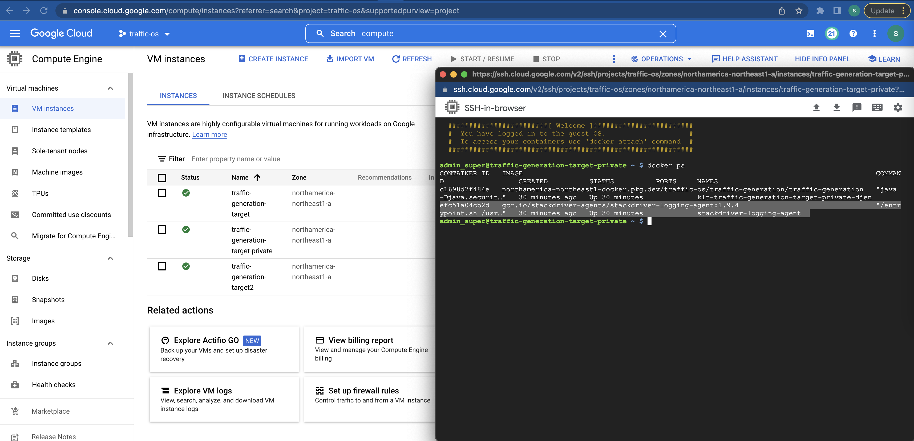

# TOC
- [Guardrails Control Subset](#guardrails-subset)
- [PBMM 31 Control Subset](#mandatory-security-controls-list)

# Security Controls Mappings
Note: 20220720 still a WIP as I bring in 30 more controls on top of the 61 to round out PBMM coverage and fill out the bidirectional control-services evidence links - expect additions over the rest of July 2020 - fmichaelobrien

The purpose of this document is to detail the relationship/coverage/evidence between ITSG-33 security controls and corresponding GCP services.

[ITSG-33 Security Controls Grid](#security-controls) | [Google Cloud Platform Services - Mapped to Controls](#google-cloud-services)

## Controls Coverage
Use the new "All Products" page for a list of Google Cloud Services https://console.cloud.google.com/products

56 so far - 16 defined - 90 required


[mermaid - diagrams as code](https://mermaid-js.github.io/mermaid/#/flowchart?id=graph)


## Security Controls
- Ref only: FedRAMP High - https://cloud.google.com/security/compliance/fedramp
- CCCS Medium Cloud Control Profile https://cyber.gc.ca/en/guidance/guidance-security-categorization-cloud-based-services-itsp50103
- at the end - Annex B Cloud Control Profile Medium https://cyber.gc.ca/sites/default/files/cyber/publications/Annex%20B%20CCCS%20MEDIUM%20Cloud%20Profile%20Recommendations.xlsx
- 140 P1 list in _italic_ referenced in https://cyber.gc.ca/sites/default/files/cyber/publications/Annex%20B%20CCCS%20MEDIUM%20Cloud%20Profile%20Recommendations.xlsx replaces older 2021 https://cyber.gc.ca/sites/default/files/cyber/publications/itsg33-ann4a-1-eng.pdf (replaces moved https://cyber.gc.ca/sites/default/files/publications/itsg33-ann4a-1-eng.pdf)
- P1 list not in subset _-italic_
- P1 list in subset _+italic_
- 91 subset controls 
- 61 microsubset controls in bold
- SA-4 marked KEY

### Mandatory Security Controls List
- 31 (15 guardrails) + 10 + 25 = 66 (guardrails subset = 48)

 `Category` | `31 Controls highlighted 20 P1 in bold, 11 P2- in italic GR + ` | `10 Extended/Inherited Controls` | `25 Guardrails Additional + `
 --- | --- | --- | --- 
AC _5_ | **[+AC-2](#0020ac-2account-management)** **[+AC-3](#0110ac-3access-enforcement)** **[+AC-4](#0120ac-4information-flow-enforcement)** **[+AC-6](#0150ac-6least-privilege)** _[AC-12](#0260ac-12session-termination)_ | _[AC-17(1)](#0290ac-171remote-access--automated-monitoring--control)_ | [+AC-5](#0140ac-5separation-of-duties) [+AC-6(5)](#0180ac-65least-privilege--privileged-accounts) [+AC-6(10)](#0200ac-610least-privilege--prohibit-non-privileged-users-from-executing-privileged-functions) [+AC-7](#0210ac-7unsuccessful-logon-attempts) [+AC-9](#0225ac-9previous-logon---access---notification) +AC‑19 +AC‑20(3)
AT _1_ | **[AT-3](#0470at-3role-based-security-training)** |  |
AU _4_ | **[+AU-2](#0500au-2audit-events)** **[+AU-3](#0520au-3content-of-audit-records)** **[+AU-6](#0580au-6audit-review-analysis-and-reporting)** _[AU-13](#0745au-13monitoring-for-information-disclosure)_ | _[+AU-9](#0700au-9protection-of-audit-information)_ _[+AU-12](#0740au-12audit-generation)_ | _[+AU-8](#0680au-8time-stamps)_ [+AU-9(4)](#0720au-94protection-of-audit-information--access-by-subset-of-privileged-users)
CA _1_ | **[CA-3](#0800ca-3system-interconnections)** |  |
CM _1_ | **[+CM-2](#0930cm-2baseline-configuration)** | _[+CM-8](#1140cm-8information-system-component-inventory)_ | [+CM-3](#0980cm-3configuration-change-control) [+CM-4](#1020cm-4security-impact-analysis) [+CM-5](#1030cm-5access-restrictions-for-change)
IA _2_ | **[+IA-2](#2100ia-2identification-and-authentication-organizational-users)** **[+IA-5](#2240ia-5authenticator-management)** | **[+IA-2(1)](#2110ia-21identification-and-authentication-organizational-users--network-access-to-privileged-accounts)** _[+IA-2(2)](#2120ia-22identification-and-authentication-organizational-users--multi-factor-authentication)_ | [+IA-2(11)](#2180ia-211identification-and-authentication-organizational-users--remote-access----separate-device) [+IA-4](#2200ia-4identifier-management) [+IA-5(1)](#2250ia-51authenticator-management--password-based-authentication) [+IA-5(6)](#2290ia-56authenticator-management--protection-of-authenticators) [+IA-5(7)](#2300ia-57authenticator-management--no-embedded-unencrypted-static-authenticators) [+IA-5(13)](#2340ia-513authenticator-management) [+IA-6](#2360ia-6authenticator-feedback) [+IA-8](#2380ia-8identification-and-authentication-non-organizational-users)
IR _1_ | _[IR-6](#2510ir-6incident-reporting)_ | |
MP _1_ | **[MP-2](#2780mp-2media-access)** | |
PE _2_ | _[PE-3](#3830pe-3physical-access-control)_ _[PE-19](#4035pe-19information-leakage)_ |  |
PS _1_ | **[PS-6](#4160ps-6access-agreements)** | |
RA _1_ | _[RA-5](#5220ra-5vulnerability-scanning)_ | |
SA _2_ | _[SA-4](#6020sa-4acquisition-process)_ _[SA-8](#6080sa-8security-engineering-principles)_ |  |  [+SA-22](#6205sa-22unsupported-system-components)
SC _5_ | **[+SC-7](#6260sc-7boundary-protection)** _[+SC-13](#6420sc-13cryptographic-protection)_ _[SC-26](#6536sc-26honeypots)_ **[+SC-28](#6540sc-28protection-of-information-at-rest)** **[SC-101](#6565sc-101unclassified-telecommunications-systems-in-secure-facilities)** | **[+SC-5](#6240sc-5denial-of-service-protection)** **[SC-7(3)](#6270sc-73boundary-protection--access-points)** **[+SC-7(5)](#6290sc-75boundary-protection--deny-by-default--allow-by-exception)** _[+SC-28(1)](#6550sc-281protection-of-information-at-rest--cryptographic-protection)_ | [+SC-8](#6350sc-8transmission-confidentiality-and-integrity) [+SC-8(1)](#6360sc-81transmission-confidentiality-and-integrity--cryptographic-or-alternate-physical-protection) [+SC-12](#6380sc-12cryptographic-key-establishment-and-management) [+SC-17](#6440sc-17public-key-infrastructure-certificates)
SI _4_ | **[+SI-2](#6580si-2flaw-remediation)** **[SI-3](#6610si-3malicious-code-protection)** **[+SI-4](#6650si-4information-system-monitoring)** _[SI-7](#6780si-7software-firmware-and-information-integrity)_ | |

#### PBHH Coverage
- 

### Extended Security Controls List

 `Category` | `77 Controls highlighted - 31 controls without bold/italics in subset, the 7 *starred like AC-12, 17(1) are optional ` 
 --- | ---  
AC _24_ | _AC-1_ _[-AC-2](#0020ac-2account-management)_ **[*AC-2(1)](#0030ac-21account-management--automated-system-account-management)** AC-2(2) [+AC-3](#0110ac-3access-enforcement) _AC-3(7)_ _AC-3(9)_ _AC-3(10)_ [+AC-4](#0120ac-4information-flow-enforcement) _AC-4(4)_ _AC-4(12) AC-4(13) AC-4(14) AC-4(15)_ [+AC-5](#0140ac-5separation-of-duties) [+AC-6](#0150ac-6least-privilege) _[AC-6(5)](#0180ac-65least-privilege--privileged-accounts)_ **[AC-6(10)](#0200ac-610least-privilege--prohibit-non-privileged-users-from-executing-privileged-functions)** _[AC-7](#0210ac-7unsuccessful-logon-attempts)_ _AC-8_ **[AC-9](#0225ac-9previous-logon---access---notification)** [+AC-12](#0260ac-12session-termination) _AC-17_ [*AC-17(1)](#0290ac-171remote-access--automated-monitoring--control) _AC-18_ _AC-18(5)_ _[AC-19](#0380ac-19access-control-for-mobile-devices)_ _AC-19(4)_ _AC-19(200)_ **[AC-20(3)](#0415ac-203use-of-external-information-systems)** _AC-22_
AT _4_ | _AT-1_ _AT-2_ _AT-2(2)_ [+AT-3](#0470at-3role-based-security-training)
AU _8_ | _AU-1_ [AU-2](#0500au-2audit-events) [AU-3](#0520au-3content-of-audit-records) **[*AU-3(2)](#0530au-31content-of-audit-records--problematic-to-meet)** _[*AU-4](#0545au-4audit-storage-capacity)_ _AU-4(1)_ [AU-6](#0580au-6audit-review-analysis-and-reporting) _[AU-8](#0680au-8time-stamps)_ **AU-8(9)** _[AU-9](#0700au-9protection-of-audit-information)_ **[AU-9(4)](#0720au-94protection-of-audit-information--access-by-subset-of-privileged-users)** _[AU-12](#0740au-12audit-generation)_ [AU-13](#0745au-13monitoring-for-information-disclosure) 
CA _8_ | _CA-1_ _CA-2(1)_ _[CA-3](#0800ca-3system-interconnections)_ _CA-3(2)_ _CA-3(3)_ _CA-3(4)_ _CA-6_ _CA-7(1)_
CM _10_ | _CM-1_ [+CM-2](#0930cm-2baseline-configuration) _CM-2(7)_ _[CM-3](#0980cm-3configuration-change-control)_ **[CM-4](#1020cm-4security-impact-analysis)** _[CM-5](#1030cm-5access-restrictions-for-change)_ _CM-6_ _CM-7_ _[*CM-7(5)](#1130cm-75least-functionality--authorized-software--whitelisting)_ _[CM-8](#1140cm-8information-system-component-inventory)_ _CM-9_
CP _2_ | _CP-1_ [*CP-7](#1400cp-7alternative-processing-site) _CP-9_
IA _8_ | _IA-1_ [+IA-2](#2100ia-2identification-and-authentication-organizational-users) _[IA-2(1)](#2110ia-21identification-and-authentication-organizational-users--network-access-to-privileged-accounts)_ **[IA-2(2)](#2120ia-22identification-and-authentication-organizational-users--multi-factor-authentication)** **[IA-2(11)](#2180ia-211identification-and-authentication-organizational-users--remote-access----separate-device)** _IA-3_ _[IA-4](#2200ia-4identifier-management)_ [+IA-5](2240ia-5authenticator-management) _[IA-5(1)](#2250ia-51authenticator-management--password-based-authentication)_ **[IA-5(6)](#2290ia-56authenticator-management--protection-of-authenticators)** **[IA-5(7)](#2300ia-57authenticator-management--no-embedded-unencrypted-static-authenticators)** **[IA-5(13)](#2340ia-513authenticator-management)** _[IA-6](#2360ia-6authenticator-feedback)_ [triage-IA-7](#2370ia-7cryptographic-module-authentication) **[IA-8](#2380ia-8identification-and-authentication-non-organizational-users)**
IR _2_ | _IR-1_ [triage-IR-4](#2430ir-4incident-handling) [IR-6](#2510ir-6incident-reporting) _IR-9_
MA _3_ | _MA-1_ _MA-3(2)_ MA-3(3) _MA-5(2)_
MP _9_ | _MP-1_ _[MP-2](#2780mp-2media-access)_ _MP-3_ _MP-4_ _MP-5_ _MP-5(3)_ _MP-8_ _MP-8(3)_ _MP-8(4)_
PE _15_ | _PE-1_ _PE-2_ _PE-2(3)_ _PE-2(100)_ [PE-3](#3830pe-3physical-access-control) _PE-4_ _PE-6_ _PE-6(2)_ _PE-6(3)_ _PE-6(4)_ _PE-8_ _PE-16_ _PE-18_ _PE-18(1)_ [PE-19](#4035pe-19information-leakage) _PE-20_
PL _7_ | _PL-1_ _PL-2_ _PL-4_ _PL-7_ _PL-8_ _PL-8(1) _PL-8(2)_
PS _9_ | _PS-1_ _PS-3_ _PS-3(1)_ _PS-3(2)_ _PS-4_ _PS-5_ [+PS-6](#4160ps-6access-agreements) _PS-6(2)_ _PS-7_
RA _3_ | _RA-1_ _RA-2_ _RA-3_ [RA-5](#5220ra-5vulnerability-scanning)
SA _17_ | _SA-1_ [+SA-4](#6020sa-4acquisition-process) _SA-4(2)_ _SA-4(6)_ _SA-4(7)_ [SA-5](#6070sa-5information-system-documentation) **[SA-8](#6080sa-8security-engineering-principles)** _SA-9_ **[SA-22](#6205sa-22unsupported-system-components)**
SC _17_ | _SC-1_ _SC-2_ _[SC-5](#6240sc-5denial-of-service-protection)_ [+SC-7](#6260sc-7boundary-protection) _[*SC-7(3)](#6270sc-73boundary-protection--access-points)_ _[SC-7(5)](#6290sc-75boundary-protection--deny-by-default--allow-by-exception)_ **[*SC-7(7)](#6300sc-77boundary-protection--prevent-split-tunneling-for-remote-devices)** SC-7(8) _SC-7(9)_ _SC-7(14)_ _[SC-8](#6350sc-8transmission-confidentiality-and-integrity)_ **[SC-8(1)](#6360sc-81transmission-confidentiality-and-integrity--cryptographic-or-alternate-physical-protection)** **[SC-12](#6380sc-12cryptographic-key-establishment-and-management)** _SC-12(2)_ _SC-12(3)_ [SC-13](#6420sc-13cryptographic-protection) **[SC-17](#6440sc-17public-key-infrastructure-certificates)** _SC-18_ _SC-23_ _SC-24_ [SC-26](#6536sc-26honeypots) [+SC-28](#6540sc-28protection-of-information-at-rest) **[SC-28(1)](#6550sc-281protection-of-information-at-rest--cryptographic-protection)** _SC-43_ [+SC-101](#6565sc-101unclassified-telecommunications-systems-in-secure-facilities)
SI _6_ | _SI-1_ [+SI-2](#6580si-2flaw-remediation) [+SI-3](#6610si-3malicious-code-protection) **[SI-3(7)](#6640si-37malicious-code-protection--non-signature-based-detection)** [+SI-4](#6650si-4information-system-monitoring) _SI-5_ [SI-7](#6780si-7software-firmware-and-information-integrity) _[SI-8](#6810si-8spam-protection)_
- See P1 list italic diff of 77 in https://cyber.gc.ca/sites/default/files/cyber/publications/itsg33-ann4a-1-eng.pdf


``` 
9 still requiring evidence 
Verify
SA-4 Acquisition process - internal (covered by Vulnerability scanning though
 
still requiring evidence
MP-2 Media access (coverage: under IAM policy/roles)
PE-3 physical access control (coverage: region physical control?)
PE-19 information leakage 
PS-6 access agreements
SC-26 honeypots (coverage: PEN testing procedures - client control) 
SI-7 Software firmware info integrity (coverage: shieldedVM, container security, PII/DLP) 
and the new AU-13 monitoring for information disclosure (coverage: audit, access logs, DLP logs) 
)
SA-8 Security Engineering principles - related SA-3, SA-4, SA-17, SC-2, SC-3
SC-101 - unclass telecom systems in secure facilities (coverage: region security)
```

### Optional Security Controls - TB subset
There is overalap bewteen the 31 subset and the TB subset
TB specific:
```
AC-2.1/5/6.5/6.10/7/9/19/20.3
AU-8/9/9.4/12
CM-3/4/5/8
IA-2.1/2.2/2.11/4/5.1/5.6/5.7/5.13/6/8
SA-22
SC-5/7.5/8/8.1/12(p3?)/17/28/28.1
SI-3.7

```


### Extra security controls - via inheritance
Extras we have
```
AC-2.1
AC-5
AC-6.5
AC-6.10
AC-7
AC-17.1
CM-7.5

```


Extras we will have - I just need to add evidence
```
AC-17 (see AC-17.1) - IAP, private access
IA-7 - cryptographic module authentication
IR-4 Incident Handling
IR-9 information spillage response - see PII
SC-8 Transmission Confidentiality and Integrity (HTTPS/SSL) - KMS
SC-12 KMS

```
### 10 Security Controls of interest
```
20220921
10 security controls of high priority - not necessarily in this subset but recommended
AC-2 AC-17 CA-3 CM-7.5 IA-7 IR-4 IR-6 IR-9 SC-8 SC-12

List of above not in 31 subset
AC-17 CM-7.5 IA-7 IR-4 (see existing IR-6) IR-9 SC-8 SC-12

List of above in TB subset
SC-8. SC-12

List of above not in larger already evidenced list
- none

```

### Mandatory 91 minimum controls total - derived from P1 subset
All P1's to prioritize and add to the 31 subset to get 91+ control coverage
```
add SC-8 

140 P1
24 AC-1/2/3/3.7/3.9/3.10/4/4.4/4.12/4.13/4.14/4.15/5/6/6.5/7/8/17/18/18.5/19/19.4/19.100/22
4 AT-1/2/2.2 3
8 AU-1/2/3/4/4.1/6/8/12
8 CA-1 / 2.1 /3/3.2 3.3/3.4/6 7.1 
10 CM-1 2 2.7 3 5 6 7 7.5 8 9 
2 CP-1 9
8 IA-1 2 2.1 3 4 5 5.1 6
2 IR-1 9
3 MA-1 3.2 5.2
9 MP-1 2 3 4 5 5.3 8 8.3 8.4
15 PE-1 2 2.3 2.100 3 4 6 6.2 6.3 6.4 8 16 18 18.1 20
7 PL-1 2 4 7 8 8.1 8.2
9 PS-1 3 3.1 3.2 4 5 6 6.2 7
3 RA-1 2 3
5 SA-1 4.2 4.6 4.7 9
17 SC-1 2 5 7 7.3 7.5 7.9 7.14 8 12.2 12.3 18 23 24 28 43 101
6 SI-1 2 3 4 5 8

44 P1s in subset
AC-2 3 4 5 6 6.5 7 19
AT-3
AU-2 3 4 8 6 9 12 
CA-3
CM-2 3 5 7.5 8
CP-7
IA-2 2.1 2.2 4 5 5.1 5.13 6 8 
MP-2
PS-6
SA-4
SC-5 7 8 28 101
SI-2 3 4 8

97 P1s not in subset
AC-1 AC-3.7 3.9 3.10 4.4 4.12 8 17 18.5 19.4 19.200 22
AT-1 2 2.2
AU-1 4.1
CA-1 2.1 3.2 3.3 3.4 6 7.1
CM-1 2.7 7.5 6 7 9
CP-1 9
IA-1 3
IR-1 9
MA-1 3.2 5.2
MP-1 3 4 5 5.3 8 8.3 8.4
PE-1 2 2.3 2.100 3.4 6 6.3 6.4 8 16 18 18.1 20
PL-1 2 4 7 8 8.1 8.2
PS-1 3 3.1 3.2 4 5 6.2 7
RA-1 2 3
SA-1 4.2 4.6 4.7 9
SC-1 2 7.3 7.9 7.14 12.2 12.3 18 23 24 43 101
SI-1 5

P1s selected in addition to subset

25 non-P1s in subset
AC-2.1 6.10 9 20.2
AU-3.2 9.4
CM-4
IA-2.2 2.11 5.6 5.7 5.13 8
IR-6
RA-5
SA-8 22
SC-7.7 8.1 12 13 17 28.1
SI-3.7 7


```

### Working out P1/P2/P3 Security Control subset
Deprecated
Need: 65 - 4(sub)

Total: 67 (-6 extra) = 61

20220706: 19: finished on wiki list: 
AC-4/17.1/20.3 
AU-8/9/12 
CA-3
IA-2.1/2.2
RA-5
SA-4/8
SC-7/7.3/7.5/28/28.1
SI-3/4

20220706: 41: services already mapped - pending wiki doc: 
AC-2/2.1/3/5/6/6.5/6.10/7/12/19
AT-3
AU-2/3/3.2/4/6/9.4
CM-2/3/4/5/8
CP-7
IA-2/4/5/5.1/5.7/5.13/6/8
IR-6
SA-22
SC-5/7.7/8/8.1/12/13/17
SI-2

20220706: 7: need mapping triage:   
- AC-9
- IA-2.11
- IA-5.6 - Customer
- PS-6 - Customer
- SC-26 (honeypots) - to be confirmed (no deploy for now)
- SI-3.7
- SI-7

Sub Optimal: 4:
MP-2
PE-3/19
SC-101 zoning

20220706: 6 : extra done:
AC-17.1
AU-3.2/4
CM-7.5
CP-7
SC-7.3/7.7


d
ITSG-33 site only
```
CM-7/7.5
CP-1/9
```

## Controls to GCP Services Mappings : 1:N
 
### Architecture Diagrams 

#### Organization/Folder/Projects Example


#### High Level PaaS Workflow Example


# Individual Security Controls

## legend
pk,control id,phase 1,phase 2, service name, service link, service evidence,code link, future, control link, title 

## 0010,AC-1,,,,,,,,,Access Control Policy and Procedures

## 0020,AC-2,,,,,,,,,Account Management
P1 :
### GCP Services Coverage:

### GCP Services Coverage:
 - [Cloud Storage - Cloud Storage Bucket not Public](#cloud-storage---cloud-storage-bucket-not-public)
 - [IAM - Organization Policies - Enforce Public Access Prevention](#iam---organization-policies---enforce-public-access-prevention) 
 - [IAM - Organization Policies - Restrict Public IP access on Cloud SQL Instances](#iam---organization-policies---restrict-public-ip-access-on-cloud-sql-instances) 
 - [IAM - Workload Identity Federation](#iam---workload-identity-federation)
 - [IAM - Roles](#iam---roles)


_5311_vm_ssh_login_non_root_ssh_dynamic_key_transfer_approved

### Definition: cloud identity super-admin root account with additional least-priv subaccounts

### Services: MFA, IAM roles/accounts - IAM Roles (org admin, billing admin, project admin, project billing admin), Identity Super Admin Role, ssh access, MFA on the identity account with optional AD federation

See Identity Onboarding and Federation options at https://cloud.google.com/architecture/landing-zones/decide-how-to-onboard-identities

Admin Group Account, Password Policy, Access Logs Event Logging, MFA, IAM Essential Contacts

### Related Controls: AC‑2, AC‑2(1), AC‑3, AC‑5, AC‑6, AC‑6(5), AC‑6(10), AC‑7, AC‑9, AC‑19, AC‑20(3), IA‑2, IA‑2(1), IA‑2(2), IA‑2(11), IA‑4, IA‑5, IA‑5(1), IA‑5(6), IA‑5(7), IA‑5(13), IA‑6, IA‑8

### Violations
- L: Cloud Audit Logging should be configured properly across all services and all users from a project
- H: Cloud Storage buckets should not be anonymously or publicly accessible
- H: Datasets should not be publicly accessible by anyone on the internet


## 0030,AC-2(1),,,,,,,,,Account Management | Automated System Account Management
P2 : TBS
### GCP Services Coverage:
_5080_terraform_service_account_project_level
_5081_terraform_service_account_org_level

IAM Policy Analyser

## 0040,AC-2(2),,,,,,,,,Account Management | Removal of Temporary / Emergency Accounts

## 0050,AC-2(3),,,,,,,,,Account Management | Disable Inactive Accounts

## 0060,AC-2(4),,,,,,,,,Account Management | Automated Audit Actions

## 0070,AC-2(5),,,,,,,,,Account Management | Inactivity Logout

## 0080,AC-2(7),,,,,,,,,Account Management | Role-Based Schemes

## 0090,AC-2(9),,,,,,,,,Account Management | Restrictions on Use of Shared Groups / Accounts

## 0100,AC-2(10),,,,,,,,,Account Management | Shared / Group Account Credential Termination

## 0110,AC-3,,,,,,,,,Access Enforcement
P1
### GCP Services Coverage:
 - [IAM](#iam)
 - ACM - no BYOD access via Looking at 
https://cloud.google.com/beyondcorp-enterprise/docs/securing-console-and-apis
 and [Access Context Manager](https://cloud.google.com/access-context-manager/docs)
 - 
### Violations
- H: Corporate login credentials should be used instead of Gmail accounts
- H: No Root: MySQL database instance should not allow anyone to connect with administrative privileges.


### Definition:

### Services:  MFA, IAM roles/accounts, Cloud Identity/Federation 

### Related Controls: AC-2

_5810_iam_project_roles_audit_project


## 0120,AC-4,,,,,,,,,Information Flow Enforcement
- P1 : subset
- The information system enforces approved authorizations for controlling the flow of information within the system and between interconnected systems based on Assignment: organization-defined information flow control policies.
### GCP Services Coverage:
 - [VPC Networks](#vpc-networks)
 - [VPC Networks - Firewall Rules](#vpc---vpc-networks---firewall-rules)
 - [Network Security - Cloud IDS](#network-security---cloud-ids)
 - [IAM - Asset Inventory](#iam---asset-inventory)
 
### Definition: VPC Perimeter + VPC firewall rules,  (WAF) or 

## 0130,AC-4(21),,,,,,,,,Information Flow Enforcement | Physical / Logical Separation of Information Flows

## 0140,AC-5,,,,,,,,,Separation of Duties
P1
### GCP Services Coverage:


### Violations
- M: Separation of duties should be enforced while assigning KMS related roles to users
- M: Separation of duties should be enforced while assigning service account related roles to users
    

### Definition:

### Services: MFA, IAM roles/accounts 


## 0150,AC-6,,,,,,,,,Least Privilege

### GCP Services Coverage:
 - [IAM](#iam)
 - [IAM - Roles](#iam---roles)
 - see Service Account key rotation https://github.com/GoogleCloudPlatform/pubsec-declarative-toolkit/issues/171
 - 
### Violations
- M: Instances should not be configured to use the default service account with full access to all Cloud APIs
- M: Users should not have "Owner" permissions on a project that has cryptographic keys
- M: Default Service account should not used for Project access in Kubernetes Clusters
- M: The iam.serviceAccountUser and iam.serviceAccountTokenCreator roles should not be assigned to a user at the project level
- M: Primitive/Basic roles (Owner, Writer, Reader) are too permissive and should not be used


## 0160,AC-6(1),,,,,,,,,Least Privilege | Authorize Access to Security Functions

## 0170,AC-6(2),,,,,,,,,Least Privilege | Non-Privileged Access for Non-Security Functions

## 0180,AC-6(5),,,,,,,,,Least Privilege | Privileged Accounts
P1
### GCP Services Coverage:


### Definition:

### Services:  MFA, IAM roles/accounts


## 0190,AC-6(9),,,,,,,,,Least Privilege | Auditing Use of Privileged Functions

## 0200,AC-6(10),,,,,,,,,Least Privilege | Prohibit Non-Privileged Users from Executing Privileged Functions
P1
### GCP Services Coverage:


### Definition:

### Services:   MFA, IAM roles/accounts, Cloud Identity/Federation 


## 0210,AC-7,,,,,,,,,Unsuccessful Logon Attempts
P1
### GCP Services Coverage:


### Definition:

### Services: MFA, IAM roles/accounts, Cloud Identity/Federation 


## 0220,AC-8,,,,,,,,,System Use Notification

## 0225,AC-9,,,,,,,,,Previous Logon - access - Notification
P2 : Alternative
### GCP Services Coverage:

Guardrails 1,2,3,4


## 0230,AC-10,,,,,,,,,Concurrent Session Control

## 0240,AC-11,,,,,,,,,Session Lock

## 0250,AC-11(1),,,,,,,,,Session Lock | Pattern-Hiding Displays

## 0260,AC-12,,,,,,,,,Session Termination

by api and user accounts
SA - (lifecycle - timed key (6 months vs 30 min)
IE: for IaaS deployment - discuss up to 
user - 
By default the SA’s used by the LZ are 6 month tokens for now

### GCP Services Coverage:
- [Console - Session Timeout](#console---session-timeout)
- Signed URL’s provide one method of timed secure access based on the token generated by for example a cloud storage bucket
https://cloud.google.com/storage/docs/access-control/signed-urls

- Cloud functions
- IAP

## 0270,AC-14,,,,,,,,,Permitted Actions without Identification or Authentication

## 0280,AC-17,,,,,,,,,Remote Access
P1 :
### GCP Services Coverage:

## 0290,AC-17(1),,,,,,,,,Remote Access | Automated Monitoring / Control
P2 : 

### GCP Services Coverage:
 - [Security - Identity Aware Proxy](#security---identity-aware-proxy)


### Definition: 

### Services: SSH, IAP


## 0300,AC-17(2),,,,,,,,,Remote Access | Protection of Confidentiality / Integrity using Encryption

## 0310,AC-17(3),,,,,,,,,Remote Access | Managed Access Control Points

## 0320,AC-17(4),,,,,,,,,Remote Access | Privileged Commands / Access

## 0330,AC-17(9),,,,,,,,,Remote Access | Disconnect / Disable Access

## 0340,AC-17(100),,,,,,,,,Remote Access | Remote Access to Privileged Accounts using Dedicated Management Console

## 0350,AC-18,,,,,,,,,Wireless Access

## 0360,AC-18(1),,,,,,,,,Wireless Access | Authentication and Encryption

## 0370,AC-18(4),,,,,,,,,Wireless Access | Restrict Configurations by Users

## 0380,AC-19,,,,,,,,,Access Control for Mobile Devices
P1 :
### GCP Services Coverage:


## 0390,AC-20,,,,,,,,,Use of External Information Systems

## 0400,AC-20(1),,,,,,,,,Use of External Information Systems | Limits of Authorized Use

## 0410,AC-20(2),,,,,,,,,Use of External Information Systems | Portable Storage Devices

## 0415,AC-20(3),,,,,,,,,Use of External Information Systems
P2 : Alternative

### Services
https://cloud.google.com/context-aware-access/

### GCP Services Coverage:
 - [Security - Context Aware Access - BeyondCorp](#security---context-aware-access)


## 0420,AC-21,,,,,,,,,Information Sharing

## 0430,AC-22,,,,,,,,,Publicly Accessible Content

## 0440,AT-1,,,,,,,,,Security Awareness and Training Policy and Procedures

## 0450,AT-2,,,,,,,,,Security Awareness Training

## 0460,AT-2(2),,,,,,,,,Security Awareness Training | Insider Threat

## 0470,AT-3,,,,,,,,,Role-Based Security Training
P1 : 
### GCP Services Coverage:
- [Training](#training)
- Training - GCP learn button on each service
- Training - Initial service training popup on first use
- GCP docs
- GCP certification training
- 

G Suite Security Assessment 

## 0480,AT-4,,,,,,,,,Security Training Records

## 0490,AU-1,,,,,,,,,Audit and Accountability Policy and Procedures

## 0500,AU-2,,,,,,,,,Audit Events
P1 : 
### GCP Services Coverage:
- [Monitoring](#monitoring)
- [Cloud Identity](#identity)
- [Identity - Password Policies](#identity---password-policies)
- [Identity - Audit and Investigation](#identity---audit-and-investigation)
- [Identity - Reporting - Apps Reports - Accounts](#identity---reporting)
- [Cloud Logging - Alert Policy](#cloud-logging---alert-policy)
- [Cloud Logging - Logs Explorer](#cloud-logging---logs-explorer)
- [Cloud Logging - Logs Router](#cloud-logging---logs-router)
- [Cloud Storage - Cloud Storage Bucket not public](#cloud-storage---cloud-storage-bucket-not-public)
- [Cloud Storage - Cloud Storage Bucket Protection Retention 1 sec](#cloud-storage---cloud-storage-bucket-protection-retention-1-sec)

### Violations
- L: Cloud Audit Logging should be configured properly across all services and all users from a project

### Definition:
- (A) The organization determines that the information system is capable of auditing the following events: privileged user/process events (at a minimum):
- 1)   Successful and unsuccessful attempts to access, modify, or delete security objects (Security objects include audit data, system configuration files and file or users’ formal access permissions.);
- - [Cloud Storage - Cloud Storage Bucket Protection Retention 1 sec](#cloud-storage---cloud-storage-bucket-protection-retention-1-sec)
- 2)   Successful and unsuccessful logon attempts;
- - see Failed device password attempts report on the security dashboard for Workspace Enterprise https://support.google.com/a/answer/7562164?hl=en
- 3)   Privileged activities or other system level access (see notes for AU-2 (4));
- - see User log events https://support.google.com/cloudidentity/answer/4580120?hl=en
- 4)   Starting and ending time for user access to the system;   
- 5)  Concurrent logons from different workstations; and    
- 6)  All program initiations (see notes for AU-2 (4)) unprivileged user/process events (at a  minimum):
- i.   Successful and unsuccessful attempts to access, modify, or delete security objects;
- ii.   Successful and unsuccessful logon attempt;
- iii.  Starting and ending time for user access to the system; and
- iv.   Concurrent logons from different workstations. Assignment: organization-defined auditable events.
- (B) The organization coordinates the security audit function with other organizational entities requiring audit-related information to enhance mutual support and to help guide the selection of auditable events.
- (C) The organization provides a rationale for why the auditable events are deemed to be adequate to support after-the-fact investigations of security incidents.
- (D) The organization determines that the following events are to be audited within the information system: Assignment: organization-defined audited events (the subset of the auditable events defined in AU-2 a.) along with the frequency of (or situation requiring) auditing for each identified event].  The organization determines, based on current threat information and ongoing assessment of risk, that the following events are to be audited within the information system: immediately upon suspicion of a security event/incident or at least monthly (PBMM) or at least weekly (SMM and above).

### Services: Monitoring, Metrics, Log Sinks, IAM audit roles/group

## 0510,AU-2(3),,,,,,,,,Audit Events | Reviews and Updates

## 0520,AU-3,,,,,,,,,Content of Audit Records
P1 : 
### GCP Services Coverage:
- [Monitoring](#monitoring)
- [Cloud Logging - Logs Explorer](#cloud-logging---logs-explorer)
- [Cloud Logging - Logs Router](#cloud-logging---logs-router)
- [Cloud Logging - Alert Policy](#cloud-Logging---alert-policy)


### Definition:


## 0530,AU-3(1),,,,,,,,,Content of Audit Records | Additional Audit Information

## 0540,AU-3(2),,,,,,,,,Content of Audit Records | problematic to meet
Priority undefined
### GCP Services Coverage:

- [Cloud Logging - Alert Policy](#cloud-Logging---alert-policy)
- 


## 0545,AU-4,,,,,,,,,Audit Storage Capacity
P1 : 
### GCP Services Coverage:


### Definition:

### Services:

_9511_cloud_storage_classes_audit_bucket_for_au-4


## 0550,AU-5,,,,,,,,,Response to Audit Processing Failures

## 0560,AU-5(1),,,,,,,,,

## 0570,AU-5(2),,,,,,,,,

## 0580,AU-6,,,,,,,,,Audit Review, Analysis, and Reporting
P1 : 
### GCP Services Coverage:
- [Monitoring](#monitoring)
- [Cloud Logging - Alert Policy](#cloud-logging---alert-policy)
- [Cloud Logging - Logs Explorer](#cloud-logging---logs-explorer)
- [Cloud Logging - Logs Router](#cloud-logging---logs-router)
- [Cloud Storage - Cloud Storage Bucket not public](#cloud-storage---cloud-storage-bucket-not-public)
- [Cloud Storage - Cloud Storage Bucket Protection Retention 1 sec](#cloud-storage---cloud-storage-bucket-protection-retention-1-sec)


### Definition:

### Services: BigQuery

_1300_cloud_bigquery_audit_project_enabled

## 0590,AU-6(1),,,,,,,,,Audit Review, Analysis, and Reporting | Process Integration

## 0600,AU-6(3),,,,,,,,,Audit Review, Analysis, and Reporting | Correlate Audit Repositories

## 0610,AU-6(4),,,,,,,,,

## 0620,AU-6(5),,,,,,,,,

_5812_iam_org_roles_least_priv_super_admin_account

## 0630,AU-6(6),,,,,,,,,

## 0640,AU-6(7),,,,,,,,,

## 0650,AU-6(10),,,,,,,,,

## 0660,AU-7,,,,,,,,,Audit Reduction and Report Generation

## 0670,AU-7(1),,,,,,,,,Audit Reduction and Report Generation | Automatic Processing

## 0680,AU-8,,,,,,,,,Time Stamps
P1 : 
### GCP Services Coverage:


Cloud Operations Suite - Event Logging

## 0690,AU-8(1),,,,,,,,,Time Stamps | Synchronization with Authoritative Time Sourcs

## 0700,AU-9,,,,,,,,,Protection of Audit Information
P2 : 

### GCP Services Coverage:
 - [Cloud Storage - Cloud Storage Bucket Not Public](#cloud-storage---cloud-storage-bucket-not-public)
 - [Cloud Storage - Cloud Storage Bucket Protection Retention 1 sec](#cloud-storage---cloud-storage-bucket-protection-retention-1-sec)


### Violations
- H: Storage buckets used as log sinks should not be publicly accessible

## 0710,AU-9(2),,,,,,,,,Protection of Audit Information | Audit Backup on Separate Physical Systems / Components

## 0720,AU-9(4),,,,,,,,,Protection of Audit Information | Access by Subset of Privileged Users
P2 : 

## 0730,AU-11,,,,,,,,,Audit Record Retention

### Violations
- L: A locked retention policy should be configured for Cloud Storage buckets
- L: Log-buckets should have Object Versioning enabled<


## 0740,AU-12,,,,,,,,,Audit Generation
P1 : 

### GCP Services Coverage:
 - [Security Command Center - Findings](#security-command-center---findings)
 - [Security Command Center - Premium - Compliance](#security-command-center---premium---compliance)
 - [VPC - VPC Networks - VPC Flow Logs](#vpc---vpc-networks---vpc-flow-logs)

VPC Flow logs

### Definition:

### Services: Log Sinks

_7382_operations_log_router_syncs_default_prod

## 0745,AU-13,,,,,,,,,Monitoring for Information Disclosure
- https://cloud.google.com/architecture/de-identification-re-identification-pii-using-cloud-dlp
- 
### GCP Services Coverage:
- [Monitoring](#monitoring)
- [Cloud Logging - Alert Policy](#cloud-logging---alert-policy)
- [Cloud Logging - Logs Explorer](#cloud-logging---logs-explorer)
- [Cloud Logging - Logs Router](#cloud-logging---logs-router)
- [Cloud Storage - Cloud Storage Bucket not public](#cloud-storage---cloud-storage-bucket-not-public)
- [Cloud Storage - Cloud Storage Bucket Protection Retention 1 sec](#cloud-storage---cloud-storage-bucket-protection-retention-1-sec)
- [Security - DLP - Data Loss Prevention](#security---dlp---data-loss-prevention)

## 0750,CA-1,,,,,,,,,Security Assessment and Authorization Policies and Procedures

## 0760,CA-2,,,,,,,,,Security Assessments

## 0770,CA-2(1),,,,,,,,,Security Assessments | Independent Assessors

## 0780,CA-2(2),,,,,,,,,Security Assessments | Specialized Assessments

## 0790,CA-2(3),,,,,,,,,Security Assessments | External Organizations

## 0800,CA-3,,,,,,,,,System Interconnections
P1 : subset 
### GCP Services Coverage:
- Security Command Center Premium - for enforcement of security of security control requirements
- [Security Command Center - Findings](#security-command-center---findings)
- [Security Command Center - Premium - Compliance](#security-command-center---premium---compliance)
- [VPC Networks - VPC Flow Logs](#vpc---vpc-networks---vpc-flow-logs)
- [IAM - Organization Policies - Define allowed external IPs for VM Instances](#iam---organization-policies---define-allowed-external-ips-for-vm-instances)
- VPC Service Controls
- VPC Peering
- Shared VPC
- Cloud Interconnect
- Cloud VPN (IPSEC)
- verify as well IAP - [Security - Identity Aware Proxy](#security---identity-aware-proxy)

### Definition:

### Services: 

Deployment Manager
IAM
Private Google access - VPC

### Violations
- H: VMs should not be assigned public IP addresses
- H: Cloud SQL database instances should not be publicly accessible by anyone on the internet

## 0810,CA-3(3),,,,,,,,,System Interconnections | Classified Non-National Security System Connections

## 0820,CA-3(5),,,,,,,,,System Interconnections | Restrictions on External Network Connections

## 0830,CA-5,,,,,,,,,Plan of Action and Milestones

## 0840,CA-6,,,,,,,,,Security Authorization

## 0850,CA-6(1),,,,,,,,,

## 0860,CA-7,,,,,,,,,Continuous Monitoring

## 0870,CA-7(1),,,,,,,,,Continuous Monitoring | Independent Assessment

## 0880,CA-7(3),,,,,,,,,

## 0890,CA-8,,,,,,,,,Penetration  Testing

## 0900,CA-8(1),,,,,,,,,Penetration  Testing | Independent Penetration Testing Agent for Team

## 0910,CA-9,,,,,,,,,Internal System Connections

## 0920,CM-1,,,,,,,,,Configuration Management Policy and Procedures

## 0930,CM-2,,,,,,,,,Baseline Configuration
P1 : 

### GCP Services Coverage:
 - [Cloud Build](#cloud-build)
 - [CSR - Cloud Source Repositories](#cloud-source-repositories)
 - Cloud Deployment Manager
 - [Cloud Deploy](#cloud-deploy)
 - [Marketplace - Role Restricted](#marketplace-role-restricted)

### Related Controls: CM-3 CM-4 CM-5 CM-8 SA-22

### [Definition](https://cyber.gc.ca/sites/default/files/cyber/publications/Annex%20B%20CCCS%20MEDIUM%20Cloud%20Profile%20Recommendations.xlsx)
(A)	The organization develops, documents, and maintains under configuration control, a current baseline configuration of the information system.


## 0940,CM-2(1),,,,,,,,,Baseline Configuration | Reviews and Updates

## 0950,CM-2(2),,,,,,,,,Baseline Configuration | Automation Support for Accuracy / Currency

## 0960,CM-2(3),,,,,,,,,Baseline Configuration | Retention of Previous  Configurations

## 0970,CM-2(7),,,,,,,,,"Baseline Configuration | Configure Systems, Components, or Devices for High-Risk Areas"

## 0980,CM-3,,,,,,,,,Configuration Change Control
P1 : 
### GCP Services Coverage:


### Definition:

### Services: 

### Related Controls: CM-2 CM-3 CM-4 CM-5 CM-8 SA-22

## 0990,CM-3(1),,,,,,,,,

## 1000,CM-3(4),,,,,,,,,Configuration Change Control | Security Representative

## 1010,CM-3(6),,,,,,,,,Configuration Change Control | Cryptography Management

## 1020,CM-4,,,,,,,,,Security Impact Analysis
P3 : 
### GCP Services Coverage:
- [Anthos - Binary Authorization](anthos---binary-authorization)

### Related Controls: CM-2 CM-3 CM-4 CM-5 CM-8 SA-22

## 1030,CM-5,,,,,,,,,Access Restrictions for Change
P1 : 
### GCP Services Coverage:


_5650_resource_manager_org_level

### Definition:

### Services: 

### Related Controls: CM-2 CM-3 CM-4 CM-5 CM-8 SA-22

## 1040,CM-5(1),,,,,,,,,Access Restrictions for Change | Automated Access Enforcement / Auditing

## 1050,CM-5(3),,,,,,,,,

## 1060,CM-5(5),,,,,,,,,Access Restrictions for Change | Limit Production / Operational Privileges

## 1080,CM-5(6),,,,,,,,,Access Restrictions for Change | Limit Library Privileges

## 1080,CM-6,,,,,,,,,Configuration Settings

## 1090,CM-6(1),,,,,,,,,Configuration Settings | Automated Central Management / Application / Verification

## 1100,CM-6(2),,,,,,,,,Configuration Settings | Respond to Unauthorized Changes

## 1110,CM-7,,,,,,,,,Least Functionality
P1 : ITSG-33
### GCP Services Coverage:


## 1120,CM-7(1),,,,,,,,,Least Functionality | Periodic Review

## 1130,CM-7(5),,,,,,,,,Least Functionality | Authorized Software / Whitelisting
P1 : ITSG-33
### GCP Services Coverage:
- [Anthos - Binary Authorization](anthos---binary-authorization)

### Definition:

### Services: 

## 1140,CM-8,,,,,,,,,Information System Component Inventory
P1 : 
### GCP Services Coverage:


_5052_cloud_asset_inventory_nonprod_default
_5053_cloud_asset_inventory_nonprod_full_36_assets

### Definition:

### Services: 

Cloud Asset Inventory

### Related Controls: CM-2 CM-3 CM-4 CM-5 CM-8 SA-22

_5052_cloud_asset_inventory_nonprod_default

_5053_cloud_asset_inventory_nonprod_full_36_assets

_5054_cloud_asset_inventory_nonprod_guardrails_on_obrien_services

_5056_cloud_asset_inventory_prod_perimeter_31

_6702_marketplace_unrestricted_to_goc

_6704_marketplace_user_limited_access_via_denied_billing

_6704_marketplace_user_limited_access_via_denied_billing

_8504_security_command_center_standard_assets


## 1150,CM-8(1),,,,,,,,,Information System Component Inventory | Updates During Installations  / Removals

## 1160,CM-8(2),,,,,,,,,Information System Component Inventory | Automated Maintenance

## 1170,CM-8(3),,,,,,,,,Information System Component Inventory | Automated Unauthorized Component Detection

## 1180,CM-8(5),,,,,,,,,Information System Component Inventory | No Duplicate Accounting of Components

## 1190,CM-9,,,,,,,,,Configuration Management Plan
P1 : ITSG-33
### GCP Services Coverage:


## 1200,CM-10,,,,,,,,,Software Usage Restrictions

## 1210,CM-10(1),,,,,,,,,Software Usage Restrictions | Open Source Software

## 1220,CM-11,,,,,,,,,User-Installed Software

## 1230,CP-1,,,,,,,,,Contingency Planning Policy and Procedures
P1 : ITSG-33
### GCP Services Coverage:


## 1240,CP-2,,,,,,,,,Contingency Plan

## 1250,CP-2(1),,,,,,,,,Contingency Plan | Coordinate with Related Plans

## 1260,CP-2(2),,,,,,,,,Contingency Plan | Capacity Planning

## 1270,CP-2(3),,,,,,,,,Contingency Plan | Resume Essential Missions / Business Functions

## 1280,CP-2(4),,,,,,,,,Contingency Plan | Resume All Missions / Business Functions

## 1290,CP-2(5),,,,,,,,,Contingency Plan | Continue Essential Missions / Business Functions

## 1300,CP-2(6),,,,,,,,,Contingency Plan | Alternate Processing / Storage Site

## 1310,CP-2(8),,,,,,,,,Contingency Plan | Identify Critical Assets

## 1320,CP-3,,,,,,,,,Contingency Training

## 1330,CP-4,,,,,,,,,Contingency Plan Testing

## 1340,CP-4(1),,,,,,,,,Contingency Plan Testing | Coordinate with Related Plans

## 1350,CP-4(2),,,,,,,,,Contingency Plan Testing | Alternate Processing Site

## 1360,CP-6,,,,,,,,,Alternate Storage Site

## 1370,CP-6(1),,,,,,,,,Alternate Storage Site | Separation from Primary Site

## 1380,CP-6(2),,,,,,,,,Alternate Storage Site | Recovery Times / Point Objectives

## 1390,CP-6(3),,,,,,,,,Alternate Storage Site | Accessibility

## 1400,CP-7,,,,,,,,,Alternative Processing Site
P3 : 
### GCP Services Coverage:

## 1410,CP-7(1),,,,,,,,,Alternative Processing Site | Separation from Primary Site

## 1420,CP-7(2),,,,,,,,,Alternative Processing Site | Accessibility

## 1430,CP-7(3),,,,,,,,,Alternative Processing Site | Priority of Service

## 1440,CP-7(4),,,,,,,,,Alternative Processing Site | Preparation for Use

## 1450,CP-8,,,,,,,,,Telecommunications Services

## 1460,CP-8(1),,,,,,,,,Telecommunications Services | Priority of Service Provisions

## 1470,CP-8(2),,,,,,,,,Telecommunications Services | Single Points of Failure

## 1480,CP-8(3),,,,,,,,,Telecommunications Services | Separation of Primary / Alternate Providers

## 1490,CP-8(5),,,,,,,,,Telecommunications Services | Alternate Telecommunication Service Testing

## 1500,CP-9,,,,,,,,,Information System Backup


## 1510,CP-9(1),,,,,,,,,Information System Backup | Testing for Reliability / Integrity

## 1520,CP-9(2),,,,,,,,,Information System Backup | Test Restoration using Sampling

## 1530,CP-9(3),,,,,,,,,Information System Backup | Separate Storage for Critical Information

## 1540,CP-9(5),,,,,,,,,Information System Backup | Transfer to Alternate Storage Site

## 1550,CP-9(7),,,,,,,,,Information System Backup | Dual Authorization

## 1560,CP-10,,,,,,,,,Information System Recovery and Reconstitution

## 1570,CP-10(2),,,,,,,,,Information System Recovery and Reconstitution | Transaction Recovery

## 1580,CP-10(4),,,,,,,,,Information System Recovery and Reconstitution | Restore within Time Period

## 2090,IA-1,,,,,,,,,Identification and Authentication Policy and Procedures

## 2100,IA-2,,,,,,,,,Identification and Authentication (Organizational Users)
P1 : 
### GCP Services Coverage:
 - [IAM - Workload Identity Federation](#iam---workload-identity-federation)
 - [IAM - Roles](#iam---roles)

### Definition:

### Services:  MFA, IAM roles/accounts, Cloud Identity/Federation 

_5810_iam_project_roles_audit_project

### Related Controls: AC‑2, AC‑2(1), AC‑3, AC‑5, AC‑6, AC‑6(5), AC‑6(10), AC‑7, AC‑9, AC‑19, AC‑20(3), IA‑2, IA‑2(1), IA‑2(2), IA‑2(11), IA‑4, IA‑5, IA‑5(1), IA‑5(6), IA‑5(7), IA‑5(13), IA‑6, IA‑8

### Violations
- H: Multi-factor authentication should be enabled for all users in your org unit
## 2110,IA-2(1),,,,,,,,,Identification and Authentication (Organizational Users) | Network Access to Privileged Accounts
P1 : 

### Definition:

### Services:  MFA, IAM roles/accounts, Cloud Identity/Federation, IAP

### GCP Services Coverage:
 - [Security - Identity Aware Proxy](#security---identity-aware-proxy)
 - [IAM - Workload Identity Federation](#iam---workload-identity-federation)
 - [IAM - Roles](#iam---roles)
 - 
### Related Controls: AC‑2, AC‑2(1), AC‑3, AC‑5, AC‑6, AC‑6(5), AC‑6(10), AC‑7, AC‑9, AC‑19, AC‑20(3), IA‑2, IA‑2(1), IA‑2(2), IA‑2(11), IA‑4, IA‑5, IA‑5(1), IA‑5(6), IA‑5(7), IA‑5(13), IA‑6, IA‑8

## 2120,IA-2(2),,,,,,,,,Identification and Authentication (Organizational Users) | Multi Factor Authentication
Priority: undefined

### Definition:

### GCP Services Coverage: 
 - [IAM MFA](#iam---mfa)
 - [IAM - MFA - MFA on entire Organization level](#iam---mfa---mfa-on-entire-organization-level)
 - [IAM - Workload Identity Federation](#iam---workload-identity-federation)
 - [IAM - Roles](#iam---roles)
 - 

## 2130,IA-2(3),,,,,,,,,Identification and Authentication (Organizational Users) | Local Access to Privileged Accounts

## 2140,IA-2(4),,,,,,,,,

## 2150,IA-2(5),,,,,,,,,

## 2160,IA-2(6),,,,,,,,,Identification and Authentication (Organizational Users) | Network Access to Privileged Accounts - Separate Device

## 2170,IA-2(8),,,,,,,,,Identification and Authentication (Organizational Users) | Network Access to Privileged Accounts - Replay Resistant

## 2180,IA-2(11),,,,,,,,,Identification and Authentication (Organizational Users) | Remote Access  - Separate Device
P2 : 
### GCP Services Coverage:
- IAM
- Identity
- GSuite
- IAP
## 2190,IA-3,,,,,,,,,Device Identification and Authentication

## 2200,IA-4,,,,,,,,,Identifier Management
P1 : 
### GCP Services Coverage:

### Definition:

### Services:  MFA, IAM roles/accounts, Cloud Identity/Federation 

### Related Controls: AC‑2, AC‑2(1), AC‑3, AC‑5, AC‑6, AC‑6(5), AC‑6(10), AC‑7, AC‑9, AC‑19, AC‑20(3), IA‑2, IA‑2(1), IA‑2(2), IA‑2(11), IA‑4, IA‑5, IA‑5(1), IA‑5(6), IA‑5(7), IA‑5(13), IA‑6, IA‑8

## 2210,IA-4(2),,,,,,,,,Identifier Management | Supervisor Authorization

## 2220,IA-4(3),,,,,,,,,Identifier Management | Multiple Forms of Certification

## 2230,IA-4(4),,,,,,,,,Identifier Management | Identify User Status

## 2240,IA-5,,,,,,,,,Authenticator Management
P1 : 

### GCP Services Coverage:
 - [IAM MFA/2FA](#iam---mfa)
 - [IAM - MFA - MFA on entire Organization level](#iam---mfa---mfa-on-entire-organization-level)
 - [IAM - Workload Identity Federation](#iam---workload-identity-federation)
 - [IAM - Roles](#iam---roles)
 - [Identity - Password Policies](#identity---password-policies)

### Definition:
- (A) The organization manages information system authenticators by verifying, as part of the initial authenticator distribution, the identity of the individual, group, role, or device receiving the authenticator.
- **Response:** The 2FA authenticator can be phone call/text, authenticator app or security key like the [Titan key](https://cloud.google.com/titan-security-key) (as part of your pixel device or standalone).  The identity is checked by asking for the code during initial 2FA registration when accepting a new Google account or when responding to a 2FA authentication request during 2FA enablement on your Google account.
- (B) The organization manages information system authenticators by establishing initial authenticator content for authenticators defined by the organization.
- **Response:**
- (C) The organization manages information system authenticators by ensuring that authenticators have sufficient strength of mechanism for their intended use.
- **Response:**
- (D) The organization manages information system authenticators by establishing and implementing administrative procedures for initial authenticator distribution, for lost/compromised or damaged authenticators, and for revoking authenticators.
- **Response:**
- (E) The organization manages information system authenticators by changing the default content of authenticators prior to information system installation.
- **Response:**
- (F) The organization manages information system authenticators by establishing minimum and maximum lifetime restrictions and reuse conditions for authenticators.
- **Response:**
- (G) The organization manages information system authenticators by changing/refreshing authenticators [Assignment: organization-defined time period by authenticator type].
- **Response:**
- (H) The organization manages information system authenticators by protecting authenticator content from unauthorized disclosure and modification.
- **Response:**
- (I) The organization manages information system authenticators by requiring individuals to take, and having devices implement, specific security safeguards to protect authenticators.
- **Response:**
- (J) The organization manages information system authenticators by changing authenticators for group/role accounts when membership to those accounts changes.
- **Response:**

### Services:  MFA, IAM roles/accounts, Cloud Identity/Federation 

### Related Controls: AC‑2, AC‑2(1), AC‑3, AC‑5, AC‑6, AC‑6(5), AC‑6(10), AC‑7, AC‑9, AC‑19, AC‑20(3), IA‑2, IA‑2(1), IA‑2(2), IA‑2(11), IA‑4, IA‑5, IA‑5(1), IA‑5(6), IA‑5(7), IA‑5(13), IA‑6, IA‑8

## 2250,IA-5(1),,,,,,,,,Authenticator Management | Password-Based Authentication
P1 : 
### GCP Services Coverage:


### Definition:

### Services:  MFA, IAM roles/accounts, Cloud Identity/Federation 

### Related Controls: AC‑2, AC‑2(1), AC‑3, AC‑5, AC‑6, AC‑6(5), AC‑6(10), AC‑7, AC‑9, AC‑19, AC‑20(3), IA‑2, IA‑2(1), IA‑2(2), IA‑2(11), IA‑4, IA‑5, IA‑5(1), IA‑5(6), IA‑5(7), IA‑5(13), IA‑6, IA‑8

## 2260,IA-5(2),,,,,,,,,Authenticator Management | PKI-Based Authentication

## 2270,IA-5(3),,,,,,,,,Authenticator Management | In-Person or Trusted Third-Party Registration

## 2280,IA-5(4),,,,,,,,,Authenticator Management | Automated Support for Password Strength Determination

## 2290,IA-5(6),,,,,,,,,Authenticator Management | Protection of Authenticators
P2 : 
### GCP Services Coverage:
- Customer

## 2300,IA-5(7),,,,,,,,,Authenticator Management | No Embedded Unencrypted Static Authenticators

## 2310,IA-5(8),,,,,,,,,Authenticator Management | Multiple Information System Accounts

## 2320,IA-5(11),,,,,,,,,Authenticator Management | Hardware Token-Based Authentication

## 2340,IA-5(13),,,,,,,,,Authenticator Management
P2 : 
### GCP Services Coverage:


## 2350,IA-5(14),,,,,,,,,Authenticator Management

## 2360,IA-6,,,,,,,,,Authenticator Feedback
P1 : 
### GCP Services Coverage:

### Definition:

### Services:  MFA, IAM roles/accounts, Cloud Identity/Federation 

### Related Controls: AC‑2, AC‑2(1), AC‑3, AC‑5, AC‑6, AC‑6(5), AC‑6(10), AC‑7, AC‑9, AC‑19, AC‑20(3), IA‑2, IA‑2(1), IA‑2(2), IA‑2(11), IA‑4, IA‑5, IA‑5(1), IA‑5(6), IA‑5(7), IA‑5(13), IA‑6, IA‑8

## 2370,IA-7,,,,,,,,,Cryptographic Module Authentication

## 2380,IA-8,,,,,,,,,Identification and Authentication (Non-Organizational Users)

## 2390,IR-1,,,,,,,,,Incident Response Policy and Procedures

## 2400,IR-2,,,,,,,,,Incident Response Training

## 2410,IR-3,,,,,,,,,Incident Response Testing

## 2420,IR-3(2),,,,,,,,,Incident Response Testing | Coordination with Related Plans

## 2430,IR-4,,,,,,,,,Incident Handling

## 2440,IR-4(1),,,,,,,,,Incident Handling | Automated Incident Handling Processes

## 2450,IR-4(3),,,,,,,,,Incident Handling | Continuity of Operations

## 2460,IR-4(6),,,,,,,,,

## 2470,IR-4(7),,,,,,,,,

## 2480,IR-4(8),,,,,,,,,

## 2490,IR-4(9),,,,,,,,,

## 2500,IR-5,,,,,,,,,Incident Monitoring

## 2510,IR-6,,,,,,,,,Incident Reporting
P2 : 
### GCP Services Coverage: 
- [Cloud Logging - Logs Explorer](#cloud-logging---logs-explorer)
- [Cloud Logging - Logs Router](#cloud-logging---logs-router)
- [Cloud Storage - Cloud Storage Bucket not public](#cloud-storage---cloud-storage-bucket-not-public)
- [Cloud Storage - Cloud Storage Bucket Protection Retention 1 sec](#cloud-storage---cloud-storage-bucket-protection-retention-1-sec)
- [Cloud Logging - Alert Policy](#cloud-Logging---alert-policy)
- 

## 2520,IR-6(1),,,,,,,,,Incident Reporting | Automated Reporting

## 2530,IR-7,,,,,,,,,Incident Response Assistance

## 2540,IR-7(1),,,,,,,,,Incident Response Assistance | Automation Support for Availability of Information / Support

## 2550,IR-7(2),,,,,,,,,Incident Response Assistance | Coordination with External Providers

## 2560,IR-8,,,,,,,,,Incident Response Plan

## 2570,IR-9,,,,,,,,,Information Spillage Response

## 2580,IR-9(1),,,,,,,,,Information Spillage Response | Responsible Personnel

## 2590,IR-9(2),,,,,,,,,Information Spillage Response | Training

## 2600,IR-9(3),,,,,,,,,Information Spillage Response | Post-Spill Operations

## 2610,IR-9(4),,,,,,,,,Information Spillage Response | Exposure to Unauthorized Personnel

## 2620,MA-1,,,,,,,,,System Maintenance Policy and Procedures

## 2630,MA-2,,,,,,,,,Controlled Maintenance

## 2640,MA-3,,,,,,,,,Maintenance Tools

## 2650,MA-3(1),,,,,,,,,Maintenance Tools | Inspect Tools

## 2670,MA-3(2),,,,,,,,,Maintenance Tools | Inspect Media

## 2680,MA-3(3),,,,,,,,,Maintenance Tools | Prevent Unauthorized Removal

## 2690,MA-4,,,,,,,,,Nonlocal Maintenance

## 2700,MA-4(1),,,,,,,,,Nonlocal Maintenance | Auditing and Review

## 2710,MA-4(2),,,,,,,,,Nonlocal Maintenance | Document Nonlocal Maintenance

## 2720,MA-4(3),,,,,,,,,Nonlocal Maintenance | Comparable Security / Sanitization

## 2730,MA-4(6),,,,,,,,,Nonlocal Maintenance | Cryptographic Protection

## 2740,MA-5,,,,,,,,,Maintenance Personnel

## 2750,MA-5(1),,,,,,,,,Maintenance Personnel | Individuals without Appropriate Access

## 2760,MA-6,,,,,,,,,Timely Maintenance

## 2770,MP-1,,,,,,,,,Media Protection Policy and Procedures

## 2780,MP-2,,,,,,,,,Media Access
P1 : suboptimal
### GCP Services Coverage:
- [Security - DLP - Data Loss Prevention](#security---dlp---data-loss-prevention)
- Refer to Google Data Center Security - https://www.google.com/about/datacenters/data-security/

### Definition:

### Services: 

## 2790,MP-3,,,,,,,,,Media Marking

## 2800,MP-4,,,,,,,,,Media Storage

## 2810,MP-5,,,,,,,,,Media Transport

## 2820,MP-5(4),,,,,,,,,Media Transport | Cryptographic Protection

## 2830,MP-6,,,,,,,,,Media Sanitization

## 2840,MP-6(1),,,,,,,,,Media Sanitization | Review / Approve / Track / Document / Verify

## 2850,MP-6(2),,,,,,,,,Media Sanitization | Equipment Testing

## 2860,MP-6(3),,,,,,,,,Media Sanitization | Non-destructive Techniques

## 2870,MP-7,,,,,,,,,Media Use

## 2880,MP-7(1),,,,,,,,,Media Use | Prohibit Use without Owner

## 2890,MP-8,,,,,,,,,Media Downgrading

## 2900,MP-8(1),,,,,,,,,Media Downgrading | Documentation of Process

## 3810,PE-1,,,,,,,,,Physical and Environmental Protection Policy and Procedures

## 3820,PE-2,,,,,,,,,Physical Access Authorizations
P1 : suboptimal
### Definition:

### GCP Services Coverage:
- Region physical security
- There are 7 levels of nested security at all Google Data Centers - Please refer to the Google Data Center Security site - https://www.google.com/about/datacenters/data-security/


## 3830,PE-3,,,,,,,,,Physical Access Control
P1 : subset : suboptimal
### GCP Services Coverage:
- Region physical security
- There are 7 levels of nested security at all Google Data Centers - Please refer to the Google Data Center Security site - https://www.google.com/about/datacenters/data-security/


### Definition:


## 3840,PE-3(1),,,,,,,,,Physical Access Control | Information System Access

## 3850,PE-4,,,,,,,,,Access Control for Transmission Medium

## 3860,PE-5,,,,,,,,,Access Control for Output Devices

## 3870,PE-6,,,,,,,,,Monitoring Physical Access

## 3880,PE-6(1),,,,,,,,,Monitoring Physical Access | Intrusion Alarms / Surveillance Equipment

## 3890,PE-6(4),,,,,,,,,Monitoring Physical Access | Monitoring Physical Access to Information Systems

## 3900,PE-8,,,,,,,,,Visitor Access Records

## 3910,PE-9,,,,,,,,,Power Equipment and Cabling

## 3920,PE-10,,,,,,,,,Emergency Shutoff

## 3930,PE-11,,,,,,,,,Emergency Power

## 3940,PE-12,,,,,,,,,Emergency Lighting

## 3950,PE-13,,,,,,,,,Fire Protection

## 3960,PE-13(2),,,,,,,,,Fire Protection | Suppression Devices / Systems

## 3970,PE-13(3),,,,,,,,,Fire Protection | Automatic Fire Suppression

## 3980,PE-14,,,,,,,,,Temperature and Humidity Controls

## 3990,PE-14(2),,,,,,,,,Temperature and Humidity Controls | Monitoring with Alarms / Notifications

## 4000,PE-15,,,,,,,,,Water Damage Protection

## 4010,PE-16,,,,,,,,,Delivery and Removal

## 4020,PE-17,,,,,,,,,Alternate Work Site

## 4030,PE-18,,,,,,,,,Location of Information Systems Components

## 4035,PE-19,,,,,,,,,Information Leakage
P1 : subset : suboptimal 
- Scope is physical - EM signal emenations


### GCP Services Coverage:
Refer to Google Data Center Security - https://www.google.com/about/datacenters/data-security/

### Definition:

### Services: 


## 4040,PL-1,,,,,,,,,Security Planning Policy and Procedures

## 4050,PL-2,,,,,,,,,System Security Plan

## 4060,PL-2(3),,,,,,,,,System Security Plan | Plan / Coordinate with Other Organizational Entities

## 4070,PL-4,,,,,,,,,Rules of Behavior

## 4080,PL-4(1),,,,,,,,,Rules of Behavior | Social Media and Networking Restrictions

## 4090,PL-8,,,,,,,,,Information System Architecture

## 4100,PS-1,,,,,,,,,Personnel Security Policy and Procedures

## 4110,PS-2,,,,,,,,,Position Risk Designation

## 4120,PS-3,,,,,,,,,Personnel Screening

## 4130,PS-3(3),,,,,,,,,Personnel Screening | Information with Special Protection Measures

## 4140,PS-4,,,,,,,,,Personnel Termination

## 4150,PS-5,,,,,,,,,Personnel Transfer

## 4160,PS-6,,,,,,,,,Access Agreements
P1 : 
### GCP Services Coverage:
- [Console - Initial Google User Cloud Identity Screen](#initial-google-user-cloud-identity-screen)
- [Console - Initial Google Cloud Login Screen](#initial-google-cloud-login-screen)
- [Shared Billing](https://github.com/GoogleCloudPlatform/pbmm-on-gcp-onboarding/blob/main/docs/google-cloud-onboarding.md#shared-billing-accounts)
- [Project Deletion](https://github.com/GoogleCloudPlatform/pbmm-on-gcp-onboarding/blob/main/docs/google-cloud-onboarding.md#gcp-project-deletion)
- 
## 4170,PS-7,,,,,,,,,Third-Party Personnel Security

## 4180,PS-8,,,,,,,,,Personnel Sanctions

## 5190,RA-1,,,,,,,,,Risk Assessment Policy and Procedures

## 5200,RA-2,,,,,,,,,Security Categorization

## 5210,RA-3,,,,,,,,,Risk Assessment

## 5220,RA-5,,,,,,,,,Vulnerability Scanning
P1: extra
### GCP Services Coverage:
 - [Artifact Registry - Vulnerability Scanning](#artifact-registry---vulnerability-scanning)
 - [Cloud Build](#cloud-build)
 - [Cloud Deploy](#cloud-deploy)
 - [IAM - Security Admin Role](#iam---roles---security-admin-role)
 - [Security Command Center - Vulnerabilities](#security-command-center---vulnerabilities)
 - 


Q)
Verify SCC scanning frequency -  verify if not just intent (time to scan) - eventually consistent -
check frequency timestamp.  default is org level
write that IAM security admin role is required for downstream org change - this role is not distributed out by default
expand on blocked vuln deployment


## 5230,RA-5(1),,,,,,,,,Vulnerability Scanning | Update Tool Capability

## 5240,RA-5(2),,,,,,,,,Vulnerability Scanning | Update by Frequency / Prior to New Scan / When Identified

## 5250,RA-5(3),,,,,,,,,Vulnerability Scanning | Breadth / Depth of Coverage

## 5260,RA-5(5),,,,,,,,,Vulnerability Scanning | Privileged Access

## 5270,RA-5(6),,,,,,,,,Vulnerability Scanning | Automated Trend Analyses

## 5280,RA-5(8),,,,,,,,,Vulnerability Scanning | Review Historic Audit Logs

## 5990,SA-1,,,,,,,,,System and Services Acquisition Policy and Procedures

## 6000,SA-2,,,,,,,,,Allocation of Resources

## 6010,SA-3,,,,,,,,,System Development Lifecycle

## 6020,SA-4,,,,,,,,,Acquisition Process
P1 : KEY
### GCP Services Coverage:
 - [Artifact Registry - Vulnerability Scanning](#artifact-registry---vulnerability-scanning)
 - [Security Command Center - Vulnerabilities](#security-command-center---vulnerabilities)

### Definition:

### Services: 


## 6030,SA-4(1),,,,,,,,,Acquisition Process | Functional Properties of Security Controls

## 6040,SA-4(2),,,,,,,,,Acquisition Process | Design / Implementation Information for Security Controls

## 6050,SA-4(8),,,,,,,,,Acquisition Process | Continuous Monitoring Plan

## 6060,SA-4(9),,,,,,,,,Acquisition Process | Functions / Ports / Protocols / Services in Use

## 6070,SA-5,,,,,,,,,Information System Documentation

## 6080,SA-8,,,,,,,,,Security Engineering Principles
P3 : 
### GCP Services Coverage:
- [Security - Encryption at Rest](#security---encryption-at-rest)
- [Security - Encryption in Transit](#security---encryption-in-transit)
- Customer
- PSO
- https://cloud.google.com/docs/security | https://cloud.google.com/docs/security/infrastructure/design


## 6090,SA-9,,,,,,,,,External Information System Services

## 6100,SA-9(1),,,,,,,,,External Information System Services | Risk Assessments / Organizational Approvals

## 6110,SA-9(2),,,,,,,,,External Information System Services | Identification of Functions / Ports / Protocols / Services

## 6120,SA-9(4),,,,,,,,,External Information System Services | Consistent Interests of Consumers and Providers

## 6130,SA-9(5),,,,,,,,,External Information System Services | Processing, Storage, and Service Location

## 6140,SA-10,,,,,,,,,Developer Configuration Management

## 6150,SA-10(1),,,,,,,,,Developer Configuration Management | Software / Firmware Integrity Verification

## 6160,SA-11,,,,,,,,,Developer Security Testing and Evaluation

## 6170,SA-11(1),,,,,,,,,Developer Security Testing and Evaluation | Static Code Analysis

## 6180,SA-11(2),,,,,,,,,Developer Security Testing and Evaluation | Threat and Vulnerability Analyses

## 6190,SA-11(8),,,,,,,,,Developer Security Testing and Evaluation | Dynamic Code Analysis

## 6200,SA-15,,,,,,,,,Development Process, Standards, and Tools
    
## 6205,SA-22,,,,,,,,,Unsupported System Components
P3 :     
### GCP Services Coverage:

Container scanning

### Related Controls: CM-2 CM-3 CM-4 CM-5 CM-8 SA-22

## 6210,SC-1,,,,,,,,,System and Communications Protection Policy and Procedures

## 6220,SC-2,,,,,,,,,Application Partitioning

## 6230,SC-4,,,,,,,,,Information in Shared Resources

## 6240,SC-5,,,,,,,,,Denial of Service Protection
P1 : 

### Definition: DDoS

### GCP Services Coverage:
- [Network Security - Cloud Armor](#network-security---cloud-armor)
### Services: 
https://cloud.google.com/armor

    
    

## 6250,SC-6,,,,,,,,,Resource Availability

## 6260,SC-7,,,,,,,,,Boundary Protection
[P1](https://cyber.gc.ca/en/guidance/annex-3a-security-control-catalogue-itsg-33) : subset  

### Definition:
### GCP Services Coverage:
 - [Network Diagram including GC-CAP/GC-TIP architecture around Fortigate](https://github.com/GoogleCloudPlatform/pbmm-on-gcp-onboarding/blob/main/docs/architecture.md#low-level-network-diagram)
 - [IAM - Organization Policies - Resource Location Restriction](#iam---organization-policies---resource-location-restriction)
 - [VPC Networks](#vpc-networks)
 - [VPC Networks - Firewall Logs](#vpc---vpc-networks---firewall-logs)
 - [VPC Networks - Firewall Rules](#vpc---vpc-networks---firewall-rules)
 - [Network Security - Cloud IDS](#network-security---cloud-ids)
    

_6820_monitoring_4_dashboard_vms_2

_6830_monitoring_metrics_explorer_vm_logs

    
_5590_iam_org_policy_resource_location_restriction_on_gr
    
### Services: 


### Violations
Examples

- NETWORK_POLICY_DISABLED	Medium	Network policy should be Enabled on Kubernetes Engine Clusters
- OPEN_CASSANDRA_PORT	High	Firewall rules should not allow connections from all IP addresses on TCP ports 7000-7001, 7199, 8888, 9042, 9160, 61620-61621
- OPEN_CISCOSECURE_WEBSM_PORT	High	Firewall rules should not allow connections from all IP addresses on TCP port 9090
- OPEN_DIRECTORY_SERVICES_PORT	High	Firewall rules should not allow connections from all IP addresses on TCP or UDP port 445
- OPEN_DNS_PORT	High	Firewall rules should not allow connections from all IP addresses on TCP or UDP port 53
- OPEN_ELASTICSEARCH_PORT	High	Firewall rules should not allow connections from all IP addresses on TCP ports 9200, 9300
- OPEN_FTP_PORT	High	Firewall rules should not allow connections from all IP addresses on TCP port 21
- OPEN_HTTP_PORT	High	Firewall rules should not allow connections from all IP addresses on TCP port 80
- OPEN_LDAP_PORT	High	Firewall rules should not allow connections from all IP addresses on TCP ports 389, 636 or UDP port 389
- OPEN_MEMCACHED_PORT	High	Firewall rules should not allow connections from all IP addresses on TCP ports 11211, 11214-11215 or UDP ports 11211, 11214-11215
- OPEN_MONGODB_PORT	High	Firewall rules should not allow connections from all IP addresses on TCP ports 27017-27019
- OPEN_MYSQL_PORT	High	Firewall rules should not allow connections from all IP addresses on TCP port 3306
- OPEN_NETBIOS_PORT	High	Firewall rules should not allow connections from all IP addresses on TCP or UDP ports 137-139
- OPEN_ORACLEDB_PORT	High	Firewall rules should not allow connections from all IP addresses on TCP ports 1521, 2483-2484 or UDP ports 2483-2484
- OPEN_POP3_PORT	High	Firewall rules should not allow connections from all IP addresses on TCP port 110
- OPEN_POSTGRESQL_PORT	High	Firewall rules should not allow connections from all IP addresses on TCP or UDP port 5432
- OPEN_RDP_PORT	High	Firewall rules should not allow connections from all IP addresses on TCP or UDP port 3389
- OPEN_REDIS_PORT	High	Firewall rules should not allow connections from all IP addresses on TCP port 6379
- OPEN_SMTP_PORT	High	Firewall rules should not allow connections from all IP addresses on TCP port 25
- OPEN_SSH_PORT	High	Firewall rules should not allow connections from all IP addresses on TCP or SCTP port 22
- OPEN_TELNET_PORT	High	Firewall rules should not allow connections from all IP addresses on TCP port 23
- OVER_PRIVILEGED_ACCOUNT	Medium	Default Service account should not used for Project access in Kubernetes Clusters
- PUBLIC_IP_ADDRESS	High	VMs should not be assigned public IP addresses
- PUBLIC_SQL_INSTANCE	High	Cloud SQL database instances should not be publicly accessible by anyone on the internet
- SSL_NOT_ENFORCED	High	Cloud SQL database instance should require all incoming connections to use SSL
- WEAK_SSL_POLICY	Medium	Weak or insecure SSL Policys should not be used


## 6270,SC-7(3),,,,,,,,,Boundary Protection | Access Points
P1 : 

### Definition:
### GCP Services Coverage:
 - [VPC - VPC Networks - Firewall Logs](#vpc---vpc-networks---firewall-logs)

### Services: 

## 6280,SC-7(4),,,,,,,,,Boundary Protection | External Telecommunications Services

## 6290,SC-7(5),,,,,,,,,Boundary Protection | Deny by Default / Allow by Exception
P1 : 
### GCP Services Coverage:
 - [VPC - VPC Networks - Firewall Logs](#vpc---vpc-networks---firewall-logs)

VPC firewalls

### Definition:

### Services: 

## 6300,SC-7(7),,,,,,,,,Boundary Protection | Prevent Split Tunneling for Remote Devices

## 6310,SC-7(8),,,,,,,,,Boundary Protection | Route Traffic to Authenticated Proxy Servers

## 6320,SC-7(12),,,,,,,,,Boundary Protection | Host-Based Protection

## 6330,SC-7(13),,,,,,,,,Boundary Protection | Isolation of Security Tools / Mechanisms / Support Components

## 6340,SC-7(18),,,,,,,,,Boundary Protection | Fail Secure

## 6350,SC-8,,,,,,,,,Transmission Confidentiality and Integrity
P1 : 
### GCP Services Coverage:
- [Security - Encryption at Rest](#security---encryption-at-rest)
- [Security - Encryption in Transit](#security---encryption-in-transit)

### Definition:

### Services: 

## 6360,SC-8(1),,,,,,,,,Transmission Confidentiality and Integrity | Cryptographic or Alternate Physical Protection
P1 : 
### GCP Services Coverage:

## 6370,SC-10,,,,,,,,,Network Disconnect

## 6380,SC-12,,,,,,,,,Cryptographic Key Establishment and Management
P1 but P3 on https://cyber.gc.ca/sites/default/files/cyber/publications/itsg33-ann4a-1-eng.pdf

### Definition:

### GCP Services Coverage:

### Services: 

### Violations
- KMS_KEY_NOT_ROTATED	Medium	Encryption keys should be rotated within a period of 90 days
- KMS_PROJECT_HAS_OWNER	Medium	Users should not have "Owner" permissions on a project that has cryptographic keys


## 6390,SC-12(1),,,,,,,,,Cryptographic Key Establishment and Management | Availability

## 6400,SC-12(2),,,,,,,,,Cryptographic Key Establishment and Management | Symmetric Keys

## 6410,SC-12(3),,,,,,,,,Cryptographic Key Establishment and Management | Asymmetric Keys

## 6420,SC-13,,,,,,,,,Cryptographic Protection
P3 : subset
### GCP Services Coverage:
- [Security - Encryption at Rest](#security---encryption-at-rest)
- [Security - Encryption in Transit](#security---encryption-in-transit)
- [Cloud Storage - Cloud Storage Bucket not public](#cloud-storage---cloud-storage-bucket-not-public)
- [Cloud Storage - Cloud Storage Bucket Protection Retention 1 sec](#cloud-storage---cloud-storage-bucket-protection-retention-1-sec)
- see [SA-8](#6080sa-8security-engineering-principles) 

## 6430,SC-15,,,,,,,,,Collaborative Computing Devices

## 6440,SC-17,,,,,,,,,Public Key Infrastructure Certificates
P3 : 
### GCP Services Coverage:

## 6450,SC-18,,,,,,,,,Mobile Code

## 6460,SC-18(3),,,,,,,,,Mobile Code | Prevent Downloading / Execution

## 6470,SC-18(4),,,,,,,,,Mobile Code | Prevent Automatic Execution

## 6480,SC-19,,,,,,,,,Voice over Internet Protocol

## 6490,SC-20,,,,,,,,,Secure Name / Address Resolution Service (Authoritative Source)

## 6500,SC-21,,,,,,,,,Secure Name / Address Resolution Service (Recursive or Caching Resolver)

## 6510,SC-22,,,,,,,,,Architecture and Provisioning for Name / Address Resolution Service

## 6520,SC-23,,,,,,,,,Session Authenticity

## 6530,SC-23(1),,,,,,,,,Session Authenticity | Invalidate Session Identifiers at Logout
## 6536,SC-26,,,,,,,,,Honeypots
Priority undefined, optional
### GCP Services Coverage:
- [Security - VPC Service Controls](#security---vpc-service-controls) - using dry run as a honeypot (no effect on actual traffic)
- Testing container threat detection with SCC premium - https://cloud.google.com/security-command-center/docs/how-to-test-container-threat-detection 
- Protection from bots with Cloud Armor and reCAPTCHA enterprise - https://cloud.google.com/blog/products/identity-security/bot-management-with-google-cloud

## 6540,SC-28,,,,,,,,,Protection of Information at Rest
P1 : 

### Definition:

### GCP Services Coverage:
- [Security - Encryption at Rest](#security---encryption-at-rest)
- [Security - Key Management Service - Customer Managed Keys](#security---key-management-service---customer-managed-keys)
### Services: 

## 6550,SC-28(1),,,,,,,,,Protection of Information at Rest | Cryptographic Protection
P2 : 
### GCP Services Coverage:
- [Security - Encryption at Rest](#security---encryption-at-rest)
- [Customer Managed Keys](https://cloud.google.com/storage/docs/encryption/customer-managed-keys)
- [Security - Key Management Service - Customer Managed Keys](#security---key-management-service---customer-managed-keys)

## 6560,SC-39,,,,,,,,,Process Isolation

## 6565,SC-101,,,,,,,,,Unclassified Telecommunications Systems in Secure Facilities
 : subset
- refer to CCCS assessment 
- https://www.google.com/about/datacenters/data-security/ 
- cellphone ie: 7 level of DC security

## 6570,SI-1,,,,,,,,,System and Information Integrity Policy and Procedures

## 6580,SI-2,,,,,,,,,Flaw Remediation
P1 : 

### Definition:
### GCP Services Coverage:

 - [Artifact Registry - Vulnerability Scanning](#artifact-registry---vulnerability-scanning)
 - [Cloud Logging - VM Logging Agent Logs](#cloud-logging---vm-logging-agent-logs)
 - [Network Security - Cloud Armor](#network-security---cloud-armor)

    _0802_cloud_armor_standard_tier_default
    

## 6590,SI-2(2),,,,,,,,,Flaw Remediation | Automated Flaw Remediation Status

## 6600,SI-2(3),,,,,,,,,Flaw Remediation | Time to Remediate Flaws / Benchmarks for Corrective Actions

## 6610,SI-3,,,,,,,,,Malicious Code Protection
P1 : 
    


### Definition: Vulnerability scanning
### GCP Services Coverage:
 - [Artifact Registry - Vulnerability Scanning](#artifact-registry---vulnerability-scanning)
 - [Security Command Center - Vulnerabilities](#security-command-center---vulnerabilities)
 

## 6620,SI-3(1),,,,,,,,,Malicious Code Protection | Central Management

## 6630,SI-3(2),,,,,,,,,Malicious Code Protection | Automatic Updates

## 6640,SI-3(7),,,,,,,,,Malicious Code Protection | Non Signature-Based Detection
P3 : 
### GCP Services Coverage:
- 

## 6650,SI-4,,,,,,,,,Information System Monitoring
P1 : 

### Definition: logging

### GCP Services Coverage:
 - [Cloud Logging - VM Logging Agent Logs](#cloud-logging---vm-logging-agent-logs)
 - [Network Security - Cloud Armor](#network-security---cloud-armor)

    _0802_cloud_armor_standard_tier_default
    _6887_logging_agent_evidence_from_vm
    
### Violations
- FIREWALL_RULE_LOGGING_DISABLED	Medium	Firewall rule logging should be enabled so you can audit network access
- FLOW_LOGS_DISABLED	Low	VPC Flow logs should be Enabled for every subnet in VPC Network


## 6660,SI-4(1),,,,,,,,,Information System Monitoring | System-Wide Intrusion Detection System

## 6670,SI-4(2),,,,,,,,,Information System Monitoring | Automated Tools for Real-Time Analysis

## 6680,SI-4(4),,,,,,,,,Information System Monitoring | Inbound and Outbound Communications Traffic

## 6690,SI-4(5),,,,,,,,,Information System Monitoring | System-Generated Alerts

## 6700,SI-4(7),,,,,,,,,Information System Monitoring | Automated Response to Suspicious Events

## 6710,SI-4(11),,,,,,,,,Information System Monitoring | Analyze Communications Traffic Anomalies

## 6720,SI-4(14),,,,,,,,,Information System Monitoring | Wireless Intrusion Detection

## 6730,SI-4(16),,,,,,,,,Information System Monitoring | Correlate Monitoring Information

## 6740,SI-4(20),,,,,,,,,Information System Monitoring | Privileged User

## 6750,SI-4(23),,,,,,,,,Information System Monitoring | Host-Based Devices

## 6760,SI-5,,,,,,,,,Security Alerts, Advisories, and Directives

## 6770,SI-6,,,,,,,,,Security Function Verification

## 6780,SI-7,,,,,,,,,Software, Firmware, and Information Integrity
P1 : 

### Definition:
### GCP Services Coverage:
 - [Artifact Registry - Vulnerability Scanning](#artifact-registry---vulnerability-scanning)
 - [Security Command Center - Vulnerabilities](#security-command-center---vulnerabilities)
 - [Compute - Shielded VMs](#compute---shielded-vms)
 - [Compute - Confidential Computing - In Memory Computing](#compute---confidential-computing---in-memory-encryption)
### Services: 


## 6790,SI-7(1),,,,,,,,,Software, Firmware, and Information Integrity | Integrity Checks

## 6800,SI-7(7),,,,,,,,,Software, Firmware, and Information Integrity | Integration of Detection and Response

## 6810,SI-8,,,,,,,,,Spam Protection

## 6820,SI-8(1),,,,,,,,,Spam Protection | Central Management of Protection Mechanisms

## 6830,SI-8(2),,,,,,,,,Spam Protection | Automatic Updates

## 6840,SI-10,,,,,,,,,Information Input Validation

## 6850,SI-11,,,,,,,,,Error Handling

## 6680,SI-12,,,,,,,,,Information Handling and Retention

## 6870,SI-16,,,,,,,,,Memory Protection

`Control` | `Services` 
--- | ---   
[AC-2](#0020ac-2account-management) | _5310_vm_ssh_login_start_towards_root_denied, _5311_vm_ssh_login_non_root_ssh_dynamic_key_transfer_approved, _5312_vm_ssh_login_non_root_approved, _5910_mfa_on_super_admin_account_before_setting_org_policy, _9951_google_admin_group_accounts

This diagram is being integrated into this page and will be removed


 
## GCP Service to Controls Mappings : 1:N

## Code To Controls Mappings : 1:N
### environments
#### common
##### guardrails-policies
###### 05-data-location
- Artifact: https://github.com/GoogleCloudPlatform/pbmm-on-gcp-onboarding/blob/main/environments/common/common.auto.tfvars#L21
- Control: [SC-7](#6260sc-7boundary-protection)


## Guardrails Subset
see - https://github.com/canada-ca/cloud-guardrails/tree/master/EN
See SSC 30 Day Guardrails guidance - https://wiki.gccollab.ca/images/a/a0/GC_Cloud_Guardrails_GCEARB_changes_Aug_2020.pdf
To be verified

 `Guardrails` | `Controls` 
 --- | ---   
GR 1 | [AC-2](#0020ac-2account-management), AC‑2(1), AC‑3, AC‑5, AC‑6, AC‑6(5), AC‑6(10), AC‑7, AC‑9, AC‑19, AC‑20(3), IA‑2, IA‑2(1), IA‑2(2), IA‑2(11), IA‑4, IA‑5, IA‑5(1), IA‑5(6), IA‑5(7), IA‑5(13), IA‑6, IA‑8
GR 2 | [AC-2](#0020ac-2account-management), AC‑2(1), AC‑3, AC‑5, AC‑6, AC‑6(5), AC‑6(10), AC‑7, AC‑9, AC‑19, AC‑20(3), IA‑2, IA‑2(1), IA‑2(2), IA‑2(11), IA‑4, IA‑5, IA‑5(1), IA‑5(6), IA‑5(7), IA‑5(13), IA‑6, IA‑8 
GR 3 | [AC-2](#0020ac-2account-management), AC‑2(1), AC‑3, AC‑5, AC‑6, AC‑6(5), AC‑6(10), AC‑7, AC‑9, AC‑19, AC‑20(3), IA‑2, IA‑2(1), IA‑2(2), IA‑2(11), IA‑4, IA‑5, IA‑5(1), IA‑5(6), IA‑5(7), IA‑5(13), IA‑6, IA‑8
GR 4 | [AC-2](#0020ac-2account-management), AC‑2(1), AC‑3, AC‑5, AC‑6, AC‑6(5), AC‑6(10), AC‑7, AC‑9, AC‑19, AC‑20(3), IA‑2, IA‑2(1), IA‑2(2), IA‑2(11), IA‑4, IA‑5, IA‑5(1), IA‑5(6), IA‑5(7), IA‑5(13), IA‑6, IA‑8 
GR 5 | SC-7
GR 6 | SC‑12, SC‑13, SC‑17, SC‑28, SC‑28(1) 
GR 7 | SC‑8, SC‑8(1), SC‑12, SC‑13, SC‑17
GR 8 | AC‑4, SC‑7, SC‑7(5) 
GR 9 | AC-3, AC‑4, SC-5, SC‑7, SC‑7(5), SI-3, SI-3(7), SI-4 
GR 10 | SI‑2, SI‑4 
GR 11 | AU‑2, AU‑3, AU‑6, AU‑8, AU‑9, AU‑9(4), AU‑12, SI-4 
GR 12 | CM‑2, CM‑3, CM‑4, CM‑5, CM‑8, SA‑22 


### Guardrails Evidence Package
- Determine your Cloud Usage Profile (1 = sandbox, 3-6secure access all the way to PBMM SC2G (in that case use a full landing zone))
- for example profile 1 for experimental (unclassified) - see [https://github.com/canada-ca/cloud-guardrails/blob/master/EN/00_Applicable-Scope.md](https://github.com/canada-ca/cloud-guardrails/blob/master/EN/00_Applicable-Scope.md#applicability-of-guardrails-to-cloud-usage-profiles)
#### 01 [Protect Root / Global Admins Account](https://github.com/canada-ca/cloud-guardrails/blob/master/EN/01_Protect-Root-Account.md)
- MFA enabled for root and admin accounts
- [IAM MFA/2FA](#iam---mfa)
- [IAM - MFA - MFA on entire Organization level](#iam---mfa---mfa-on-entire-organization-level)
- Screencaps
- MFA on in admin (pre Identity Federation)
- Manual: turn on 2-step verification via admin (on the root SA first)https://myaccount.google.com/security?pli=1 then in admin  https://admin.google.com/ac/security/2sv?rapt=AEjHL4Ms89mggTBP8qFPL07qixCjB40_ATfiSvdMuCHF5ahEu4BXcdDpkfOff1-NqPGS-2S8sRy_8X2UBKgERXc0_0pwWYAM6Q
- 
- 


#### 02 [Management of Administrative Privileges](https://github.com/canada-ca/cloud-guardrails/blob/master/EN/02_Management-Admin-Privileges.md)
- MFA enabled for root and admin accounts
- password policies (lockout, expiration, banned lists, complexity)
- missing: 
- [IAM - MFA - MFA on entire Organization level](#iam---mfa---mfa-on-entire-organization-level)
- Screencaps
- MFA on in admin (pre Identity Federation)
- constraints/iam.disableServiceAccountKeyCreation
- constraints/storage.uniformBucketLevelAccess
- 

#### 03 [Cloud Console Access](https://github.com/canada-ca/cloud-guardrails/blob/master/EN/03_Cloud-Console-Access.md)
- MFA, policy for devices, conditional access, IP limitations
- missing: 

- Screencaps
- MFA on in admin (pre Identity Federation)
- limited project and project owner user
- 

#### 04 [Enterprise Monitoring Accounts](https://github.com/canada-ca/cloud-guardrails/blob/master/EN/04_Enterprise-Monitoring-Accounts.md)
- groups, users, service accounts for cloud brokering services (billing reader, marketplace admin, enrollment admin)
- missing: 

- Screencaps
- admin groups
- 

#### 05 [Data Location](https://github.com/canada-ca/cloud-guardrails/blob/master/EN/05_Data-Location.md)
- CA region restrictions to both DC's via organization policy "Resource Location Restriction"
- missing: 

- Screencaps
- constraints/gcp.resourceLocations
- 

#### 06 [Protection of Data-at-Rest](https://github.com/canada-ca/cloud-guardrails/blob/master/EN/06_Protect-Data-at-Rest.md)
- Storage encryption (KMS) for VM drives, Filestore NFS, Object Storage (cloud storage), SQL persistence
- Screencaps
- cloud storage
- https://cloud.google.com/storage/docs/public-access-prevention?_ga=2.69713040.-1298402321.1664215317
- 
- constraints/compute.requireOsLogin (revisit whether this is the right GR)
- 

#### 07 [Protection of Data-in-Transit](https://github.com/canada-ca/cloud-guardrails/blob/master/EN/07_Protect-Data-in-Transit.md)
- HTTPS/SSL encryption for workloads, service endpoints, internal API calls
- missing: 

- Screencaps
- Show console CLI REST calls via HTTPS (until we get a workload up)
- https://console.cloud.google.com/iam-admin/orgpolicies/sql-restrictPublicIp?organizationId=743091813895&supportedpurview=project
- 

#### 08 [Segment and Separate](https://github.com/canada-ca/cloud-guardrails/blob/master/EN/08_Segmentation.md)
- Network diagram (subset of full dev/prod landing zone here in guardrails) - example VPC shared network for IE
- The following diagram illustrates 2 projects - the first seed project is empty and created with a default VPC with default ingress firewall rules (ICMP, SSH, RDP) and 2 NA subnets in both restricted regions.  The 2nd project is an example post-guardrails created project and default VPC - the same as the first but used with a cloud profile 1 workload like BigQuery against a Cloud Storage bucket.  Note the restricted public access.
- 


##### 08 Project/VPC separation via IAM Roles

- we can create a 2nd user - or reuse the reduced billing permissions user used for GR12 (no Billing Account Administrator role) - this user should have owner only on a 2nd project.  In this way we also show IAM/Identity separation between VPCs running in different projects (where separate sandbox teams under this single org will not see each others' cloud assets.
- see also full landing zone example network zoning diagram at https://github.com/GoogleCloudPlatform/pbmm-on-gcp-onboarding/blob/main/docs/architecture.md#low-level-network-diagram 
- Folder creation for new client project
- 
- Project creation for in new client folder
- 
- Add project local "Owner" role to reduced permissions user
- 
- see reduced permissions user role at the IAM project level
- 
- Notice role "Billing Account User" only for reduced permissions user
- 
- Enable compute on the project - to create the default VPC with regional NA only subnets
- 
- See default NA1 and NA2 subnets on default VPC
-  
- 
#### 09 [Network Security Services](https://github.com/canada-ca/cloud-guardrails/blob/master/EN/09_Network-Security-Services.md)
- Network perimeter, public IP limits, source IP allowlists, firewall rules
- missing: 

- Screencaps

- see https://github.com/GoogleCloudPlatform/pubsec-declarative-toolkit/issues/155
- Manual : IAM organization policy - restrict SQL public IPs - https://console.cloud.google.com/iam-admin/orgpolicies/sql-restrictPublicIp?organizationId=743091813895&supportedpurview=project
- 
- Manual : IAM organization policy - allowd external IPs for VMs - https://console.cloud.google.com/iam-admin/orgpolicies/compute-vmExternalIpAccess?organizationId=743091813895&supportedpurview=project
- 
- constraints/compute.restrictVpcPeering (selected folders using shared VPC's)
- 
#### 10 [Cyber Defense Services](https://github.com/canada-ca/cloud-guardrails/blob/master/EN/10_Cyber-Defense-Services.md)
- C* monitoring in place via MOU or engagement started
- Armor standard for now
- missing: 

- Screencaps

#### 11 [Logging and Monitoring](https://github.com/canada-ca/cloud-guardrails/blob/master/EN/11_Logging-and-Monitoring.md)
- requires traffic generation workload
- event log policies
- generated log examples
- notifications and email received
- 
- missing: 

- Screencaps
- Audit Logs Example - https://console.cloud.google.com/logs/query;cursorTimestamp=2022-10-04T00:07:30.664811244Z?referrer=search&project=guardrails-8bfd

- 
- Log sinks - https://console.cloud.google.com/logs/router?organizationId=743091813895
- 


#### 12 [Configuration of Cloud Marketplaces](https://github.com/canada-ca/cloud-guardrails/blob/master/EN/12_Cloud-Marketplace-Config.md)
- 20221114: Implement the following https://github.com/GoogleCloudPlatform/pbmm-on-gcp-onboarding/issues/205 Orgainization Policy setting to lock down the public Marketplace
```
Set to true
constraints/commerceorggovernance.disablePublicMarketplace
```


- Note: Google Marketplace is also used to enable Google Native Services like Cloud Workstations https://console.cloud.google.com/marketplace/product/google/workstations.googleapis.com - it must be left on.
- Locking down the public marketplace without turning it off has many options.
- We can lock down billed services by restricting the Billing Account Administrator role distribution
- show public marketplace but with no billing permissions on a reduced permission user
- [Marketplace - Role Restricted](https://github.com/GoogleCloudPlatform/pbmm-on-gcp-onboarding/blob/main/docs/google-cloud-security-controls.md#marketplace-role-restricted)
- 
- We can also lock down use of IaaS GCE VM images per project or at the org level with the following Organization Policy at the org level.
- [IAM - Organization Policy - Define Trusted Image Projects](#iam---organization-policies---define-trusted-image-projects)
- A 3rd option is to create a curated private catalog https://cloud.google.com/service-catalog
- 
 
 
 
# Google Cloud Services
Use the new "All Products" page for a list of Google Cloud Services https://console.cloud.google.com/products

## Uncategorized
### Software Delivery Shield
- Next 22 https://cloud.google.com/blog/products/devops-sre/introducing-software-delivery-shield-from-google-cloud
- Cloud Workstations https://cloud.google.com/workstations
- Source Protect (part of Cloud Code) - https://cloud.google.com/code
- Binary Authorization - https://cloud.google.com/binary-authorization
- Assured Open Source Software - https://cloud.google.com/assured-open-source-software
- SLSA Level 3 in [Cloud Build](https://cloud.google.com/build) and [Cloud Deploy](https://cloud.google.com/deploy) - https://slsa.dev/ 
- Security Posture Management capabilities for [GKE](https://cloud.google.com/kubernetes-engine) (can be used in a SIEM - security information and event management system via [Pub/Sub](https://cloud.google.com/pubsub) or [Pub/Sub Lite](https://cloud.google.com/pubsub/lite/docs) - https://cloud.google.com/kubernetes-engine/docs/concepts/about-security-posture-dashboard


## Application Security
### Application Security - Buffer Overflow Vulnerabilities
### Application Security - Command Injection
### Application Security - Cross Site Scripting
### Application Security - Memory Corruption
### Application Security - Memory Encryption
### Application Security - SQL Injection


## Anthos
### Anthos - Binary Authorization
- https://cloud.google.com/binary-authorization/docs/key-concepts
- Security Controls covered: [CM-4](#1020cm-4security-impact-analysis) [CM-7.5](#1130cm-75least-functionality--authorized-software--whitelisting)
## Artifact Registry 
- https://cloud.google.com/sdk/gcloud/reference/artifacts/repositories/create

 ### Artifact Registry - Vulnerability Scanning
 Artifact Registry - Vulnerability scanning can be turned on for any development artifact (IE: java JAR or Docker/K8S container).  When the cloud source repository target picks up a commit - a triggered build will invoke a scan of the development artifact and report on CVE (critical vulnerabilities) - which can be set to block a deployment of that code change.
 - Security Controls covered: [RA-5](#5220ra-5vulnerability-scanning) [SA-4](#6020sa-4acquisition-process) [SI-2](#5220ra-5vulnerability-scanning) [SI-3](#6610si-3malicious-code-protection) [SI-7](#6780si-7software-firmware-and-information-integrity)
 - Tags: dynamic
 - Workload: [Traffic Generation](google-cloud-landingzone-traffic-generation.md)
 
 This control requires that a workload has been deployed - ideally a container created from a cloud build trigger off a CSR repo.
 #### Evidence: 
  - _0904_artifact_registry_vulnerability_scanning_example_run
  - Navigate to the artifact registry service at https://console.cloud.google.com/artifacts?project=traffic-os
  - select the repository https://console.cloud.google.com/artifacts/docker/traffic-os/northamerica-northeast1/traffic-generation?project=traffic-os
  - select the digest https://console.cloud.google.com/artifacts/docker/traffic-os/northamerica-northeast1/traffic-generation/traffic-generation?project=traffic-os
  - select the image and the vulnarabilities tab [https://console.cloud.google.com/artifacts/docker/traffic-os/northamerica-northeast1/traffic-generation/traffic-generation/sha256:5a8ba156be1baa972eb49d90a69ee97e3984aae75d783e1e132db5275f392781;tab=vulnerabilities?project=traffic-os&supportedpurview=project](https://console.cloud.google.com/artifacts/docker/traffic-os/northamerica-northeast1/traffic-generation/traffic-generation/sha256:5a8ba156be1baa972eb49d90a69ee97e3984aae75d783e1e132db5275f392781;tab=vulnerabilities?project=traffic-os)
 
- 
- Turning on Vulnerability Scanning in Artifact Registry
- 


## Cloud Build
- Compile, Build (artifact and optionally docker image) and Continuous Integration unit test code
- https://cloud.google.com/build/docs/automating-builds/create-manage-triggers
- Security Controls covered: [CM-2](#0930cm-2baseline-configuration) [RA-5](#5220ra-5vulnerability-scanning)

### Evidence
- Example cloud build job from the traffic generator canary application
- 
- Example Landing Zone Terraform build jobs (gitops)
- 
- Landing Zone build triggers
- 


## [Cloud Deploy](https://cloud.google.com/deploy)
- Continuous Delivery Pipeline
- Security Controls covered: [CM-2](#0930cm-2baseline-configuration) [RA-5](#5220ra-5vulnerability-scanning)
### Evidence
- An example Continuous Delivery Pipeline for a GKE cluster
- 


## Cloud Identity
 - Security Controls covered: [IA-2(1)](#2110ia-21identification-and-authentication-organizational-users--network-access-to-privileged-accounts) [IA-2.2](#2120ia-22identification-and-authentication-organizational-users--multi-factor-authentication)


## Cloud Logging
see (logging and monitoring) AU‑2, AU‑3, AU‑6, AU‑8, AU‑9, AU‑9(4), AU‑12, AU-13, SI-4
add 
```
curl http://127.0.0.1/nbi/api
```

### Cloud Logging - Alert Policy
  - GCP[ Log based alerts](https://cloud.google.com/logging/docs/alerting/log-based-alerts) can notify you whenever a specific message appears in your included logs.
  - Security Controls covered:  [AU-2](#0500au-2audit-events) [AU-3](#0520au-3content-of-audit-records) [AU-6](#0580au-6audit-review-analysis-and-reporting) [AU-3.2](#0540au-32content-of-audit-records--problematic-to-meet) [AU-13](#0745au-13monitoring-for-information-disclosure) [IR-6](#2510ir-6incident-reporting)
#### Evidence:
 - 

### Cloud Logging - Audit Logging
- Security Controls covered: 
#### Evidence
- IAM roles for audit logging access
- 

### Cloud Logging - Logs Explorer
  - GCP **[Logs Explorer](https://cloud.google.com/logging/docs/view/logs-explorer-interface)** is part of the Operations Suite - it can be used to retrieve, view, and analyze log data. 
  - Security Controls covered:  [AU-2](#0500au-2audit-events) [AU-3](#0520au-3content-of-audit-records) [AU-6](#0580au-6audit-review-analysis-and-reporting) [AU-13](#0745au-13monitoring-for-information-disclosure) [IR-6](#2510ir-6incident-reporting)
 #### Evidence:
- 
- 
- 
### Cloud Logging - Logs Router
  - GCP [Logs routers](https://cloud.google.com/logging/docs/export/configure_export_v2) are used to configure and manage log sinks.  Sinks control how Cloud Logging routes logs. Using sinks, you can route some or all of your logs to supported destinations including Cloud Storage (buckets), Pub/Sub (messaging) and BigQuery.
  - Security Controls covered:  [AU-2](#0500au-2audit-events) [AU-3](#0520au-3content-of-audit-records) [AU-6](#0580au-6audit-review-analysis-and-reporting) [AU-13](#0745au-13monitoring-for-information-disclosure) [IR-6](#2510ir-6incident-reporting)
 #### Evidence:
- Log sinks - https://console.cloud.google.com/logs/router?organizationId=743091813895
- 

- 


 ### Cloud Logging - VM Logging Agent Logs
  - The GCP [Logging agent](https://cloud.google.com/logging/docs/agent/logging/installation) streams logs from your VM instances and from selected third-party software packages to Cloud Logging. It is a best practice to run the Logging agent on all your VM instances.
  - Security Controls covered:  [AU-2](#0500au-2audit-events) [AU-3](#0520au-3content-of-audit-records) [AU-6](#0580au-6audit-review-analysis-and-reporting) [AU-13](#0745au-13monitoring-for-information-disclosure) [SI-2](#5220ra-5vulnerability-scanning) [SI-4](#6650si-4information-system-monitoring)
 #### Evidence:
 - 
 - 
 - 
 - This control requires that a workload has been deployed
 - Navigate to the VM that is generating the logs (the Stackdriver logging agent docker container must be deployed along with the workload container) https://console.cloud.google.com/compute/instancesDetail/zones/northamerica-northeast1-a/instances/traffic-generation-target-private?project=traffic-os&supportedpurview=project&pageState=(%22duration%22:(%22groupValue%22:%22PT1H%22,%22customValue%22:null))
 
 

 - click the logs link on the VM details page - and change the time from 1h https://console.cloud.google.com/logs/query;query=%2528resource.type%3D%22gce_instance%22%20AND%20resource.labels.instance_id%3D%227618594468053982908%22%2529%20OR%20%2528resource.type%3D%22global%22%20AND%20jsonPayload.instance.id%3D%227618594468053982908%22%2529;timeRange=2022-06-22T19:47:48.975Z%2F2022-06-23T02:47:48.975872Z;cursorTimestamp=2022-06-23T02:32:32.680417Z?project=traffic-os&supportedpurview=project
 

 
## Cloud Storage
### Cloud Storage - Encryption at Rest
- see [Security - Encryption at Rest](#security---encryption-at-rest)
#### Evidence
- 
### Cloud Storage - Cloud Storage Bucket not public
- GCP by default sets the public access flag on all buckets to false - this can be overridden with the appropriate admin level role to be public.
 - Security Controls covered: [AU-2](#0500au-2audit-events) [AU-6](#0580au-6audit-review-analysis-and-reporting) [AU-9](#0700au-9protection-of-audit-information) [AU-13](#0745au-13monitoring-for-information-disclosure) [SC-13](#6420sc-13cryptographic-protection)
 #### Evidence:
 - _9502_cloud_storage_audit_bucket_no_public_access_for_au-9
 - Navigate to the audit buckets created in the audit project - check the "**Public Access**" flag (set to false)
 - https://console.cloud.google.com/storage/browser?referrer=search&orgonly=true&project=ospe-obs-audit-obs&supportedpurview=project&prefix=
 

### Cloud Storage - Cloud Storage Bucket Protection Retention 1 sec
- Cloud storage buckets can have a retention policy set to 1 sec - effectively disallowing modification after storage.
 - Security Controls covered: [AU-2](#0500au-2audit-events) [AU-6](#0580au-6audit-review-analysis-and-reporting) [AU-9](#0700au-9protection-of-audit-information) [AU-13](#0745au-13monitoring-for-information-disclosure) [SC-13](#6420sc-13cryptographic-protection)
 #### Evidence:
 - _9503_cloud_storage_audit_bucket_retention_1_sec_protection
 - Navigate as above to the audit bucket https://console.cloud.google.com/storage/browser?referrer=search&orgonly=true&project=ospe-obs-audit-obs&supportedpurview=project&prefix=
 
 

## Cloud Source Repositories
- The GCP source control repository
- Security Controls covered: [CM-2](#0930cm-2baseline-configuration)
### Evidence
- The CSR for the Landing Zone gitops repo
- 

## Compute
### Compute - [Shielded VMs](https://cloud.google.com/shielded-vm?_ga=2.189452651.-175179844.1646174174)
- Shielded VMs have 3 options - Secure Boot (Secure boot helps protect your VM instances against boot-level and kernel-level malware and rootkits), vTPM (Virtual Trusted Platform Module (vTPM) validates your guest VM pre-boot and boot integrity, and offers key generation and protection) and Integrity Monitoring (Integrity monitoring lets you monitor and verify the runtime boot integrity of your shielded VM instances using Stackdriver reports. Requires vTPM to be enabled)
- Security Controls covered: [SI-7](#6780si-7software-firmware-and-information-integrity)
#### Evidence
- 

### Compute - Confidential Computing - In Memory Encryption
- https://cloud.google.com/confidential-computing
- Security Controls covered: [SI-7](#6780si-7software-firmware-and-information-integrity)

#### Evidence
- 
## IAM
-  GCP provides for standard (minimum Billing Account User and Billing Account Administrator for example) and custom granular roles that can be applied per user account or service account at the organization and project level.
WIF/ADFS/admin procedures
- Security Controls covered: [AU-2](#0500au-2audit-events) [AC-3](#0110ac-3access-enforcement) [AC-6](#0150ac-6least-privilege) [IA-2(1)](#2110ia-21identification-and-authentication-organizational-users--network-access-to-privileged-accounts) [IA-2.2](#2120ia-22identification-and-authentication-organizational-users--multi-factor-authentication)
- IAM general roles screen for restricted access


## Console


### Initial Google User Cloud Identity Screen
- Security Controls covered: [PS-6](#4160ps-6access-agreements)
#### Evidence
- On initial super admin creation - see google account access agreements
- 
### Initial Google Cloud Login Screen
- Security Controls covered: [PS-6](#4160ps-6access-agreements)
 
#### Evidence
- On initial super admin (organization administrator) - seed / breakglass account - see screens with initial login agreements.
- 
- 

### Console - Session Timeout
- Security Controls covered: [AC-12](#0260ac-12session-termination)

#### Evidence
- After a configurable https://support.google.com/a/answer/9368756?hl=en timeout for Google Cloud Services of 1 hour the console and/or shell session times out and requires re-authentication.


- The container behind the session may require recreation which takes less than 10-20 seconds

- re-authenticate


### IAM - Asset Inventory
- IAM Asset Inventory allows for automated discovery/export of currently deployed services across the organization or individual projects.
- Security Controls covered: [AC-4](#0120ac-4information-flow-enforcement)
  #### Evidence
- Navigate to IAM and select Cloud Asset Inventory, filter by organization or project to see all resources


### IAM - MFA
 - 2FA and MFA via mobile phone, mobile code, Titan security key or Authenticator app
 - Security Controls covered: [IA-2.2](#2120ia-22identification-and-authentication-organizational-users--multi-factor-authentication) [IA-5](#2240ia-5authenticator-management)


 - distributing below 
 - 


- MFA/2FA via Authenticator app
- 
- 


### IAM - MFA - MFA on Super Admin Account
 - Security Controls covered: [IA-2.2](#2120ia-22identification-and-authentication-organizational-users--multi-factor-authentication) [IA-5](#2240ia-5authenticator-management)
 -
#### Evidence
- Admin MFA on super admin account before setting organization policy


  
### IAM - MFA - MFA on entire Organization level 
 - Security Controls covered: [IA-2.2](#2120ia-22identification-and-authentication-organizational-users--multi-factor-authentication) [IA-5](#2240ia-5authenticator-management)
 -
#### Evidence
- Admin 2FA Authenticator Management - The organization must have 2FA authentication set **"on"** by default in the admin console as detailed below


### IAM - Organization Policies
#### IAM - Organization Policies - Define allowed external IPs for VM Instances
- The IAM Organization Policy - "Define allowed external IPs for VM Instances", restricts use of public IPs for all IaaS/PaaS Virtual Machines. 
- Security Controls covered: [CA-3](#0800ca-3system-interconnections)
 
 
 
 
#### IAM - Organization Policies - Define trusted image projects
- Security Controls covered: [GR-12](#12-configuration-of-cloud-marketplaces)
- This list constraint defines the set of projects that can be used for image storage and disk instantiation for Compute Engine. By default, instances can be created from images in any project that shares images publicly or explicitly with the user. The allowed/denied list of publisher projects must be strings in the form: projects/PROJECT_ID. If this constraint is active, only images from trusted projects will be allowed as the source for boot disks for new instances.
- The default is allow, override as "Deny' for all or with an override for projects that are using GCE directly

- 


#### IAM - Organization Policies - Enforce Public Access Prevention
 - Security Controls covered: [AC-2](#0020ac-2account-management) [AU-9](#0700au-9protection-of-audit-information)
 - 
 - related [Cloud Storage - Cloud Storage Bucket not Public](#cloud-storage---cloud-storage-bucket-not-public)

 - https://console.cloud.google.com/iam-admin/orgpolicies/storage-publicAccessPrevention?organizationId=962342543445


#### IAM - Organization Policies - Restrict Public IP access on Cloud SQL Instances
 - Security Controls covered: [AC-2](#0020ac-2account-management) [AU-9](#0700au-9protection-of-audit-information)

 - https://console.cloud.google.com/iam-admin/orgpolicies/sql-restrictPublicIp?organizationId=962342543445


#### IAM - Organization Policies - Resource Location Restriction
The IAM organization policy "Resource Location Restriction" allows for regional and zonal restriction of all GCP resources at the organization or project level.  For example, restricting to northamerica-northeast2 will only restrict the scope of GCP service use and deployment to the NA-NE2 region.  The default is all GCP regions. 
 - Security Controls covered: [SC-7](#6260sc-7boundary-protection)
 - Code: [05-data-location](#05-data-location)
##### Evidence

###### Screencap


###### CLI
```
prep
export PROJECT_ID=lz-lgz
export ORG_ID=$(gcloud projects get-ancestors $PROJECT_ID --format='get(id)' | tail -1)

verify org level
gcloud beta resource-manager org-policies list --organization $ORG_ID
CONSTRAINT: constraints/gcp.resourceLocations
LIST_POLICY: SET
BOOLEAN_POLICY: -

Verify specific policy
gcloud beta resource-manager org-policies describe gcp.resourceLocations --organization $ORG_ID

constraint: constraints/gcp.resourceLocations
etag: CMe_i5gGEKDVkL8D
listPolicy:
  allowedValues:
  - in:northamerica-northeast2-locations
  - in:northamerica-northeast1-locations
updateTime: '2022-08-22T01:45:43.937700Z'
```


### IAM - Roles
GCP provides for standard (minimum Billing Account User and Billing Account Administrator for example) and custom granular roles that can be applied per user account or service account at the organization and project level.
 - Security Controls covered: [AC-6](#0150ac-6least-privilege) [IA-2(1)](#2110ia-21identification-and-authentication-organizational-users--network-access-to-privileged-accounts) [IA-2.2](#2120ia-22identification-and-authentication-organizational-users--multi-factor-authentication) [IA-5](#2240ia-5authenticator-management)

#### IAM - Roles - Security Admin Role
- Security Controls covered: [RA-5](#5220ra-5vulnerability-scanning)
- 

### IAM - Workload Identity Federation
 - GCP [Workload Identity Federation](https://cloud.google.com/iam/docs/workload-identity-federation) provides for SSO and 2FA/MFA.   Using identity federation, you can grant on-premises or multi-cloud workloads access to Google Cloud resources, without using a service account key.
 - You can use identity federation with Amazon Web Services (AWS), or with any identity provider that supports OpenID Connect (OIDC), such as Microsoft Azure, or SAML 2.0
 - Security Controls covered: [AC-2](#0020ac-2account-management) [IA-2(1)](#2110ia-21identification-and-authentication-organizational-users--network-access-to-privileged-accounts) [IA-2.2](#2120ia-22identification-and-authentication-organizational-users--multi-factor-authentication) [IA-5](#2240ia-5authenticator-management)

 - Secure LDAP is only available in Cloud Identity Premium - https://support.google.com/cloudidentity/answer/9048516 via https://cloud.google.com/identity/docs/editions

#### Evidence
- Identity Federation is across both the GCP console and Cloud Identity
- 


## Identity
- Security Controls covered: [AU-2](#0500au-2audit-events) 

### Evidence
Comparison between standard, premium and enterprise cloud identity


### Identity - Audit and Investigation
- Security Controls covered: [AU-2](#0500au-2audit-events) 
- See your google admin screens under **Reporting | Audit and Investigation** https://admin.google.com/ac/sc/investigation?ref=reporting
#### Evidence
- 
- 

### Identity - Password Policies
- Security Controls covered: [AU-2](#0500au-2audit-events) [+IA-5](#2240ia-5authenticator-management)
#### Evidence
- _6011_cloud_identity_premium_failed_password_attempts_android_only.png
- Password Length 12+ and Expiry at 30 days
- 

### Identity - Reporting
#### Identity - Reporting - Apps Reports
##### Identity - Reporting - Apps Reports - Accounts
- Security Controls covered: [AU-2](#0500au-2audit-events)
###### Evidence
- 
- move 

## Marketplace
- Note: Google Marketplace is also used to enable Google Native Services like Cloud Workstations https://console.cloud.google.com/marketplace/product/google/workstations.googleapis.com - it must be left on.

### Marketplace: Role Restricted

- Security Controls covered: [CM-2](#0930cm-2baseline-configuration) [GR-12](#12-configuration-of-cloud-marketplaces)
CM-4
CM-5
CM-8
SA-22
#### Evidence
- Use a restricted non-billing user and attempt to buy something like Fortigate or elasticsearch-cloud from the marketplace - which will be blocked
- Optionally create a curated private catalog - https://cloud.google.com/service-catalog
- 
- 
- 
 
## Monitoring
- The GCP Monitoring dashboard https://console.cloud.google.com/monitoring supports tracking of metrics and alerting logs.
- Security Controls covered: [AU-2](#0500au-2audit-events) [AU-3](#0520au-3content-of-audit-records) [AU-6](#0580au-6audit-review-analysis-and-reporting) [AU-13](#0745au-13monitoring-for-information-disclosure)
 
 ### Evidence
 - 
 - 
 - 
 - 
 
 ## Network Security
  ### Network Security - Cloud Armor
- Google Cloud Armor Helps protect your applications and websites against denial of service and web attacks.
- GCP deploys Cloud Armor in front of the PAZ zone for additional default protection in the form of ML based L7 DDoS attack mitigation, OWASP top 10, LB attacks and Bot management via reCAPTCHA  
- Security Controls covered: [SC-5](#6240sc-5denial-of-service-protection) [SI-2](#6580si-2flaw-remediation) [SI-4](#6650si-4information-system-monitoring)
- 
- 
  ### Network Security - Cloud IDS
  - GCP provides Layer 4 to 7 network security via packet inspection using Cloud IDS (Intrusion Detection System) built on Palo Alto Networks technologies
  - IDS works via traffic mirroring to zonal IDS endpoints (peered VM’s via [private connect](https://cloud.google.com/vpc/docs/configure-private-services-access)) 
  - Security Controls covered: [AC-4](#0120ac-4information-flow-enforcement) [SC-7](#6260sc-7boundary-protection)
  #### Evidence
    - Navigate to Network Security - select Cloud IDS (based on Paloalto networks) https://console.cloud.google.com/marketplace/product/google/ids.googleapis.com?returnUrl=%2Fnet-security%2Fids%2Flist%3Fproject%3Dtraffic-os%26supportedpurview%3Dproject&project=traffic-os&supportedpurview=project
    
   
  
 ### Network Security - SSL Policies
 #### Evidence
  - Navigate to Network Security - select SSL Policies
    https://console.cloud.google.com/net-security/sslpolicies/list?project=traffic-os&supportedpurview=project
    
    

 ## Security
 ### Security - Access Context Manager
    _0110_security_access_context_manager_org_level
 
 ### Security - Context Aware Access
  - Security Controls covered: [AC-20.3](#0415ac-203use-of-external-information-systems)

 #### Evidence:
 - Navigate to Security and select Beyondcorp : https://console.cloud.google.com/security/caa 
 - The service is not enabled by default - see also IAP and access levels in VPC Service Controls
 
 

### Security - Assured Workloads
- Expand on automation into https://cloud.google.com/assured-workloads as part of [Premium or Enhanced Support](#support)
- Data at Rest Regionalization
- Assured Support (Security Clearance related)
### Security - Key Management Service
#### Security - Key Management Service - Customer Managed Keys
- Security Controls covered: [SC-28](#6540sc-28protection-of-information-at-rest) **[SC-28(1)](#6550sc-281protection-of-information-at-rest--cryptographic-protection)**
- [Customer Managed Keys](https://cloud.google.com/storage/docs/encryption/customer-managed-keys)
##### Evidence
- Selecting a customer managed key during bucket creation override of default google managed keys - for key rotation
- 

### Security - DLP - Data Loss Prevention
- GCP DLP ([Data Loss Prevention](https://cloud.google.com/architecture/de-identification-re-identification-pii-using-cloud-dlp)) - allows for de-identification and re-identification of PII (Personally Identifiable Information).  DLP is enabled at the project level and has 100 built in classifiers
- Security Controls covered: [AU-13](#0745au-13monitoring-for-information-disclosure) [MP-2](#2780mp-2media-access)
#### Evidence
- 
- 
### Security - Encryption at Rest
- GCP incorporates default rotated google managed security keys for storage encryption.  Customer supplied and customer managed security keys solutions are also available.
  - Security Controls covered: [SA-8](#6080sa-8security-engineering-principles) [SC-8](#6350sc-8transmission-confidentiality-and-integrity) [SC-13](#6420sc-13cryptographic-protection) [SC-28](#6540sc-28protection-of-information-at-rest) **[SC-28(1)](#6550sc-281protection-of-information-at-rest--cryptographic-protection)**
 #### Evidence:
 - see https://cloud.google.com/docs/security/encryption/default-encryption
 - 
 - 

### Security - Encryption in Transit
- GCP incorporates default L4 encryption in transit between all google services.  L7 encryption is available.
  - Security Controls covered: [SA-8](#6080sa-8security-engineering-principles) [SC-8](#6350sc-8transmission-confidentiality-and-integrity) [SC-13](#6420sc-13cryptographic-protection) 
 #### Evidence:
 - See Google Managed SSL certificate used for https workloads through an External Google Load Balancer.  A customer supplied certificate can be also applied.  This certificate is usually used to front public cloud storage bucket sites or a cloud run workload.
 - Where the certificate chain is
 ```
 - Certificate chain
GTS Root R1 - Jan 27, 2028, 7:00:42 PM
GTS CA 1D4 - Sep 29, 2027, 8:00:42 PM
obrienlabs.dev - Dec 5, 2022, 9:22:08 PM
```
 - https://console.cloud.google.com/net-services/loadbalancing/advanced/sslCertificates/details/biometric-obrienlabs-dev?project=eventstream-dev&supportedpurview=project
 - 


 - see [https://cloud.google.com/docs/security/encryption/default-encryption](https://cloud.google.com/docs/security/encryption-in-transit)

 
 ### Security - Identity Aware Proxy
 The GCP IAP ([Identity Aware Proxy](https://cloud.google.com/iap)) is part of the Beyond Corp initiative at Google.  IAP allows for controlled access to cloud and on-prem applications and VMs.  It verifies user identity and context to determine if a user should be granted access - to allow work from untrusted networks without the use of a VPN
 
 From my experience no bastion should be required (it is too easy to keep the ssh keys on the bastion instead of enforcing key passthrough/tunnelling - I would expect this is a security hole over IAP).  IaaS workload use caseses need IAP for VM access - the current landing zone has no VM's that require SSH until we get into IaaS, PaaS, SaaS and Hybrid use cases 

 This is a good explanation of IAP over Bastion use https://cloud.google.com/blog/products/identity-security/cloud-iap-enables-context-aware-access-to-vms-via-ssh-and-rdp-without-bastion-hosts

Implement a zero-trust access model
  - see https://github.com/GoogleCloudPlatform/pbmm-on-gcp-onboarding/issues/51 
  - Security Controls covered: [AC-17(1)](#0290ac-171remote-access--automated-monitoring--control) [CA-3](#0800ca-3system-interconnections) [IA-2(1)](#2110ia-21identification-and-authentication-organizational-users--network-access-to-privileged-accounts)
 #### Evidence:
  - navigate to IAP https://console.cloud.google.com/security/iap/getStarted?project=ospe-obs-obsprd-obshostproj9&supportedpurview=project
  - and enable the service per project https://console.cloud.google.com/security/iap?project=ospe-obs-obsprd-obshostproj9&supportedpurview=project  
     
    


 ### Security - VPC Service Controls
 - VPC Service controls act as a firewall for Google Cloud APIs.  Projects are placed into the VPC Service Control Perimeter to enforce data exfiltration rules.
 - Dry Run mode can be used to verify VPC Service Control policies without actually affecting traffic.  One use of Dry Run mode is to act as a **honeypot**.
 - Security Controls covered: [SC-26](#6536sc-26honeypots)
  
 #### Evidence
 
 

 
 ## Security Command Center
 ### Security Command Center - Premium
 
 ### Security Command Center - Premium - [Compliance](https://cloud.google.com/security-command-center)
 - Review and export compliance reports to help ensure all your resources are meeting their compliance requirements with PCI-DSS 3.2.1, OWASP Top Ten, NIST 800-53, ISO 27001, and CIS benchmarks for Google Cloud foundation (v1.0, v1.1, v1.2). 
 - Security Controls covered: [AU-12](#0740au-12audit-generation) [CA-3](#0800ca-3system-interconnections)
 - Navigate to GCP Security Command Center - https://console.cloud.google.com/security/command-center/overview?referrer=search&organizationId=507082630395&orgonly=true&supportedpurview=organizationId
 - Navigate to the complance tab /security/command-center/compliance 
 - scroll down to the NIST 800-53
 - push "export NIST report"


 
 
 ### Security Command Center - [Findings](https://cloud.google.com/security-command-center/docs/concepts-vulnerabilities-findings)
  - Rapid Vulnerability Detection, Security Health Analytics, and Web Security Scanner detectors generate vulnerabilities findings that are available in Security Command Center. When they are enabled in Security Command Center, integrated services, like VM Manager, also generate vulnerability findings
  - Security Controls covered: [AU-12](#0740au-12audit-generation) [CA-3](#0800ca-3system-interconnections)
  - 
 #### Evidence:
 - Navigate to GCP Security Command Center Standard - https://console.cloud.google.com/security/command-center/overview?referrer=search&organizationId=507082630395&orgonly=true&supportedpurview=organizationId
 - Navigate to the Findings tab  https://console.cloud.google.com/security/command-center/findings?organizationId=507082630395&orgonly=true&supportedpurview=organizationId&view_type=vt_finding_change_type&columns=category,resourceName,eventTime,createTime,parent,securityMarks.marks
 - Set flags "inactive" on "More Options" if no example data for current deployments
https://console.cloud.google.com/security/command-center/findings?organizationId=507082630395&orgonly=true&supportedpurview=organizationId&view_type=vt_finding_change_type&vt_finding_type=All&columns=category,resourceName,eventTime,createTime,parent,securityMarks.marks&vt_source_type=All&vt_severity_type=All&resourceId=organizations%2F507082630395%2Fsources%2F11085136268600343687%2Ffindings%2F2ecbdaa8391e59f2ef9aef92929237bc
 

    


 ### Security Command Center - Secure Landing Zone Service 
- SCC Premium - https://cloud.google.com/security-command-center/docs/how-to-use-secured-landing-zone-service
    
 ### Security Command Center - Vulnerabilities
 - Security Command Center's vulnerabilities dashboard to find potential weaknesses in your Google Cloud resources.  SCC  displays results only for projects in which Security Health Analytics and Web Security Scanner are enabled.
  - Security Controls covered: [RA-5](#5220ra-5vulnerability-scanning) [SA-4](#6020sa-4acquisition-process) [SI-2](#6580si-2flaw-remediation) [SI-3](#6610si-3malicious-code-protection) [SI-7](#6780si-7software-firmware-and-information-integrity)
 #### Evidence:
 - _6888_logging_agent_logs_from_vm_in_logging_api
 - This control does not require that a specific workload is deployed - it does however require that SCC be enabled for each project (the default)
 - Navigate to Security Command Center and select the 2nd tab "vulnerabilities" at https://console.cloud.google.com/security/command-center/vulnerabilities?organizationId=507082630395&supportedpurview=organizationId,folder,project
 
 

_8502_security_command_center_standard_enabled
 
 ## Training
  - Security Controls covered: [AT-3](#0470at-3role-based-security-training)
 ### Evidence
  - GCP Training material: https://github.com/cloud-quickstart/wiki/blob/main/google-training.md
  - Initial service popup to learn new features
  - 
  - Service specific - Learn | Tutorial sidebar
  - 
  - Start with Google Cloud Docs https://cloud.google.com/docs - These are the most up to date with the GCP platform
  - The main GCP training site is at https://www.cloudskillsboost.google/
  - The GCP Cerification sites https://cloud.google.com/certification are excellent training - start with the Cloud Digital Leader training - https://cloud.google.com/training/business#cloud-digital-leader-path
  - The GCP Architecture section https://cloud.google.com/architecture
  - The GCP DevOps section https://cloud.google.com/devops
  - The GCP Developer Blog https://cloud.google.com/blog/topics/developers-practitioners
  - The GCP Security Summit July 2022 https://cloudonair.withgoogle.com/events/summit-security


## Support
- https://cloud.google.com/support-hub

### [Basic Support](https://cloud.google.com/support/docs#basic_support)
### [Standard Support](https://cloud.google.com/support/docs/standard)
### [Enhanced Support](https://cloud.google.com/support/docs/enhanced)
- https://cloud.google.com/support/docs/enhanced#assured_support
### [Premium Support](https://cloud.google.com/support/docs/premium)

 ## VPC
  ### VPC - VPC Networks
  GCP provides information flow enforcement services, rules and policies at several infrastructure and platform levels.  At the network level the [VPC Network](https://cloud.google.com/vpc) is a virtualized global SDN network service that spans the entire Google Cloud internal network.  A VPC network can be segmented using regional subnets.  Network connectivity and zoning is provided for IaaS Compute Virtual Machines which also include app engine flexible and GKE instances.  Internal TCP load balancers and https proxies are provided.  VPN and cloud interconnects are available for on prem connectivity.
  
The VPC network allows for incoming and outgoing firewall rules to allow or limit the flow of information based on layer 4 IPs or Ports.

When determining the scope of information flow enforcement the operations team can utilize IAM Asset Inventory to automate discovery of currently deployed services.

 - Security Controls covered: [AC-4](#0120ac-4information-flow-enforcement) [SC-7](#6260sc-7boundary-protection)
 - 
  #### VPC - VPC Networks - Firewall Rules
   - VPC Network firewall rules are stateful and provide for allowing or limiting the incoming and outgoing packet flow at the layer 4 level (IP and Port)
   - Security Controls covered: [AC-4](#0120ac-4information-flow-enforcement) [SC-7](#6260sc-7boundary-protection)
 - Tags: static/dynamic
 - Workload: [Traffic Generation](google-cloud-landingzone-traffic-generation.md)
    
  ##### Evidence: 
  - Navigate to VPC networks and switch to the public perimeter project https://console.cloud.google.com/networking/networks/list?project=ospe-obs-obsprd-obspubper&supportedpurview=project
  - Navigate to one of the 4 VPC's - the public perimeter VPC https://console.cloud.google.com/networking/networks/details/ospecnr-obspubpervpc-vpc?project=ospe-obs-obsprd-obspubper&supportedpurview=project&pageTab=SUBNETS
  - Navigate to the bastion ingres firewall rule showing 22 and 3389 enabled https://console.cloud.google.com/networking/firewalls/details/ospefwl-ospecnr-obspubpervpc-vpc-iap-bastian-ports-fwr?project=ospe-obs-obsprd-obspubper&supportedpurview=project
  - Navigate to the 0.0.0.0/0 ingres firewall rule [https://console.cloud.google.com/networking/firewalls/details/ospefwl-ospecnr-obspubpervpc-vpc-iap-bastian-ports-fwr?project=ospe-obs-obsprd-obspubper&supportedpurview=project ](https://console.cloud.google.com/networking/firewalls/details/ospefwl-allow-ssh-ingress-p-fwr?project=ospe-obs-obsprd-obspubper&supportedpurview=project)
    
    


#### VPC - VPC Networks - Firewall Logs
- VPC Network [Firewall logs](https://cloud.google.com/vpc/docs/firewall-rules-logging) let you audit, verify, and analyze the effects of your firewall rules 
- Security Controls covered: [SC-7](#6260sc-7boundary-protection) [SC-7(3)](#6270sc-73boundary-protection--access-points) [SC-7(5)](#6290sc-75boundary-protection--deny-by-default--allow-by-exception)
 - Tags: static/dynamic
 - Workload: [Traffic Generation](google-cloud-landingzone-traffic-generation.md)    

##### Evidence
 - Navigate to VPC networks on the production/host/proj project https://console.cloud.google.com/networking/networks/list?project=ospe-obs-obsprd-obshostproj9
 - Check any of the firewalls on the prod project https://console.cloud.google.com/networking/firewalls/details/ospefwl-allow-midtier-to-datatier-fwr?project=ospe-obs-obsprd-obshostproj9
-  Verify Logs are On with Metadata = https://registry.terraform.io/providers/hashicorp/google/latest/docs/resources/compute_firewall#log_config 
Code = ``` flow_logs = true ``` https://github.com/GoogleCloudPlatform/pbmm-on-gcp-onboarding/blob/main/environments/prod/prod-firewall.auto.tfvars#L30
https://console.cloud.google.com/networking/firewalls/details/ospefwl-deny-datatier-to-any-fwr?project=ospe-obs-obsprd-obshostproj9

    


      
    
    
#### VPC - VPC Networks - VPC Flow Logs
 - Security Controls covered: [AU-12](#0740au-12audit-generation) [CA-3](#0800ca-3system-interconnections)
##### Evidence:  


     
VPC: ingress/egress monitor
AC-3
AC-17(1)

VPC private google access
CA-3

VPC: security zones
AC-4

VPC: dns managed zone

   
    
    
## Services Linking TODO
    

admin - group account
AC-2

Password policy
AC-2

Access Logs
AC-2
AC-7   

Event Logging
AC-2
    
MFA
_5910_mfa_on_super_admin_account_before_setting_org_policy
AC-2
IA-5.1

AC-19
IA=5.13
SC-7


Organization Policy Service

IAM : Policy Analyser


IAM : Roles 975
AC-2
AC-3
AC-5
AC-6
AC-6.5
AC-6.10
CM-7.5
IA-2
    
IAM : Organization Policies 72 - Resource Location Restriction
AC-2
AC-6
AC-6.10
    
IAM : Quotas
AC-2
AC-6.10
    
IAM : Tags
AC-2
    
IAM : Labels

IAM : Essential Contacts
AC-2

 
IAM : Groups
AC-6.5

IAM : Least Priv super admin account
AC-6.5

IAM : Asset Inventory
CM-8

IAM : Audit Logs
AC-3
    
IAM : Release Notes

IAM : Privacy & Security

IAM : Resource Manager
AC-5
CM-5
CM-8

IAM : Policy Troubleshooter

IAM : Workload Identity Fedn
IA-2
IA-2.1
IA-2.2
IA-4
IA-5
IA-5.1
IA-5.13
IA-8

Cloud Identity Premium - failed password attempts

Cloud Datalab
AU-6
cloud functions

BigQuery
AU-6

BigQuery Sink

Org Log Sink

Security : Identity Aware Proxy
AC-12
AC-17.1
CA-3
CM-7.5
IA-2
IA-2.1
    
G Suite Security Assessment


Cloud Storage
AU-9 

 Cloud Storage : storage classes
AU-4

Cloud console
CM-4
CM-8


Cloud Deployment Manager
CA-3?
CM-3

Cloud Build
CM-2?
CM-3
CM-7.5

Cloud Deploy
CM-2 future
CM-3

Terraform
CM-2?
CM-3

Cloud Logging
AU-2
AU-3

 Cloud Logging : log based alerts

 security audit logs

Cloud Monitoring/perf

Cloud Operations Suite
AU-2
AU-6
AU-6.4
AU-12
CM-3

Access Transparency
AU-3

Customer
IA-5.6

data loss prevention

network: zone

network: region

Cloud Load Balancing
AC-4

 Autoscaling

CSR


Application layer Transport sec
IA-6

Cloud CDN

K8S Binary Authorization
CM-4
CM-7.5

Cloud Security Scanner

Container Registry : cont analysis

Shielded VMs

Titan


KMS
IA-5.7

Cloud HSM

Encryption at rest

Encryption in Transit

Customer Managed SSL/Cert

Google Managed SSL/Cert

Google Public Key Infra

cloud Armor Managed Detection

cloud Armor - standard

cloud Armor - plus

MOU defense/thread mon/protect

Security Command Center

Fortigate HA Cluster

Managed Instance Groups

GKE Nodes auto upgrades

bulk instance API

IAM deny 202203 preview

Google Workspace - https://cloud.google.com/blog/topics/public-sector/google-workspace-earns-dod-il4-authorization
   
   
   
# Guidance
## Vulnerabilities
CM-2 RA-5 SA-4 SI-2 SI-7
Proof of Vulnerability Management
SCC
application allowlisting (locked configs) or protection through Admin-level protected baseline (no user allowed changes);

## IAM

Focus on IA control of privileged system and Administrator Accounts.  Review of AD Users and Group (i.e. DAC via Windows Groups. Roles and Permissions, Domain, and Applications) mandatory 

## DLP
- cloud storage encyrption
- log files IG, VPC flow logs,
- PII DLP
- IDS
- DC HD disposal process
- unauthorized publicly available content - private buckets


# References
- https://www.googlecloudcommunity.com/gc/Public-Sector-Connect/ct-p/public-sector-connect
- https://cloud.google.com/blog/topics/public-sector/meet-canadian-compliance-requirements-protected-b-landing-zones
- https://cloud.google.com/security/compliance/offerings#/regions=Canada
- SCED (SC2G) connection patterns - slide 18/19 for cloud profiles 1 to 6 https://wiki.gccollab.ca/images/7/75/GC_Cloud_Connection_Patterns.pdf
- CCCS PBMM ITSG-33 Annex 4A Profile 1 https://cyber.gc.ca/sites/default/files/cyber/publications/itsg33-ann4a-1-eng.pdf from https://cyber.gc.ca/en/guidance/annex-4a-profile-1-protected-b-medium-integrity-medium-availability-itsg-33
- Google Architecture Center - Security Blueprints - https://cloud.google.com/architecture/security-foundations see [127](https://github.com/GoogleCloudPlatform/pbmm-on-gcp-onboarding/issues/127)
- Google infrastructure security design overview  https://cloud.google.com/docs/security/infrastructure/design
- Workspace - https://cloud.google.com/blog/topics/public-sector/google-workspace-earns-dod-il4-authorization
- Workspace Guardrails Repo - https://github.com/canada-ca/cloud-guardrails-workspace
- Cloud Logging Compliance = https://cloud.google.com/blog/products/identity-security/5-must-know-security-and-compliance-features-in-cloud-logging
- FedRamp High (see ITSG-33) GCP services - https://cloud.google.com/security/compliance/fedramp
- https://www.canada.ca/en/government/system/digital-government/government-canada-digital-operations-strategic-plans/canada-digital-ambition.html
- SSC Public Cloud DNS - https://ssc-clouddocs.canada.ca/s/dns-ground-to-public-article?language=en_US
- NIST Cybersecurity Framework & Google Cloud 202204 - https://services.google.com/fh/files/misc/gcp_nist_cybersecurity_framework.pdf
-  


# Links
  - detailed ITSG-33 (2014) https://cyber.gc.ca/en/guidance/annex-2-information-system-security-risk-management-activities-itsg-33
  - summary ITSG-33 https://cyber.gc.ca/en/guidance/annex-4-identification-control-elements-security-controls-itsg-41
  - AU-2 AU-3 AU-4 AU-5 AU-16 via cloud logging fedramp compliance https://cloud.google.com/blog/products/identity-security/5-must-know-security-and-compliance-features-in-cloud-logging
# Appendix
    
## Traffic Generation
 To generate logs either run a couple curls directly on the target VM - or turn on traffic generation on the source cloud run container.  Use your own system DNS and IPs in place of below
  VM (for logs, ssh and the IP for the traffic generator
  
  https://console.cloud.google.com/compute/instancesDetail/zones/northamerica-northeast1-a/instances/traffic-generation-target-private?project=traffic-os&supportedpurview=project&pageState=(%22duration%22:(%22groupValue%22:%22PT1H%22,%22customValue%22:null))
  
  swagger
    
  https://traffic-generation-magellan-private-nnnnn-nn.a.run.app/nbi/swagger-ui.html#/forwarding-controller
```    
  curl -X GET "https://traffic-generation-magellan-private-3nnn-nn.a.run.app/nbi/forward/traffic?chaosPercentage=0.0&client=1&delay=500&dns=http%3A%2F%2F34.....105&iterations=20&region=1&to=8080&useCaseNumber=1" -H "accept: */*"
 ```
 

 # diagrams
https://docs.github.com/en/get-started/writing-on-github/working-with-advanced-formatting/creating-diagrams

# TODO
- 20221031 review new API tags on Storage Buckets - https://cloud.google.com/storage/docs/tags-and-labels#examples_for_attaching_tags_to_buckets
- Auditor report - https://www.oag-bvg.gc.ca/internet/English/parl_oag_202211_07_e_44153.html

